# Preparing the lab: installation & configuration
It is highly recommended to have at least two distributions from both **RPM** & **Debian**, because LPIC1 expects us to know how to work with both of these distros. for the purpose of having multiple distributions, we must use a Virtual Machine on our system.

### Download and install VirtualBox
**VirtualBox** by Oracle is one of the most supported and useful tools to create virtual enviroments especially on X86_64 and AMD cpu architectures.

###### [install VirtualBox](https://www.virtualbox.org/wiki/Downloads)

#

### Install Fedora server
**Fedora** is an RPM (RedHat) distribution, and is popular for being a platform for innovation. it is used by many devs and pro linux users who want to both experience the edge and receive most updated software and open-source tools and have a fast, secure and reliable system.

**installing and configuring Fedora-server step by step:**

- 1- Download Fedora desktop or server *ISO* file: [Download Fedora ISO.](https://www.fedoraproject.org/)

- 2- Install *VirtualBox* and preferably start it with root access or on windows, run as administration.

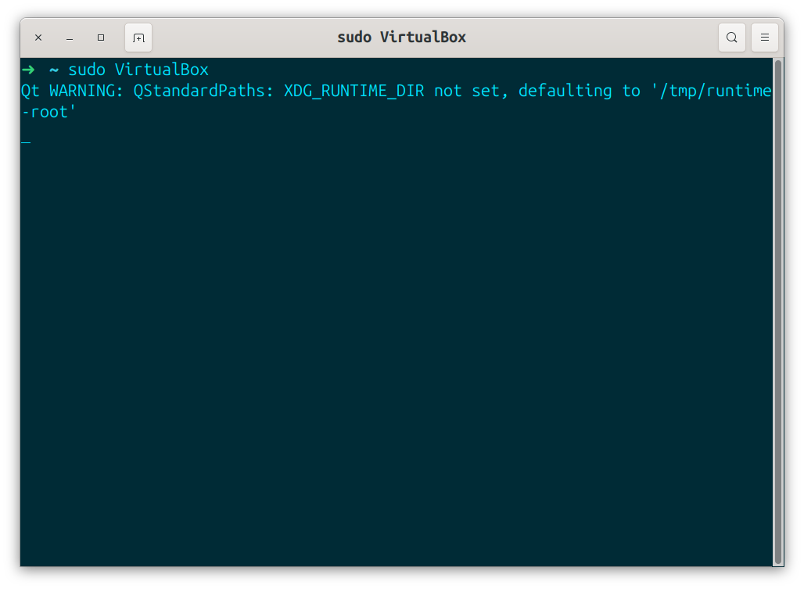

- 3- Once the VB (VirtualBox) is opened, click on **new** or press **CTRL+N**.

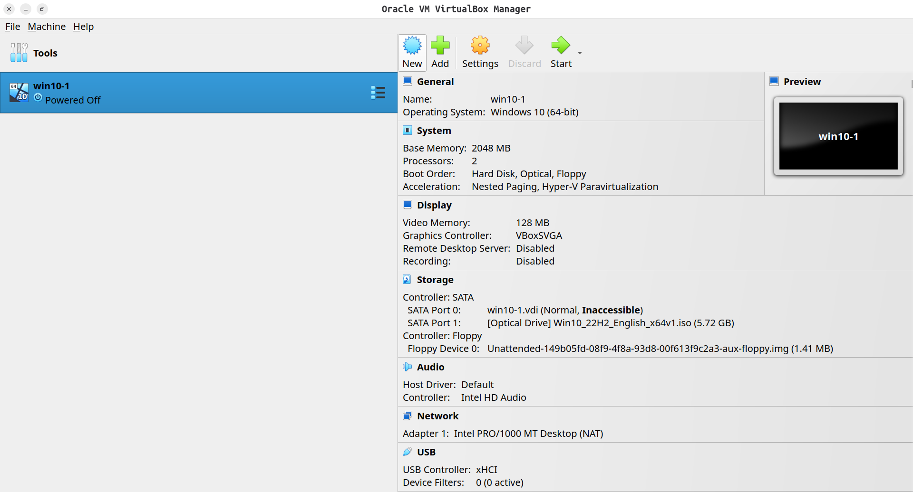

- 4- Enter a name for VM and select the *ISO* file you previously downloaded; then you'll see that VB will detect its type and version; click on **Next**.

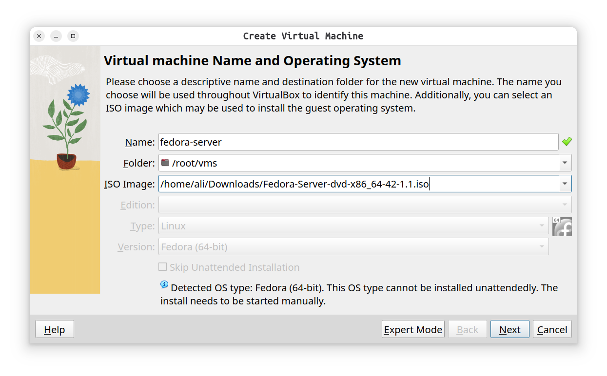

- 5- Choose at least **2GB** of memory and **1** or **2** CPU cores for smoother workflow and package management.

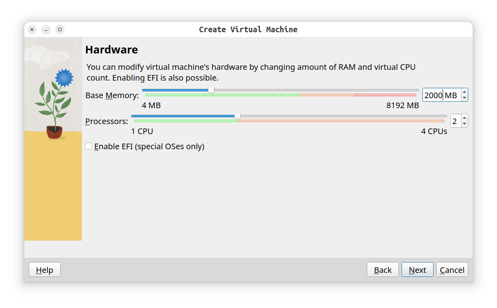

- 6- Create a Virtual Disk with minimum size of **8GB**s.

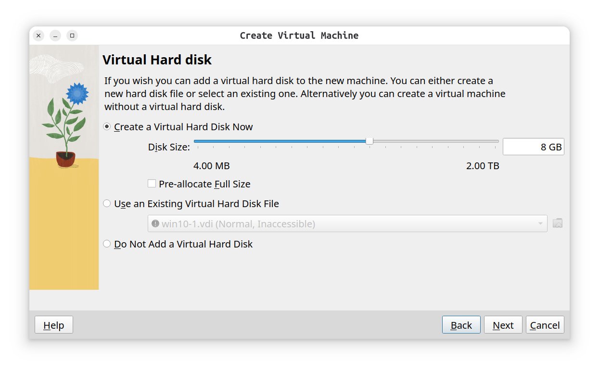

- 7- Now a summary page containing your VM properties will show up; click on **Finish**

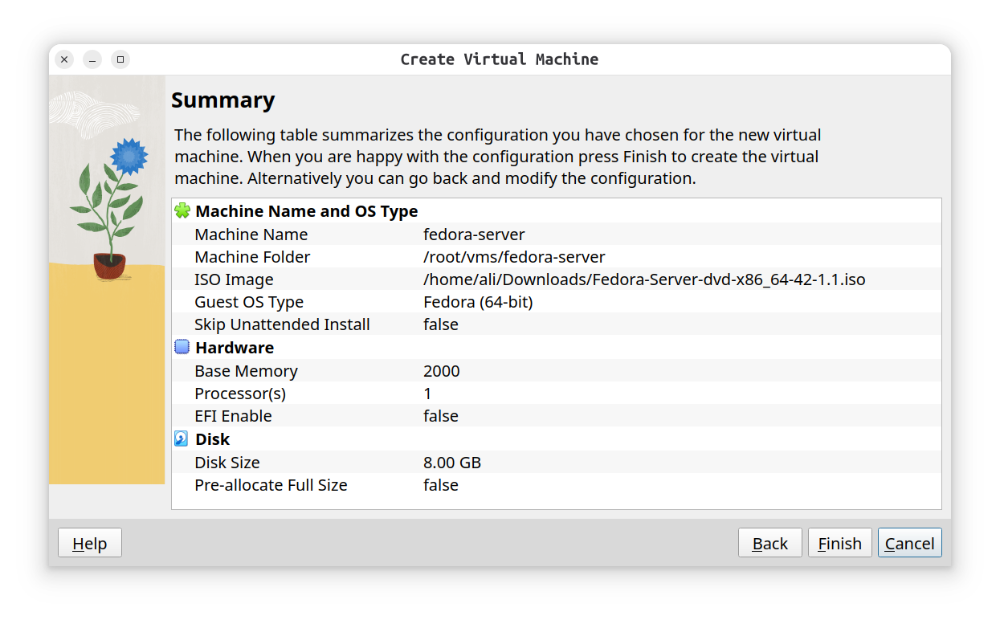

- 8- Now that you can see your VM on the left sidebar, select it and press the **Start** button or double click on it to run fedora. ( if you got an error starting the VM, you might want to see the last section on this page: **Disable KVM** )

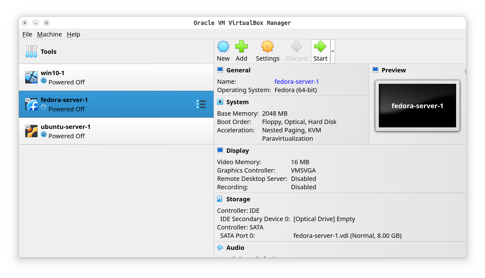

- 9- After starting it, you'll see the grub menu, select **Install Fedora 42**.

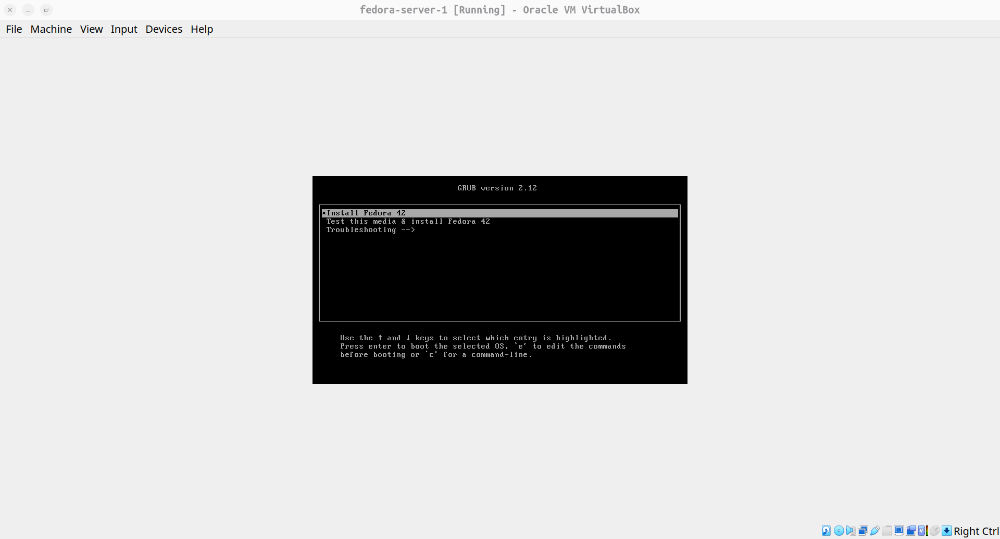

- 10- Now fedora installation on virtual disk, the easy part begins; click on next with its default settings until finished. you may need to create a user (do not set random username or password cuz your gonna need it to login) and choose your previously created Virtual Disk which is pretty straightforward.

- 11- After that the installation has been finished, you'll have to reboot the VM so you be able to start working with it.

#

### Install ubuntu server
**Ubuntu** is the most preferred distribution among Linux users and Newcomers due to its simplicity, consistent security updates, and LTS(Long-Term-Support) versions, and is considered good for learning linux.

**Installing and configuring Ubuntu-server step by step:**

- 1- Download Ubuntu desktop or server *ISO* file: [Download Ubuntu ISO.](https://ubuntu.com/)

- 2- Open *VirtualBox* and preferably start it with root access or on windows, run as administration.

- 3- Once the VB (VirtualBox) is opened, click on **new** or press **CTRL+N**.

- 4- Enter a name for VM and select the *ISO* file you previously downloaded; then you'll see that VB will detect its type and version; click on **Next**.

- 5- The difference between ubuntu and fedora VM being created is that you have to select a username and password at this stage too (do not pick random user and psswd, you'll need for login).

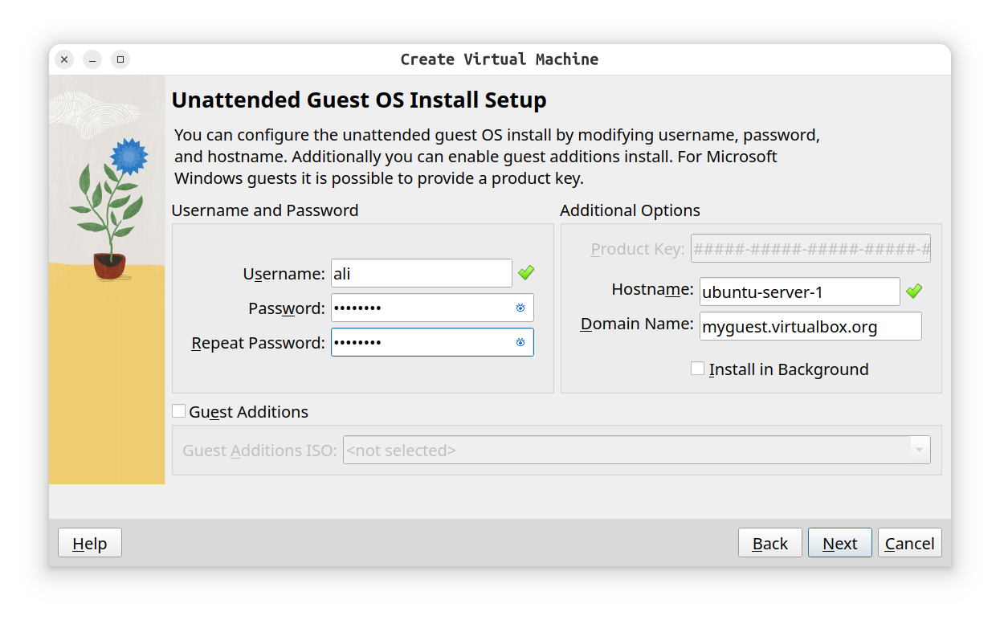

- 6- Choose at least **2GB** of memory and **1** or **2** CPU cores for smoother workflow and package management.

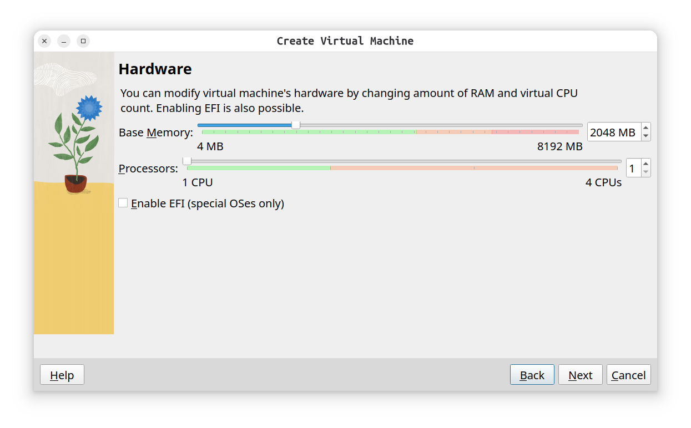

- 7- Create a Virtual Disk with minimum size of **8GB**s, then click on next until finished.

- 8- Now that you can see your VM on the left sidebar, select it and press the **Start** button or double click on it to start Ubuntu. ( if you got an error starting the VM, you might want to see the last section on this page: **Disable KVM** )

- 9- From now on it is straight-forward, select your language and click next with default settings until you see **Profile Configuration** page.

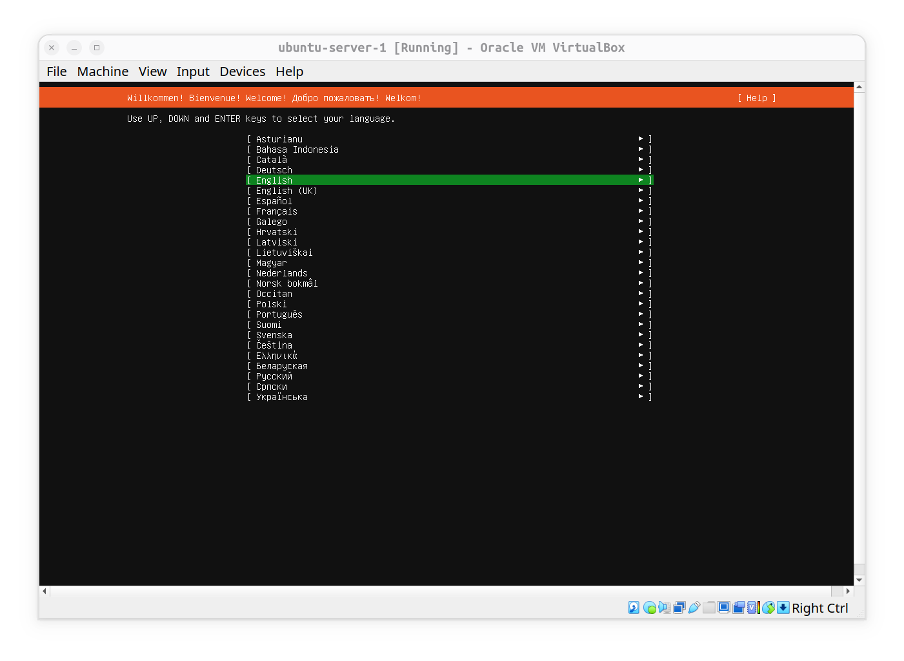

- 10- On **Profile Configuration** page, set your name, server name and a username and password (the same username and psswd that you've created previously on stage 5).

- 11- Click **done** with default settings until the installation begins.

- 12- after that installation has been finished, select **Reboot** and then you are able to start and use your Ubuntu virtual machine.
#
### Disable KVM (if) needed:
On some computers, we will receive an error from VirtualBox like this:

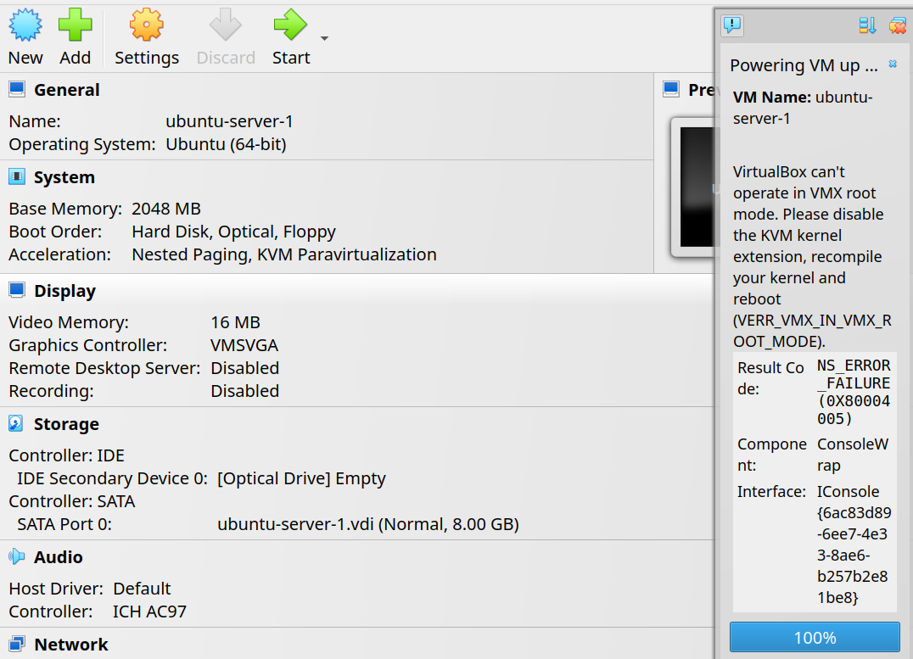

This error is saying that KVM module is preventing VirtualBox to operate. the workaround for this is disabling KVM module each time we want to use our VMs on VirtualBox. for example on an ubuntu os we can do this:

```bash
# execute them respectively
sudo modprobe -r intel_kvm
sudo modprobe -r kvm
```
