# Section 101.1-Determine and Configure Hardware Settings
**LPIC** starts from the hardest part, knowing how to install, configure partitions and detect hardware is from those sort of things that even some pro users don't know how to do it without outside help. in 70% of times, even if you're super professional, you don't deal with hardware.

### Section 101.1 Objectives:
- Enable & disable integrated peripherals.
- Differentiate between various mass storage devices.
- Determine Hardware resources for devices.
- Tools and utils to list various Hardware information like **lsusb & lspci**.
- Tools and utils to manipulate **USB** (Universal-serial-bus) devices.
- Conceptual understanding of **sysfs**, **udev**, **dbus**.
- **/sys**
- **/proc**
- **/dev**
- **modprobe**
- **lsmod, lspci, lsusb**

# Table of Contents

- [101.1 Determine and Configure Hardware Settings](#section-1011-determine-and-configure-hardware-settings)
  - [Section 101.1 Objectives](#section-1011-objectives)

### 101.1 - Part 1
- [Operating System (OS)](#operating-system-os)
- [Firmware](#firmware)
  - [BIOS (Basic Input/Output System)](#bios)
  - [UEFI (Unified Extensible Firmware Interface)](#uefi)
- [Hardware](#hardware)
  - [Peripheral Devices](#peripheral-devices)
  - [PCI (Peripheral Component Interconnect)](#pci)
  - [USB (Universal Serial Bus)](#usb)
  - [GPIO (General Purpose Input/Output)](#gpio)

### 101.1 - Part 2
- [Sysfs](#sysfs)
  - [Sysfs Structure and Key Directories](#sysfs-structure-and-key-directories)
  - [What Sysfs Actually Does](#what-sysfs-actually-does)
- [Udev (Userspace /dev)](#udev)
  - [UdevAdm](#udev-adminstration-udevadm)
- [D-Bus](#d-bus)
- [Proc Directory](#proc-directory)
  - [Proc vs Sysfs](#proc-vs-sysfs)
  - [Key Files and Directories in /proc](#key-files-and-directories-in-proc)
  - [IRQ (Interrupt Request)](#irq)
  - [Important /proc Sub-directories](#some-directories-that-are-good-to-know-about)
    - [/proc/interrupts](#procinterrupts)
    - [/proc/ioports](#procioports)
    - [/proc/iomem](#prociomem)
    - [/proc/dma](#procdma)
  - [Quick Proc Summary](#quick-proc-summery)

### 101.1 Part3
- [Hardware Recognition Commands and Tools](#hardware-recognition-commands-and-tools)
  - [Important Tools and Commands](#important-tools-and-commands)
  - [RedHat Package Manager](#rpm)
- [Loadable Kernel Modules](#loadable-kernel-modules)
  - [Kernel Modules Commands](#kernel-modules-commands)
  - [Loadable Kernel Modules Mental Model](#loadable-kernel-modules-mental-model)
  - [Change Modules Permanently](#change-modules-permanently)
  - [Loadable Kernel Modules in other words](#loadable-kernel-modules-in-other-words)
  - [Kernel Modules Problems](#kernel-modules-problems)

- ### [Chapter Overview](#chapter-overview)
---

### 101.1 - Part 1 =>

## Operating System (OS):
**An** operating system (**OS**) is system software that manages Computer hardware, software resources and provides common services for computer programs. it sits on top of the Hardware and manages resources when another software ( sometimes called a **UserSpace** program ) asks for it. a real example could be a game asking for some space on RAM or graphic card.

## Firmware
**Is** a sort of software that launches the hardware. think of it as a *built-in* **OS** or driver for your hardware. every hardware and even motherboards need some firmware to be able to work. for example think of a keyboard that contains a built-in **Firmware** that allows it to be able to talk with our Operating system and tell it which key have we clicked.


**Motherboards** also use a built-in firmware to integrate Hardware ( like detecting sound or network card ).

### BIOS 

*( Basic input/output system )*
**Is** one of those old firmwares, in which you could do some limited settings and configurations from a *text-based* menu system and boot the computer from the bootloader which was located on the first sector of the first partition of the hard disk and was called **MBR** or ( *Master-Boot-Record* ). 

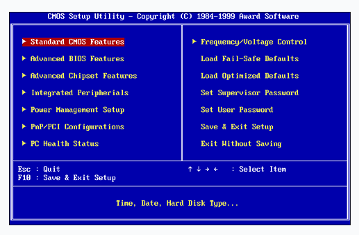

Nowadays most of the new systems use a 2-step procedure for boot, because MBR alone doesn't have enough space to store modern bootloaders; so what they do is to load the MBR into memory for **addressing** the cpu to the main bootloader.

### UEFI 

*( Unified Extensible Firmware Interface )*
**It** is newer, fancier and the standard firmware interface for nowadays modern systems; first it was started as **EFI** in 1998 by Intel corp to make the booting process more secure and flexible. in this interface we have to register each bootloader; it uses a specific disk partition which is called ( EFI system partition *(ESP)* ) with **FAT** disk format which stands for (*File Allocation Table*) which doesn't have **MBR** size limit.


### BIOS vs UEFI

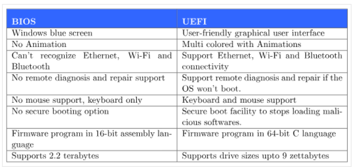

**On** linux systems we can find the Bootloader partition on */boot* directory which contains files with *.efi* extension, for example on an Ubuntu Desktop it may look like this:

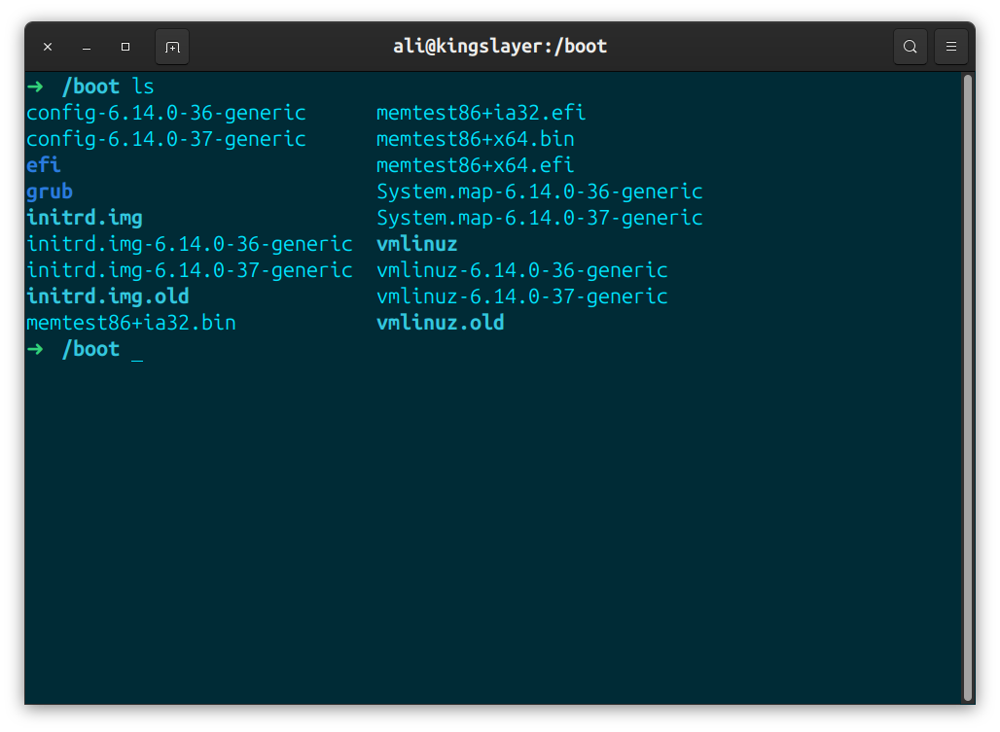

**Now** we know that what does Motherboard firmware do, in short terms it simply recognizes Hardware in our computer and lets the bootloader to boot up the system and the Operating system to use the resources of our hardware to do what we ask for it on User space. 

## Hardware
**We** can have very different types of Hardware in our computer. in early days producers used to put the whole hardware on the motherboard, but with time passing, different users used to come up with different needs and expectations of their systems, so producers had to invent smart ways to cover users needs of different hardware and resources for their systems.

### Peripheral Devices
**Are** Hardware pieces to be used to add new in/output features or connections to computers. these components usually can get connected to the system using these repeatedly evolutioned ways:
- **PCI** *(Peripheral Component Interconnect)*: A motherboard expansion bus.
- **USB** *(Universal Serial Bus)*: The most common external connection standard.
- **GPIO** *(General purpose Input/Output)*: Pins used to directly control electronics.
- **PATA** *(Parallel Advanced Technology Attachment)*: Storage device interface.
- **SATA** *(Serial Advanced Technology Attachment)*: Modern replacement for PATA.
- **SCSI** *(Small Computer System Interface)*: A powerful older interface mainly used in Servers, Workstations, Enterprise storages and ....
 
examples of Peripheral Devices:
- Internal Hard Disk Drives (**HDDs**). mostly via: *SATA/PATA/SCSI*.
- External HDDs with fiber cable. mostly via: *USB/Firewire*.
- Network cards. example: *RJ45*.
- Wireless cards. example: *IEEE 802.11*.
- Bluetooth.
- Video Accelerators. for faster Graphical rendering. 
- Audio cards.

### PCI 

*( Peripheral Component Interconnect )*
**Was** a workaround to let users to add different Hardware boards and pieces to their computers flexibly, so they weren't forced to change the Motherboard entirely for a tiny Hardware upgrade like for example adding 2GBs memory space to their system.


**We** also have different types of PCI ports, for example PCI-32bits are older and most servers now use **PCI-E** or *( PCI Express )* for it's speed of data transaction.

Some typical PCI devices: 
- Sound cards.
- Network cards.
- Wi-Fi Adapters.
- Capture cards ( captures external sources like a Camera or Game console ).

### USB 

*( Universal Serial Bus )*
**In** the past, if you needed to connect literally anything to your Motherboard, you had to turn off the system, open up your computer, possibly change your motherboard or connect it via its ports, so you couldn't just do it on the fly when your system was working and etc. so **USB** came up and solved this issue and now you are able to connect many types of external devices via your USB ports to your computer even if it is on work.


**A** simple look at USB technology evolution can say how much it was useful:
- USB v.1: 12 Mbps.
- USB v.2: **480** Mbps.
- USB v.3: **20 Gbps**.

### GPIO 

*( General Purpose In/Output )*
**Using** GPIO ports, we can have different and arbitrary I/Os. though it is not serial and complex protocols cannot work on it like they do on PCI or USB, using its Pins we can directly control electronics. This technology is pretty popular in:
- Raspberry Pi
- Micro Controllers
- Embedded Systems

**An** example of GPIO pins on a Raspberry Pi:


**GPIO** pins can:
- Read sensors
- Turn LEDs on/off
- Control Motors
- Talk to electronic circuits.


**This** is more *electronics/embedded* world than normal desktop computing.

---

### 101.1 - Part 2 =>

**In** previous part we got more familiar with hardware and firmware, but in this part we will discuss about the way that Linux recognizes and communicates with hardware as an OS. to achieve this we need to observe four important systems:
- 1- Pseudo or (Virtual) file system: **SysFs**.
- 2- User space manager: **Udev**.
- 3- Dbus System.
- 4- /proc directory.

## Sysfs
**Is** a pseudo filesystem, provided by the Linux Kernel that exports information about various Kernel subsystems, hardware devices and associated device drivers from the Kernel's device model to user space through virtual files. **in addition** to providing information about various devices and kernel subsystems, exported virtual files are also used for their configuration.


**SysFs** is mounted under the **/sys** mountpoint:

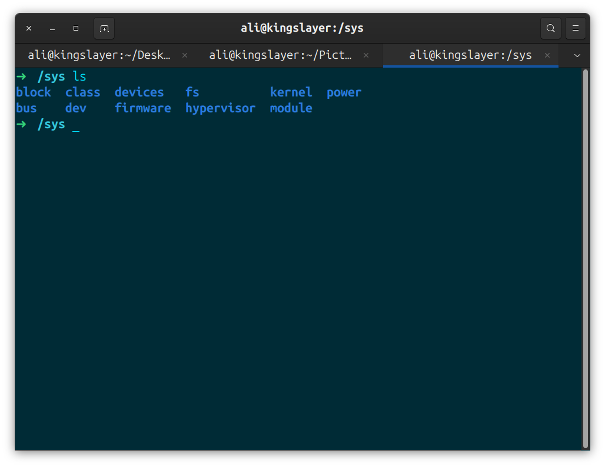

#### Sysfs structure and key directories

All block devices are at "/block", and "/bus" has all the connected **PCI, USB, Serial** and etc. Note that here in "/sys" we have the devices based on their technology, but in "/dev" it is abstracted:

- `/sys/block`:

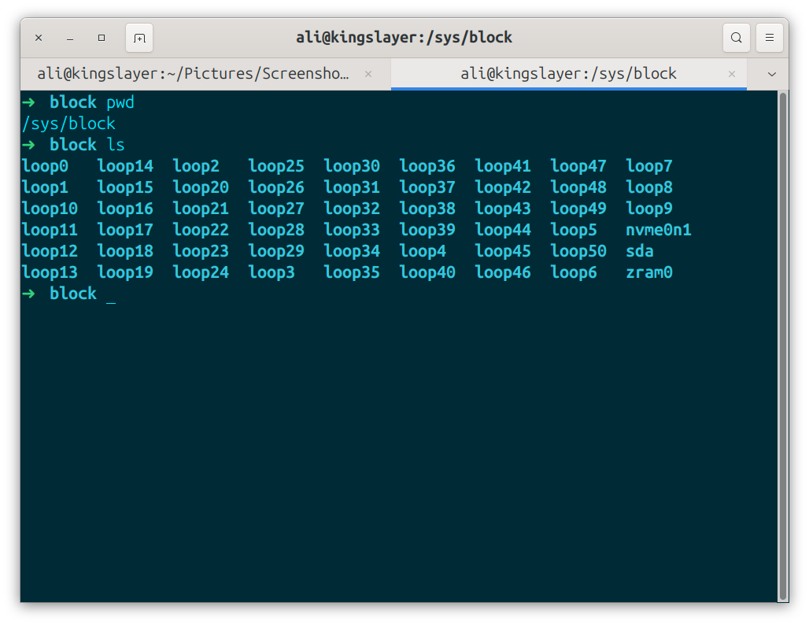

- `/sys/devices`:

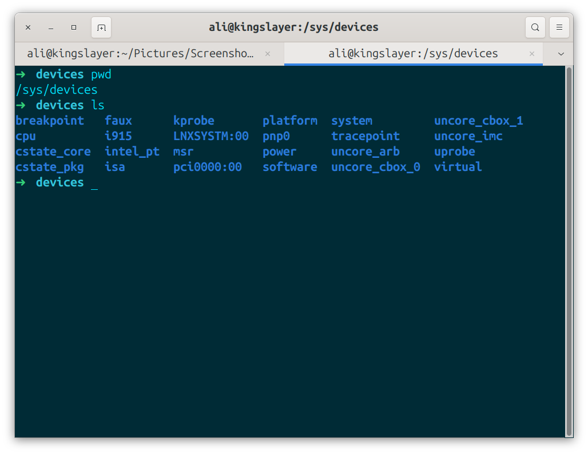

- `/sys/bus`:

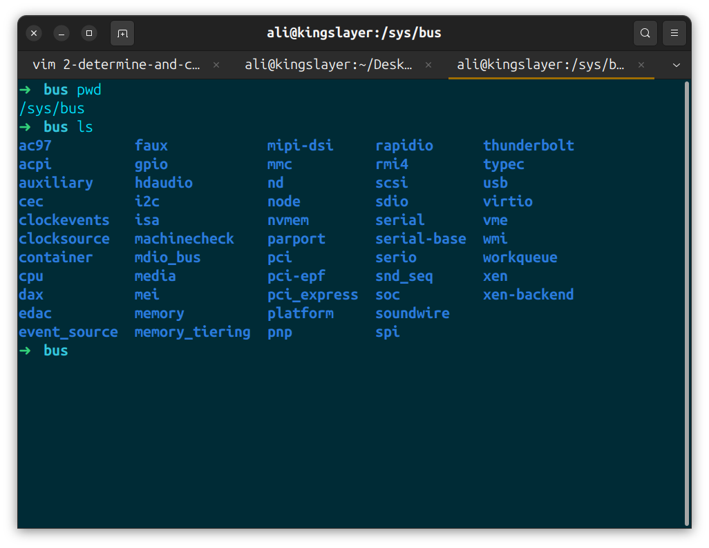

**When** we say "sysfs" is a virtual file system exported by kernel we mean:
+ The files we see under "/sys" are not actually stored on disk and are instead generated dynamically by the Linux kernel in RAM and is basically a live interface into kernel objects & device state.
+ A real filesystem stores persistent data on a storage device, for example: ext4, XFS, NTFS.
+ Pseudo filesystems are different, they are mostly: *kernel interfaces, temporary runtime data, abstractions, communication channels...* and this means no actual disk is involved.

### What "SysFs" actually does?
Sysfs exposes Kernel objects as files, for example these represent:

- "/sys/class/net/" : Network interfaces.
- "/sys/block/" : Block devices.
- "/sys/devices/" : Hardware buses, drivers....

For example when we run:

```bash
$ cat /sys/class/net/eth0/mtu
```
We are not actually reading a disk file, instead:
+ 1- The kernel receives the read request.
+ 2- A kernel function generates the value.
+ 3- The value is returned as a text.

So the file is really like an API endpoint disguised as a file.

#### Why Linux does this?
It follows the **Unix** philosophy that says everything is a file, because it gives huge advantages like:
- Standard tools like "echo", "grep", "cat" works.
- Easy shell scripting.
- No special gui/api is needed.
- **Consistent interface**.

## Udev 

( Userspace */dev* )
**Udev** is a userspace device manager. Most of the times that we have somthing to do with our devices, we refer to **Udev**.

Udev is a device manager for linux kernel, and as the successor of *devfsd* & hotplug, Udev not only manages devices nodes in **/dev** directory, but also manages all userspace events raised when hardware devices are added into the system or removed from it; including firmware loading as required by certain devices.

**There** are a lot of devices in *"/dev"* shown as files, and if you plug in any device it will be assigned a file for it. example? say */dev/sda* which is a file representing a block device.

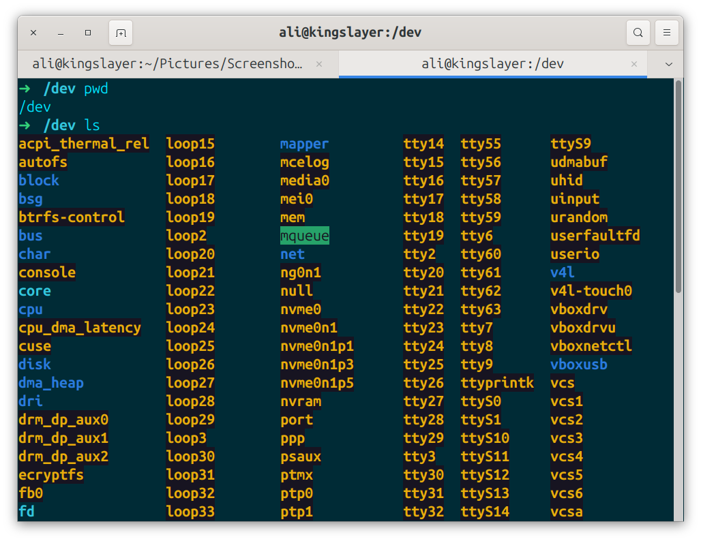

**Udev** lets you decide what will be what in *"/dev"* directory. for example? you can use a rule to force your flash drive with a specific vendor to appear as *"/dev/mybackups"* when you plug it in. you can even start and set a back process as soon as it connects to the system.

**In essence** Udev serves as a custodian of the *"/dev"* directory. it abstracts the representation of devices such as hard disk which is identified as "*/dev/sda*" or "*/dev/hd0*", **Irrespective of its manufacturer model or underlaying technology**

### Why Udev?
**Udev** exists so that programs can interact with devices through consistent files in *"/dev"*, instead of dealing directly with the details of each hardware technology.

#### When a device appears:
- The Kernel detects it.
- The Kernel exposes information about it.
- Udev creates the appropriate file in *"/dev"*.
- Programs use that file to access that device.

*this way software doesn't need to be specifically programmed to able to work with different devices, but they can communicate through a standard interface* ( files in *"/dev"* ). It dynamically manages device files, providing a consistent way for Linux and Applications to access hardware. this is the opposite way that *"/sys"* does which is sorting devices based on a certain and hierarchy.

### udev adminstration (udevadm)
**It's** a udev management tool; udevadm is a tool for adminstors; udevadm command expects a command and command specific options. it controls the runtime behaviour of Systemd/Udevd and requests kernel events, manages the events queue and provides simple debugging mechanism. for example if we want to gain more info about hotplug devices, we can use: `udevadm info <device-name>`.

**Configuration** of udev devices can be done on `/etc/udev`.

## D-bus
**Is** an IPC ( Inter Process Communication ) system which allows programs to have a simple & reliable way of communication between eachother.

#### Three of most important services provided by this system are:
- Is a message bus system for inter process communication and displacement of data & messages between programs.
- Helps coordinate process lifecycle.
- Makes it simple and reliable to code a single instance application or daemon and to launch applications and daemons on-demand when their services are needed.

#### A short summery about D-Bus ( Desktop-Bus ) system:
**D-Bus** is a modern and high speed messaging system that allows applications and services on Linux to easily communicate with eachother. think of it as a post office for programs. instead of applications directly communicate with each other they send messages through D-Bus.

**D-Bus runs two main buses:**
- The system bus: for system-wide services like NetworkManager, Systemd and Hardware devices.
- The session bus: for user application and desktop environment.

**D-Bus** is heavily used in modern Linux desktops and is essential for features like:
- Notifications
- Power Management
- Service Control

## Proc directory
**This** is where Linux Kernel keeps its settings & properties. this directory is also a pseudo file system and is created on RAM and some files there might have write access ( say some for hardware configuration ).

**Proc** provides an interface for to Kernel data structures, this way you can see system status in essence, and tools like **ps** and other tools can query data about Kernel and processes, about their Pid, user, current working directory, memory and etc.

! Sys was introduced later to address the mess that proc became. **Sysfs** is more structured and organized around the Kernel's device model. it reflects the hierarchy of devices, buses, drivers and Kernel objects.

### Proc vs Sysfs:

**/proc**: What is Kernel and System doing now?
- Processes
- Memory
- CPU info
- Kernel settings

**/sys**: What hardware devices exists and how are they organized?
- Disks
- Network cards
- USB devices
- Drivers
- Device attributes

### What **Proc** & **Sysfs** have in common?
They both are Pseudo file systems and the files aren't actually stored on Disks, and Kernel generates their content dynamically.

### Key files and directories in Proc:
- IRQs: interrupt requests.
- I/O ports: Locations in memory Where CPU can talk with devices.
- DMA: direct memory access, faster than I/O ports.
- Processes
- Network settings

**In** "/proc" you can see many numbers as directories; these numbers are the process IDs, also there are other files like **cpuinfo**, **mounts**, **meminfo**, **net**, **interrupts** which are used to observe hardware info and system status.

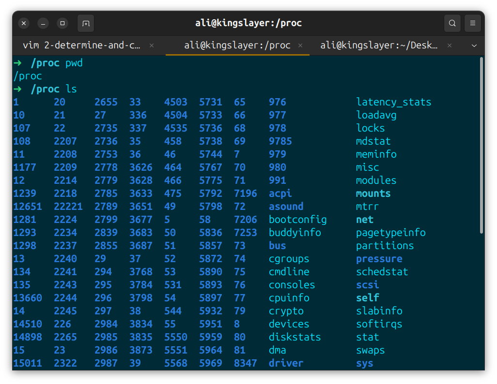

**You** can also do some limited configurations in proc; for example if you've got an IBM Lenovo laptop you can turn on/off or even blinking the LEDs on laptop. example:
```bash
$ echo "10 blink" | tee /proc/acpi/ibm/led

# in this example, 10 represents my red led on the back of the laptop lid,
# and blink is the condition i want it to have which is blinking.
``` 

**Another** very useful directory here is ``/proc/sys/net/ipv4`` which controls real-time networking configuration.

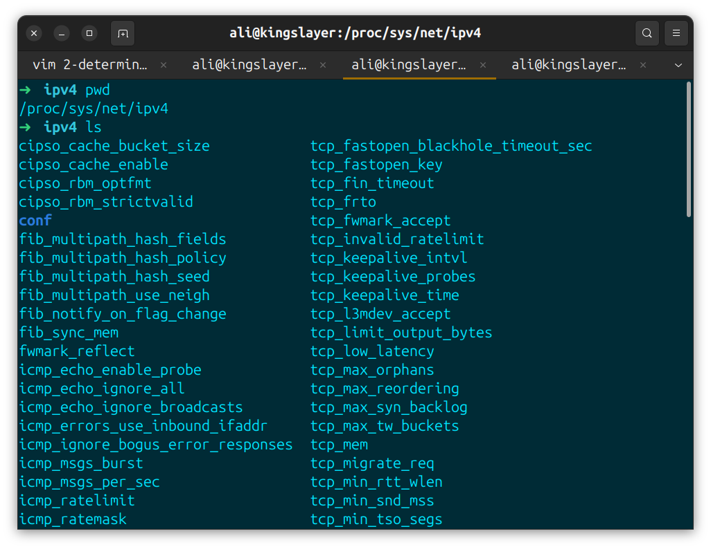

**! Attention**: all the changes will be reverted after a reboot. to make it permanent, you have to configure them in `/etc` directory. 

### IRQ

( Interrupt request )
**Is** a mechanism used by hardware devices to signal the CPU that they require immediate attention. so instead of CPU constantly checking and polling devices to see if they need processing, an IRQ allows the device to interrupt the processor, **triggering the Kernel's interrupt handler** for that specific device. each device is assigned an IRQ number *(or uses message signaled interrupts in modern systems)*. proper IRQ handling is essential for system performance & responsiveness.

**In Linux** you can monitor IRQ activity using `/proc/interrupts`. understanding IRQs is a fundamental part of Linux hardware management & System architecture.

### Some directories that are good to know about:
##### `/proc/interrupts`:

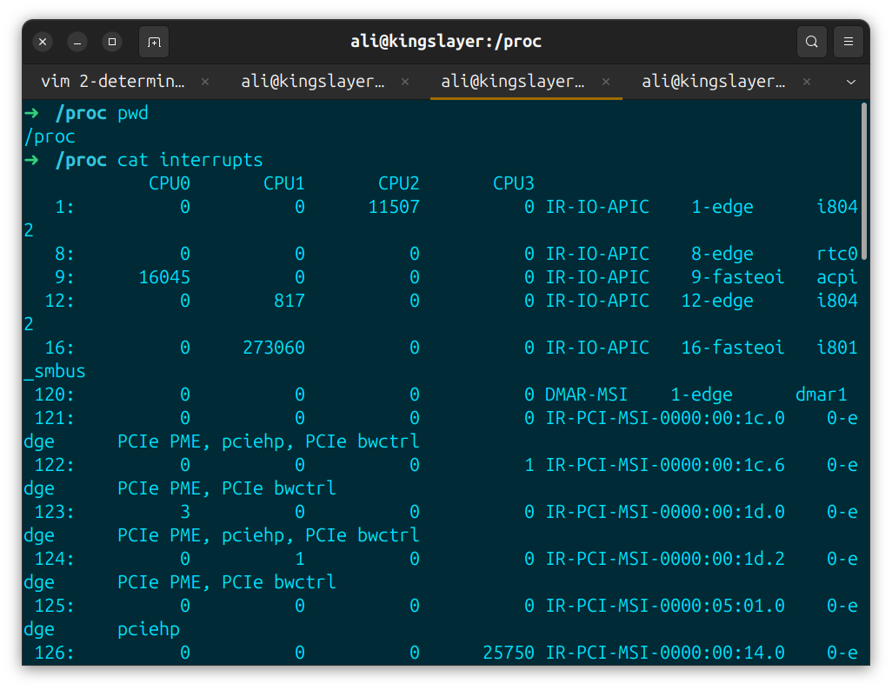
  
  1- Useful to see which devices are using which IRQs & to diagnose interrupt related issues.

  2- Lists all IRQs currently used by Hardware devices.

  3- Display how many times each interrupt occurred per CPU core.

##### `/proc/ioports`:

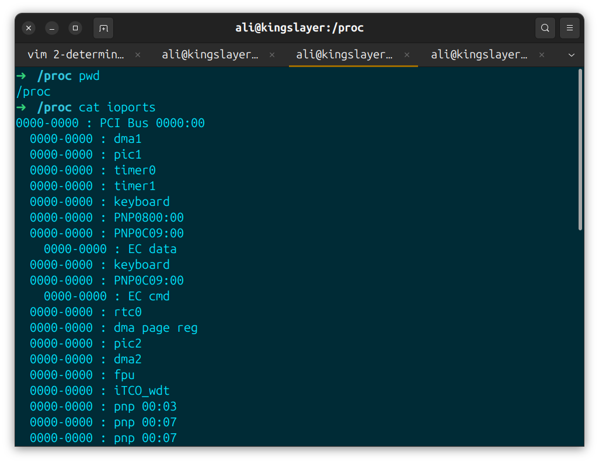

  1- Lists I/O ports addresses assigned to hardware devices.

  2- I/O ports are used for communication between CPU & Devices ( Older method ).

  3- Shows the range of ports & the device and drivers that are using them.

##### `/proc/iomem`:

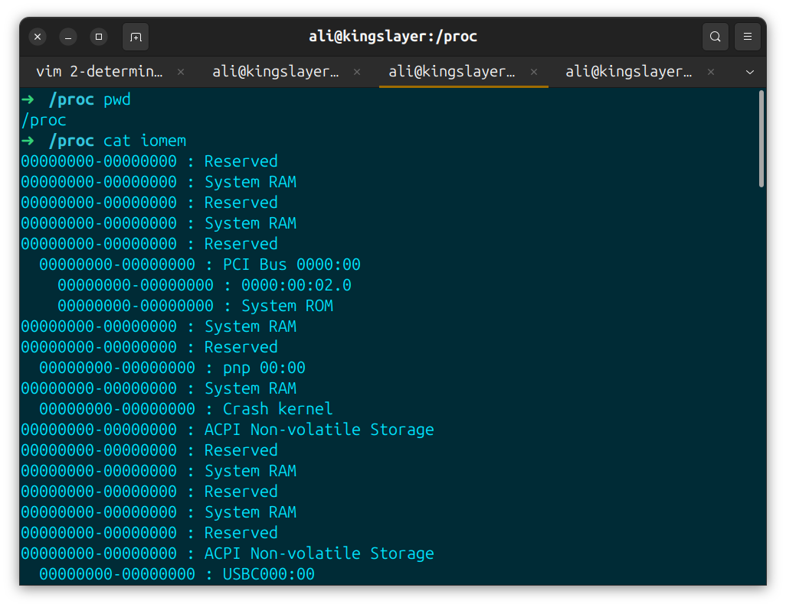

  1- Displays I/O memory ( Memory mapped I/O ) regions assigned to devices.

  2- Shows physical memory addresses used by hardware devices ( e.g. Network cards, graphics, PCI devices )

  3- Important for understanding how devices map their memory into the system's address space.

##### `/proc/dma`:

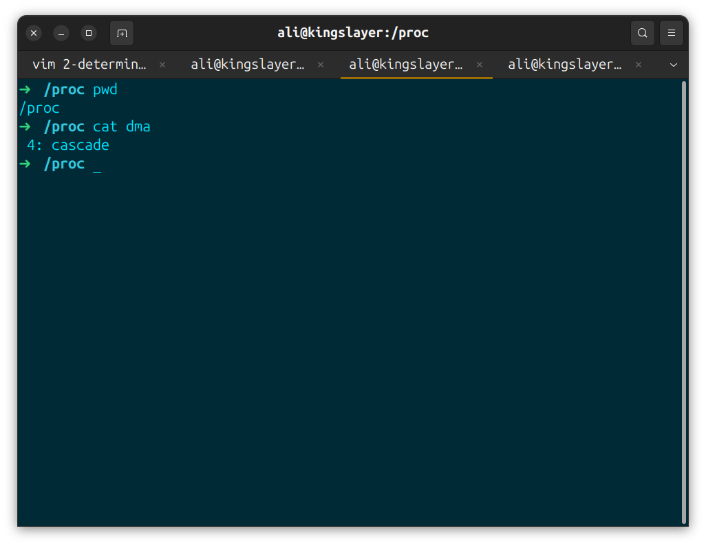

  1- Shows direct-memory-access ( DMA ) channels currently in use.

  2- DMA helps devices to transfer data directly to/from RAM without involving the CPU ( performance improve ).

  3- Most modern systems show very little here because they use **Bus Mastering** instead of traditional DMA channels.

### Quick Proc Summery:
the `/proc` file system provides useful information about hardware resource allocation.

**"Interrupts"** shows IRQ usage & statistics. 

**"ioports"** displays I/O port ranges.

**"iomem"** shows memory mapped I/O regions.

**"dma"** shows direct-memory-access channels.

---

### 101.1 - Part 3 =>

# Hardware Recognition Commands and Tools

**In** this part we'll learn about four important commands or tools which are used for **diagnosis** and identification the Hardware in Linux.

with these tools we are able to observe various devices like USB, PCI, disks and full hardware details to use them to troubleshoot problems with system.

#### Important Tools and Commands:
- **lsusb**: all USB devices connected to the system ->
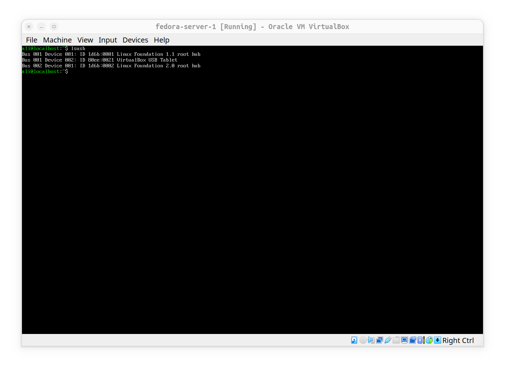
- **lspci**: PCI peripherals connected to the computer ->
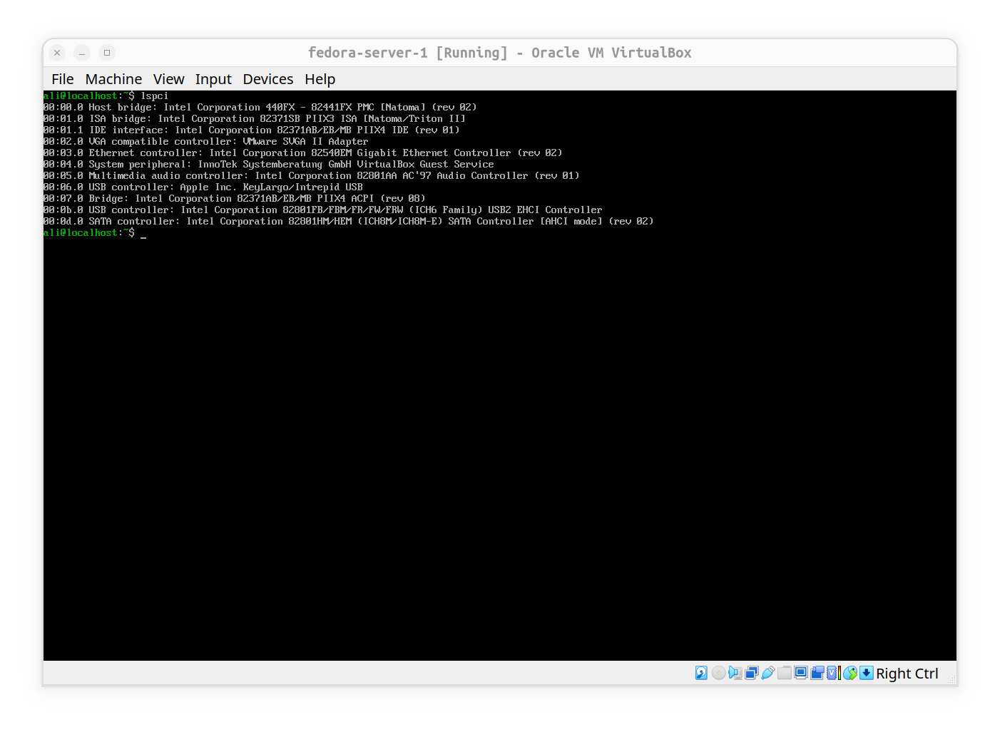
- **lshw**: The whole Hardware information (might need root access or sudo). ->
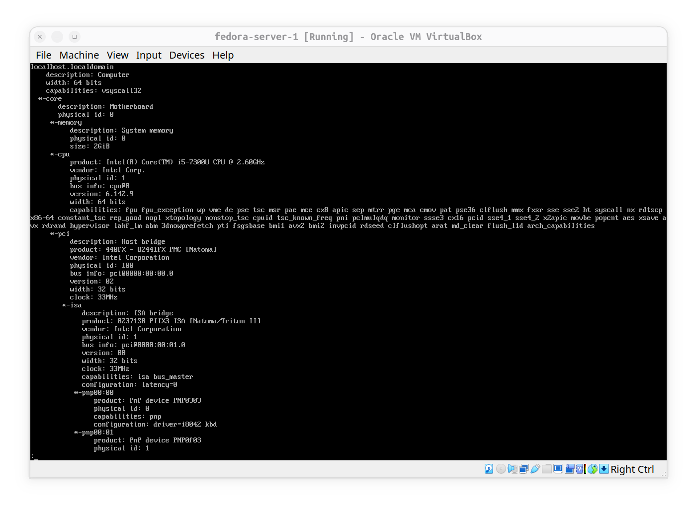
- **lsblk** : disks & block devices; devices that you can read/write blocks of data from/to it.


**!Note**: When we read or write blocks of data from/to a device, we call it a block device. examples: ssd.

## RPM
*(RedHat Package Manager)* is free and open-source package management system. the name RPM refers to the *.rpm* file format and the package manager program itself and the command tool for installing, removing and ... RPM itself couldn't resolve dependencies of packages when installing or removing, so it used to output error until dependencies are manually installed. so although `rpm` could install software directly from a .rpm file, it does not resolve dependencies automatically resolve package dependencies. so if a library or package is missing the installation may fail until those dependencies are installed manually.

**To** simplify software management, RedHat-based distributions provide higher level package management tools like **yum** and its successor **dnf**. these tools work on top of RPM and automatically download packages from online repositories, resolve dependencies, install required libraries, update software and remove packages safely.

**In other words** RPM is underlying package format and installation engine, while yum and dnf are package management tools that make working with RPM packages much easier. so consider it like this:

1- **.rpm** a shipping box containing a program.

2- **rpm** a worker who opens and installs that single box.

3- **yum/dnf** a warehouse manager who finds the box, orders any missing parts and installs everything automatically.

**and in short,** *rpm* is installer and format of package, and **yum/dnf** are dependency aware package managers built on top of RPM.

# Loadable Kernel Modules
Linux as an Operating System needs drivers to be able to work with hardware and use resources. in MS Windows you literally need to install drivers separately (older versions), but Linux has most of the drivers built-in. but to prevent kernel from loading all of them and become a monolith and to decrease kernel size, Linux uses loadable kernel modules (.ko) files (drivers). these are object files that are used ti extend the kernel of the Linux distribution they are used tp provide drivers for new Hardware like IOT expansion cards that have not been included in Linux kernel modules.

**by** putting loadable kernel modules accessible to the kernel itself, kernel still does have access to drivers but is also in smaller size.

## Kernel Modules Commands
- `lsmod`: output a list of active modules from directory (/lib/modules).

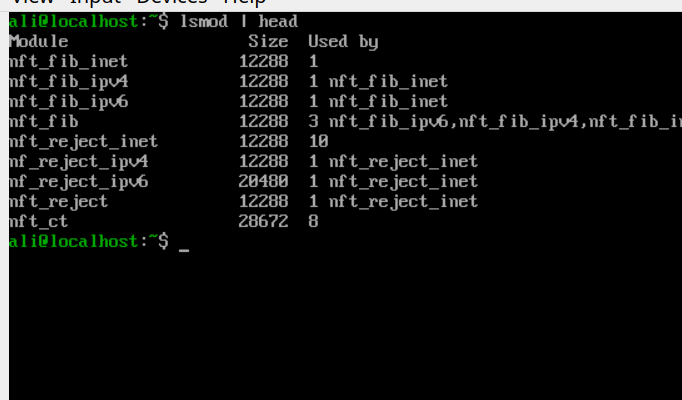

- `rmmod`: remove a module until next reboot.

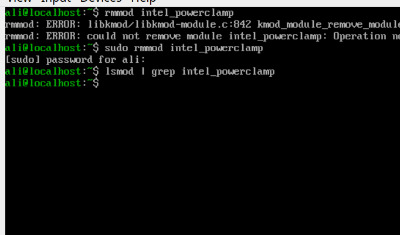

- `insmod`: insert a module by providing its (.ko) file address.

- `modeprobe`: add/remove modules from kernel until next reboot.

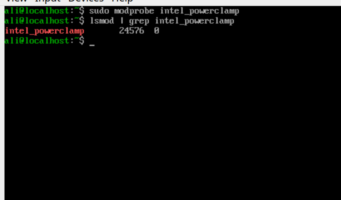

`/etc/modprobe.d`: is a directory to add or block a specific module from being loaded.

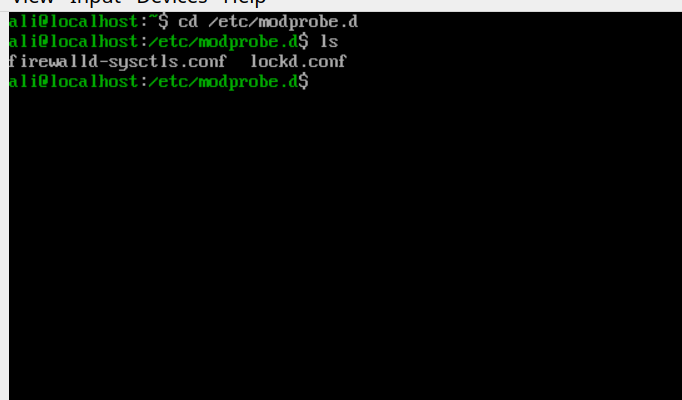

**!Note** that when you plug a device and .ko file gets loaded, kernel doesn't need any rebuild or reboot.

### Loadable Kernel Modules Mental Model:
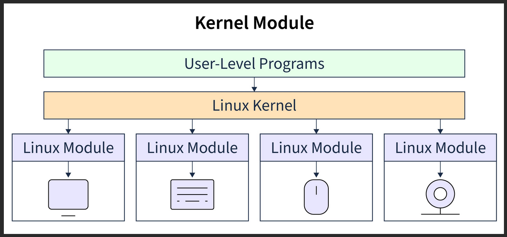

### Change Modules Permanently:
**if** you wanna load or remove some modules every time the system boots up; you can do one of the following:
- 1- add their name to `etc/modules`.
- 2- add their config file to `etc/modprobe.d`.


**When** we say Linux, technically we mean Linux Kernel. it is the most internal part of the OS which controls and communicates with the hardware.


**When** we say Operating System in general, we mean larger components than Kernel itself, like someone adding a browser or photo or other Userspace programs. example? Ubuntu which has default Firefox browser or photo library.

### Loadable Kernel Modules in other words:
**When** you have a hardware, your OS should know how to communicate with it. this issue has been solved through using loadable kernel modules(drivers). **So** when ever there is a hardware the OS should have drivers for it. therefore when we are programming, we just tell the OS to do things with hardware and use resources, and we don't have to deal with drivers or HW itself.

### Kernel Modules Problems:
**Many** vendors don't provide good or at all any drivers for linux to use their hardware. this is a bad thing from hardware manufacturer because if you buy a new fancy printer with many features, most of the times those capabilities  won't work for linux desktop, because simply kernel doesn't know how to communicate with it. Remember how Linus Torvalds sent a nice message to Nvidia by his fingers? LoL.


**The good** news is Linux has most of the drivers already installed and it is 100% batteries included. so if you buy a new HW and connect it to the system, it will work because there is either Manufacturers Loadable Kernel module or there is a Module that has been somehow reverse engineered.

**!Note** After attaching the hardware to system and kernel module being loaded, you don't even need to reboot the system to be able to make your OS work with that module.

**Linux** has most of the drivers included, but if it loads all of them, kernel becomes bloated and huge, so this issue been solved by separating (.KO) files from Kernel so we can load them on kernel and use them whenever we want, without pre-loading and increasing the size of the Kernel. for example if you attach a webcam to your system this gonna happen:
- 1- Kernel Recognizes it.
- 2- Loads the related (.ko) file.
- 3- you start using it without a reboot.

**This** way Kernel size remains reasonable.

---

### Chapter Overview

- Operating System
- Firmware
- Sysfs
- Udev
- Proc
- D-Bus
- `insmod`
- `rmmod`
- `lsmode`
- `modprobe` 

**This** chapter was one of the hardest ones to learn; as we continue it gets more easy.

### Operating System
**It** sits on top of the hardware and manages resources when a userspace program asks for it.
therefore a program does not need to communicate directly with hardware by low-level programming.

### Firmware
**Is** a software pre-installed on hardware so the hardware can communicate with Operating system

## Sysfs
**is** a Pseudo(virtual) file system that extracts information such as hardware info, kernel subsystems and various device drivers from kernel's device model and exposes kernel objects as files. in addition of giving us info about hardware and subsystems and etc, it also makes it possible to do some limited configurations. in `sys` devices are in a certain hierarchy and based on their model, the opposite of what udev does.

**Purpose:** providing a way to represent the kernel's device model as virtual file system.

**Functionality:** provides a way for userspace to query data from kernel or sometimes modify attributes of kernel 
objects

**Structure:** Organaized in a hierarchal that mirrors kernel's interface organization of device and subsystems.


### Udev
**acts** as the custodian of `/dev`. and not only exposes devices nodes in `dev`, but as a successor of hotplug and devsfd, manages events when a device is plugged in or out. also, devices in dev are abstracted and programs and software does not need to be programmed specifically for a specific device vendor, as Udev creates an integrated interface for them to communicate with any devices by writing a single instance of programm or daemon.

**Functionality:** detects and responds when hardware changes and executes necessary scripts and apps to configure hardware. it uses rules defined in configuration file to determine how to handle each device

**Integration:** works closely with Sysfs to retrieve device info and populate `/dev` accordingly.

### udev adminstration (udevadm)
**It's** a udev management tool; udevadm is a tool for adminstors; udevadm command expects a command and command specific options. it controls the runtime behaviour of Systemd/Udevd and requests kernel events, manages the events queue and provides simple debugging mechanism. for example if we want to gain more info about hotplug devices, we can use: `udevadm info <device-name>`.


**Configuration** of udev devices can be done on `/etc/udev`.


### Proc
**is** responsible, mainly for processes. if you open `/proc` you can see many numbers as directories there. each number is representing a process and contains information and ... of it. Proc is mainly used for observing system status and processes.

**Purpose:** exposes process info and system-wide parameters for userspace.

**Functionality:** allows userspace programs to read and in some cases modify kernel parameters at runtime. for example: info 'bout current running processes, kernel parameters, sys status.

**structure:** organized in a hierarchal structure where each process has a directory, containing files that represent different aspects of process such as memory usage, open file descriptor ....

## D-bus
**is** an inter process communication system (ICS) that creates a relible and safe way for programs and software to talk to each other. there are two types of d-bus in each system. first is system bus, which is used for daemons and system programs, and second is session bus which is assigned to make communication between user-space programs.

---

### `insmod`
it is an older method we used to insert a loadable kernel module (.ko file or drivers) for devices. you use this command, usually to insert a module, but for this you have to give the whole .ko file address for it which makes it difficult to use.

### `rmmod`
we use this command to delete a module, temporary until next boot. one example is `rmmod kvm_intel` which removes kvm module from active modules. if a module is in use we can use `rmmmod` with `-f` switch to force remove that module. example: `rmmod -f kvm`.


### `lsmod`
lists all active modules in current session.

### `modprobe`
is a very useful command which we can remove or load a kernel module by it. loading a module with modprobe is much more easier than `insmod` because it only needs the module name to be provided.

## Key Differences between `Sysfs` & `Udev` & `Proc`:
- **Sysfs** primarily is focused on exposing the kernel's device model & Hardware related info.
- **Udev** Acts as a device manager, dynamically managing device nodes in `/dev` & handling hardware events.
- **Proc** focuses on exposing process related information & variuos system parameters.

**!Note** that each of these components serves a distinct role within linux OS and provides critical infrastructure for managing hardware and processes.

## SSD vs HDD
- ssd is faster. reads up to 10x and writes upto 20x faster than hdd. also it is quietes, smaller, more durable, less energy consumer.

- ssd doesn't have moving parts & spining platters, therfore it withstands accidental drops or other shocks, vibration & ....

- hdds tend to last 3-5 years and though data in them is recoverable, ssd remains up to 10 years. also ssd has reserved capacities which aren't available to users, but they are used for repair damaged cells. defect cells are replaced with new reserved cells. this process is called 'Bad Block Management'.


## Network Cards vs Wireless Cards
- NIC (Network interface card): provides computing network connectivity on a system to ethernet in home or office, through RJ45 port. Wireless adaptors provides wireless connectivity to computing network enabled by access points in premises (in home or office) on a computer device
- Wireless cards: they are installed on an industrial computer and is used to enable wireless connectivity to the internet.
