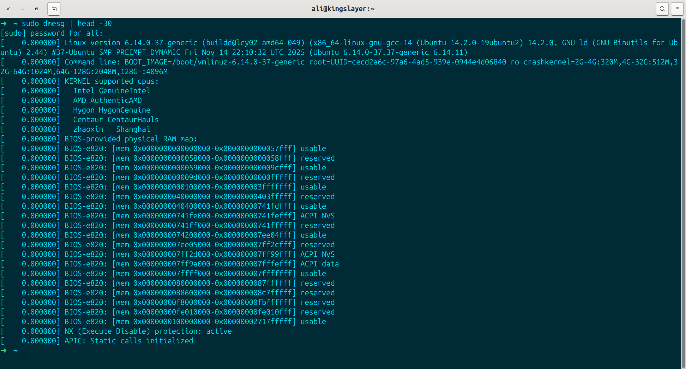
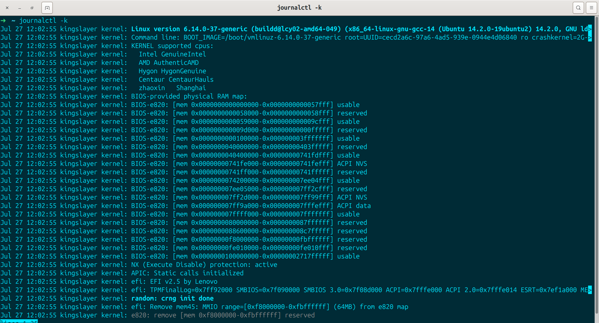
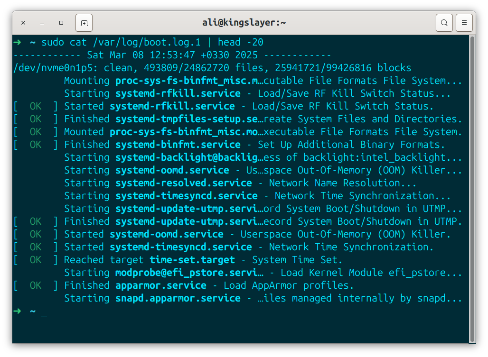
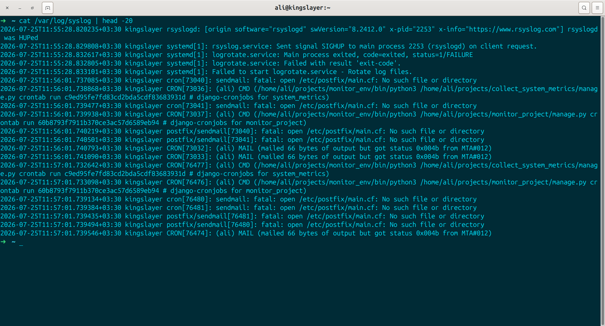
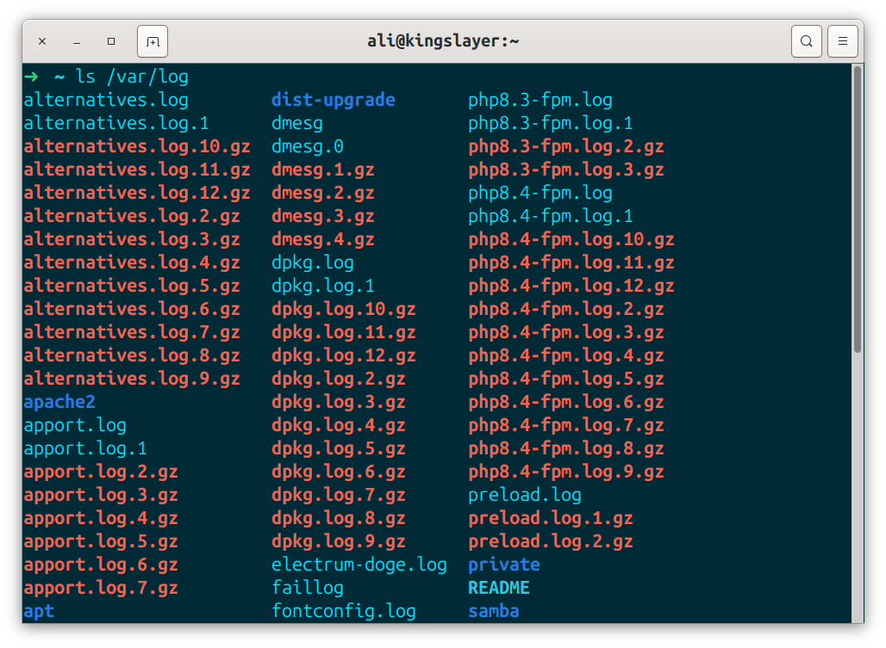
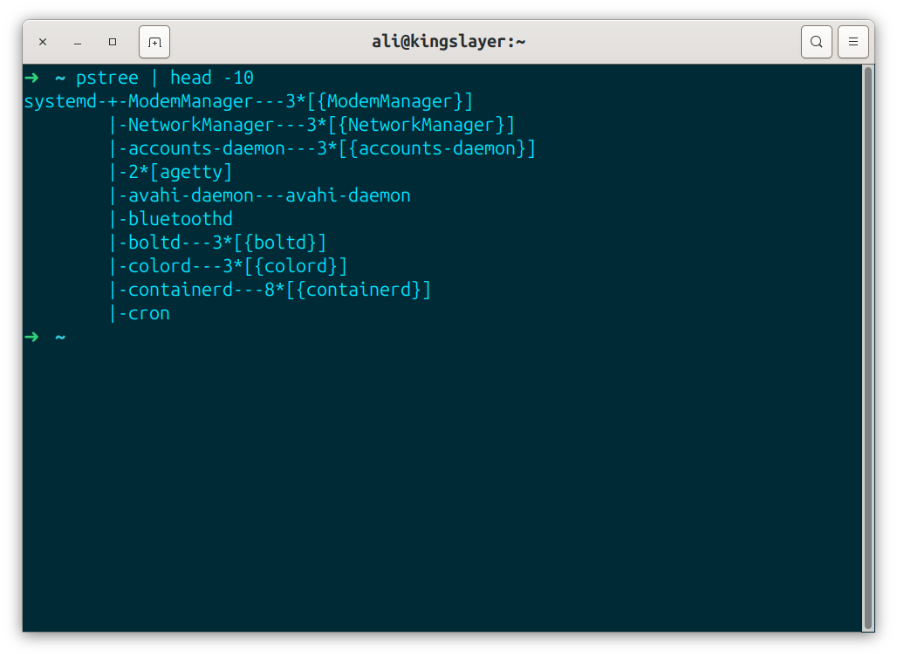
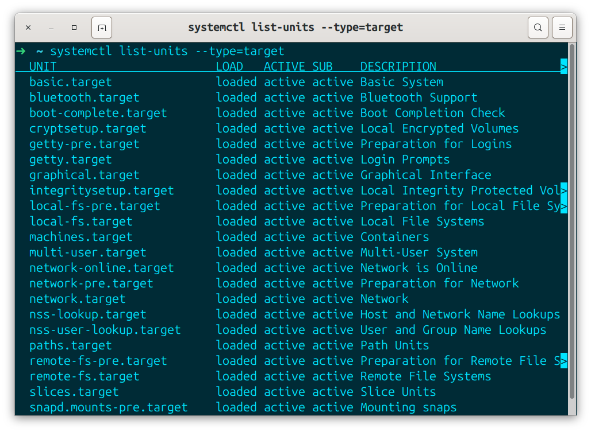
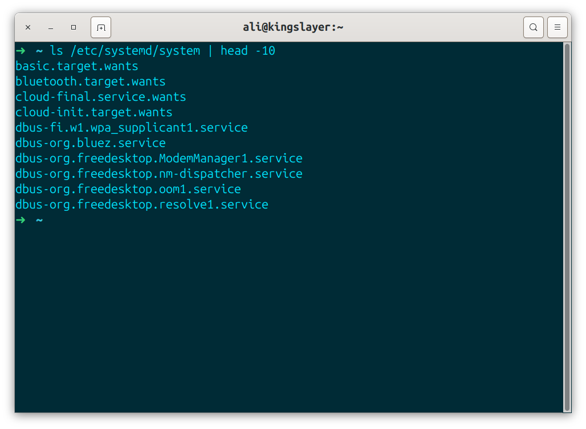
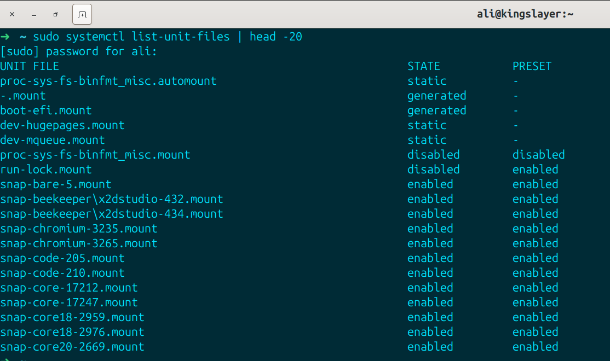
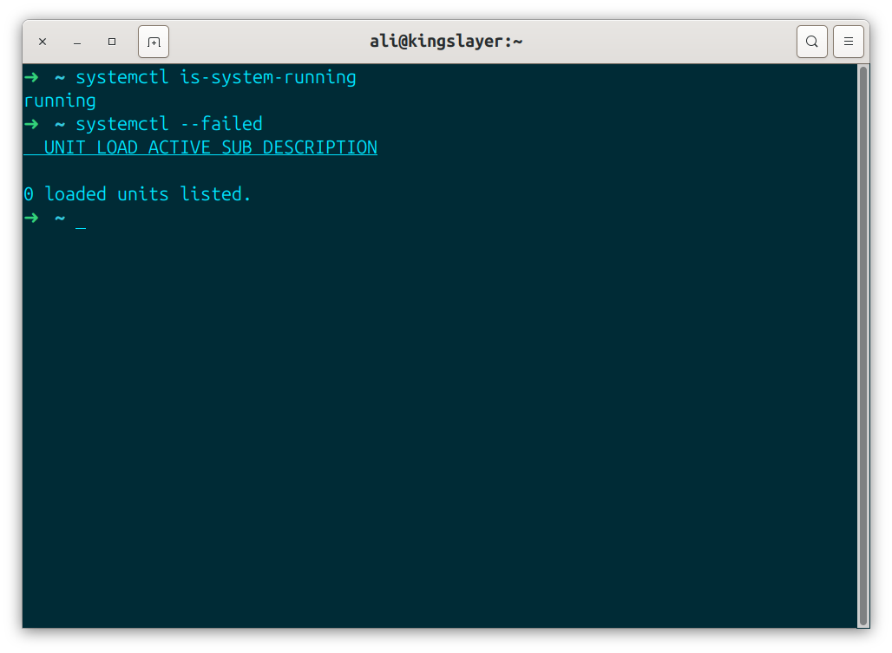

>**Primary refrence:** linux1st.com
> These notes are based on that material and supplements with my own experiments and researches.

# Section 101.2-Boot the System
Candidate should be able to guid the system through the boot process.

### Key knowledge areas:
- provide common commands to the bootloader & options to the kernel at boot time.
- demonstrate knowledge of the boot sequence from BIOS/UEFI to boot completion.
- understanding of `SysVinit` & `Systemd`.
- awareness of Upstart.
- check boot events in the log files.

### Terms
- dmesg
- journalctl
- BIOS
- UEFI
- bootloader (Grub)
- kernel (linux core)
- initramfs (initialization program)
- init
- SysVinit
- Systemd

# Table of contents
- [Section 101.2-Boot the system](#section-1012-boot-the-system)
  - [Key knowledge areas](#key-knowledge-areas)
  - [Terms](#terms)

### 101.2 - Part 1
- [The Boot Process](#the-boot-process)
  - [BIOS](#bios-basic-input-output-system)
  - [UEFI](#uefi-unified-extensible-firmware-interface)
  - [Bootloader](#bootloader)
  - [Kernel](#kernel)
  - [Boot Procedure](#boot-procedure)
  - [BIOS vs UEFI Boot Procedure](#bios-vs-uefi-boot-procedure)
    - [Why not booting directly without bootloader?](#why-not-booting-the-system-directly-from-firmware-without-bootloader)
  - [Linux vs GNU/Linux](#linux-vs-gnulinux)

### 101.2 - Part2
- [Dmesg](#dmesg)
- [Init Program](#init)
  - [Various init systems](#there-are-different-init-systems)
- [Systemd](#systemd)
  - [Commands to work with services](#we-can-use-these-commands-to-work-with-services)
- [SysVinit](#sysvinit)
- [Systemd Important parts in units](#important-parts-among-systemd-units)
  - [Targets](#targets)
  - [Unit Files](#unit-files)
  
---

### 101.2 - Part 1 =>

# The Boot Process
It is important to understand it because at this stage, we have very little control over the system and we cannot issue commands to troubleshoot much. we should have a very good understanding of what is happening.

- 1- MotherBoard does a PowerOnSelfTest (POST).
- 2- MotherBoard Loads the Bootloader.
- 3- Bootloader loads the Linux Kernel based on its configs and commands.
- 4- The Kernel loads & prepares the system (root file system) & runs the initialization program (systemd).
- 5- init program start the service such as a webserver, Gui, networking, ntp, etc.

**As** we discussed in 101.1, the Motherboard firmware on the motherboard can be BIOS or UEFI.

## BIOS (basic-input-output-system):
- older
- limited to one sector of the disk & needs a multi-stage bootloader
- can start the bootloader from internal/external HDD,CD,SSD,USB,NetworkServer
- if booting from the HDD, the master boot record (MBR) will be used (1 sector).

## UEFI (unified extensible firmware interface)
- modern and fancy
- specifies a specific disk partition for the bootloader, called EFI system partition (ESP)
- ESP is FAT(file allocation table) and mounted on */boot/efi* & bootloader files has .efi extentions.

**You** can check `/sys/firmware/efi` to see if you are using a UEFI system or not.


## BootLoader
BootLoader initializes the minimum hardware needed to boot the system. then it locates and runs the OS.
**Technically** you can point your UEFI to run anything you want but typically, under GNU/Linux systems we use GRUB. 
Grub can be used to run any specific program you need, but it Generally runs the OS(Kernel).

## Kernel
**is** the core of your operating system, it basically is Linux itself. your bootloader loads the kernel in the memory and runs it. but the kernel needs some initial info to start; things like drivers, which are necessary to work with the hardware. Those are stored in **initrd/initramfs** alongside kernel and used during the boot.

**You** can also send parameters to the kernel during the boot using the grub configs. for example sending a `1` ot `S` will result the system booting in single user mode (recover), or you can force your graphical to work in 1024x768X24 mode by passing vga=792 to the kernel during the boot.

passing 1 or s to kernel is used for booting in single user mode and mainly for maintainance. and also vga=792 boots in low resolution to find out that the booting problem is caused by graphical issues or not.

## Boot Procedure

---


## BIOS vs UEFI Boot Procedure


### Why not booting the system directly from Firmware without bootloader?
- 1-because of old time limitations. it is pretty hard to start the whole operating system from a BIOS firmware with MBR size limitation, so we have to start the bootloader and tell the bootloader to load the Kernel.
- 2-if you have a problem in your kernel for any reason, for example doing an update or make a change which makes your kernel problematic. in that case your computer won't boot at all; but nowadays if you break the kernel, your computer boots into the bootloader and gives you the possability to do somthing with commands. So you can go & check your kernel, change your Kernel or use an older version of the kernel. this is good even if you have a dual boot computer. your computer finds out that there is another OS too & you can use it. in short: Bootloader gives us a better control over system.


### Linux vs GNU/Linux:
Linux itself is just a Kernel by technical point of view and is made based on the *posix* standard which defines a unix system. Linux is a unix like Kernel operating system; but it needs other tools to work properly. it needs a command line, it needs a copy command, a graphical interface & many other things for different purposes. **GNU** project provides most of them.

**So** the correct way to say what ubuntu is, what fedora is, what debian is, what redhat is, is to tell that it is a GnuLinux, because it has Kernel linux and with Gnu Tools. **But** for simplicity we call the whole thing Linux. So at this time when we say Linux, we specifically mean linux Kernel.

**So** bootloader loads the linux and linux should take control, but it needs some additional data like drivers and .... So there is a file system called **initramfs** which stands for *( initialization ram file system )*. it's like a disk in the memory which has some drivers and some needed things for kernel to start.

**So** when the system boots, firmware(BIOS/UEFI) loads the bootloader(GRUB), and bootloader loads the kernel and gives the *initramfs* to it. so now the kernel knows how to control the hardware and it can start everything and run them. if it is a webserver, it starts webserver services and if it is a desktop it starts a graphical system.

**But** it is not a very good architecture because you don't want to bloat everything into the kernel, so in modern systems & old systems, kernel only runs a process which is called **init** and nowadays **systemd**.

**init** runs and initializes everything else you need like webservers, like network time protocol (ntp) to set the time based on the internet server like ssh to make it possible to connect to the server using ssh command; like graphical interfaces or whatever you want.

> Most famouse bootloader we use these days is the Grub. we used to have somthing called `Lilo` but now it is not standard and is expired.

**So** Firmware(BIOS/UEFI) -> BootLoader(GRUB) -> Kernel + initProgram or Systemd.

---

### 101.2 - Part2 =>

# dmesg
**Linux** will show you the boot process logs during the boot. some desktop systems hide this behind a fancy splash screen which you can hide using the `Esc` key or press `Ctrl+alt+f1`.

**Due** to several reasons which are beyond the scope of this course, the kernel saves its own logs into the "Kernel Ring Buffer". after the compilation of the boot process, the *Syslog* Daemon collects the boot logs & stores them in `/var/log/dmesg`.

**To** view all the logs including what has been logged after the boot process we use the `dmesg` command.



**We** can also use `journalctl -k` to check kernel logs or use `journalctl -b` to check for boot logs ( or even use `journalctl -u kernel` to see all previous logs too ).

`journalctl -b`:


`journalctl -k`:



**In** addition to these, most systems keep the boot logs in a text-like file too and they can be found in `/var/log/boot` or `/var/log/boot.log` in Debian or RedHat based systems repectively.



#### `/var/log/messages`:
**After** the init process comes up, syslog daemon will log messages. it has timestamps and will persist during restarts.
- Kernel is still loggin its messages in kernel ring buffer
- in some systems it might be called `/var/log/syslog`



- there are many other logs at `/var/log`.



# init
**When** the kernel initialization is complete, it's time to start other programs. To do so, the kernel runs the **initialization** Daemon process, and takes care of starting other daemons, services, subsystems and programs. Using the init system one can say "I need service A and then B, then I need C and D and E but do not start D unless A&B are running". The sys admin can use the init system to stop and start the services later.

#### **There** are different init systems:
- SysVinit: is based on unix system V. Not being used much anymore but people loved it because it followed unix philosophies. you may see it on older machines or even on recently installed ones.

- Upstart: was an event based replacement for the traditional init daemon developed by Canonical. The goal of the project was to build a replacement for SysVinit when it got released in 2007. Eventually the project got discontinued due to the wide adoption of Systemd. even Ubuntu use Systemd these days, but upstart still can be found on google's chrome OS.

- Systemd: is the new replacement. it is hated by linux elitists for not following Unix Principles. but it's widely adopted by major distros. it can start services in parallel and do lot's of fancy stuff!.

**The Init process** had the ID 1 and you can find it by running the:
```bash
➜  ~ which init
/usr/sbin/init
➜  ~ readlink -f /usr/sbin/init
/usr/lib/systemd/systemd
➜  ~ ps -p 1
    PID TTY          TIME CMD
      1 ?        00:00:37 systemd
```

**You** Can also see which init program do your kernel use by checking the hierarchy of processes using `pstree` command:



# Systemd
**Is** new, loved, and hated. lots of new ideas but not following some of the beloved unix principles, ( say not saving logs in a text file or trying to help you too much and asking for the root password when you're not running commands by sudo ). it lets us run services if the hardware is connected, in time intervals, if another service is started, and etc.

**The Systemd** is made around units. A unit can be a service, group of services, or an action.
units do have a name, a type and configuration file. there are 12 unit types: **automount, device, mount, path, scope, service, slice, snapshot, socket, swap, target & timer**

We use `systemctl` to work with these units and `journalctl` to see the logs.
```bash
systemctl list-units
systemctl list-units --type=target
systemctl get-default # default target
```


the **units** can be found in these places( sorted by priorty ):
- 1- `/etc/systemd/system`
- 2- `/run/systemd/system`
- 3- `/usr/lib/systemd/system`



```bash
systemctl list-unit-files
systemctl cat ntpd.service 
systemctl cat graphical.target
```


#### We can use these commands to work with services:
```bash
systemctl stop sshd
systemctl start sshd
systemctl status sshd
systemctl is-active sshd
systemctl is-failed sshd
systemctl restart sshd
systemctl reload sshd
systemctl daemon-reload sshd
systemctl enable sshd
systemctl disable sshd
```

#### There are other commands too:
```bash
systemctl is-system-running # running, degraded, maintenance, initializing, starting, stopping
systemctl --failed
```


**To** Check the logs we have to use the `journalctl` utility:
```bash
journalctl # show all journal
journalctl --no-pager # do not use less
journalctl -n 10 # only 10 lines
journalctl -S -1d # last 1 day
journalctl -xe # last few logs
journalctl -u ntp # only ntp unit
journalctl _PID=2134
```

# SysVinit
**Is** the older init system. still can be used on many systems. the control on files are located at `/etc/init.d` abd are closer to the general bash scripts. in many cases you can call like:
```bash
/etc/init.d/ntpd status
/etc/init.d/ntpd stop
/etc/init.d/ntpd start
/etc/init.d/ntpd restart
```

**One good thing** about linux systems is that they generate lots and lots of logs. when somthing bad happens on a Windows Os, you don't have enough logs to troubleshoot. all the thing you can do is install or reinstall programs or delete and reinstall configs and nothing much more.

**During the bootup** kernel shows you line by line that what is happening. 

**When Booting up**, Kernel doesn't have enough access to write logs into files. that is why we have somthing called *Kernel Ring Buffer*. by using this, kernel saves its own logs until compilation of bootup. 

**So Kernel Ring Buffer** is inside kernel's memory. until bootup compilation and logs will be collected by the Syslog Daemon.

**We separate init program** from kernel to make it more stable, less complicated, and sepration of the tasks.

**SysVinit** was not able to start two services simultaneously. so it was replaced.

**Systemd** was purposly neglecting some of the principles of unix design systems. for example in unix systems we want all our logs to be normal text wise; and another example: each thing should do one thing but do it very good. but *Systemd* is not respecting these ideas.


## Important parts among systemd units
**services/daemons** are the program which are running behind the scenes & answer back to the request or does somthing. for example ntp is a service which can be run by systemd. and it always keep your time accurate by internet clock. or sshd is another serviec which lets other people or you connect to your computer from remote using the ssh command. in sshd, d stands for daemon. which means it is running behind the scenes. and another example is cups which is for printers.


### Targets
**Are** the combination of services & configurations.

*for example* ( Targets ):
**ssdm**: Let's you to log into the graphical mode.
**xorg**: It is the graphical mode itself.
These Two services create a Target together.


### Unit Files
`systemctl list-unit-files` shows all the unit files it has.

The Unit files can have 8 states:
- `enabled`: starts automatically at boot.
- `disabled`: installed but not enabled. can still get started manually or by another unit.
- `static`: cannot be enabled because it has no "[install]" section; usually started only as a dependency.
- `generated`: was created automatically at boot or during daemon reload by a generator. not installed on disk by a package.
- `masked`: completely disabled by linking it to `/dev/null`. it cannot be started even manually.
- `indirect`: has an "[install]" section, but isn't meant to be enabled directly. usually enabled through another unit or an alias.
- `alias`: just another name pointing to different unit.
- `transient`: Created dynamically through the D-Bus API (for example by `system-run`).

`systemctl reload <unit>`: most of the times we use it when we've changed our unit configs.

`systemctl daemon-reload <unit>`: sshd has a file on my system which systemd handles & if i change that file and for example say sshd should be run after multi-user has started, we actually changed systemd configuration for that file. in this case i have to do a daemon-reload.


### JournalCtl
is a command used by systemd to give us a structured vision to observe different logs on system.
```bash
journalctl -xe  #get us to the last 100 line of logs.
journalctl --since "10min ago"  #show us logs from ten minutes ago.
```