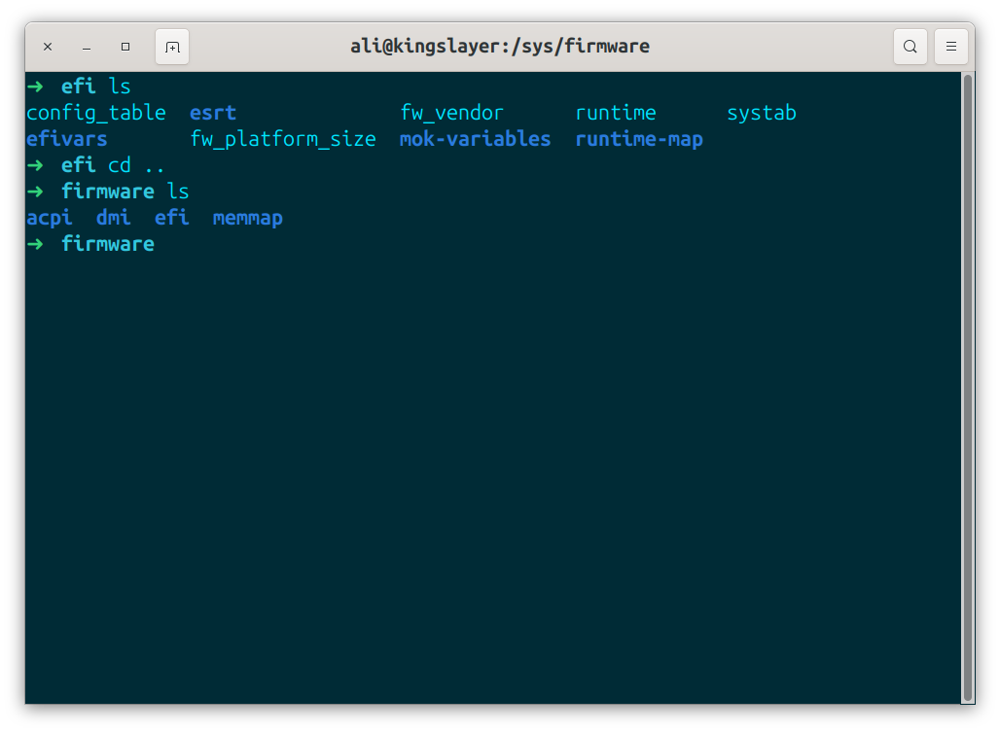
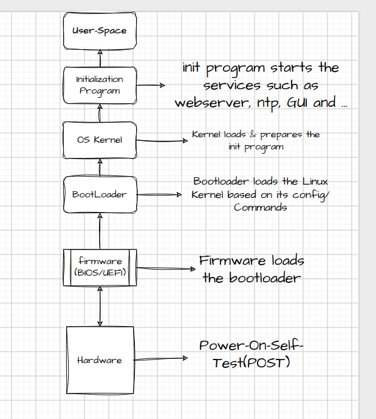
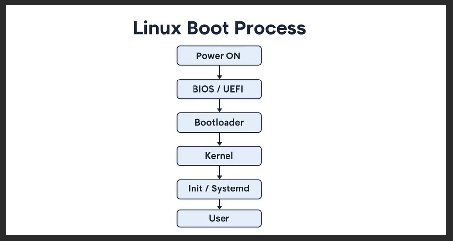
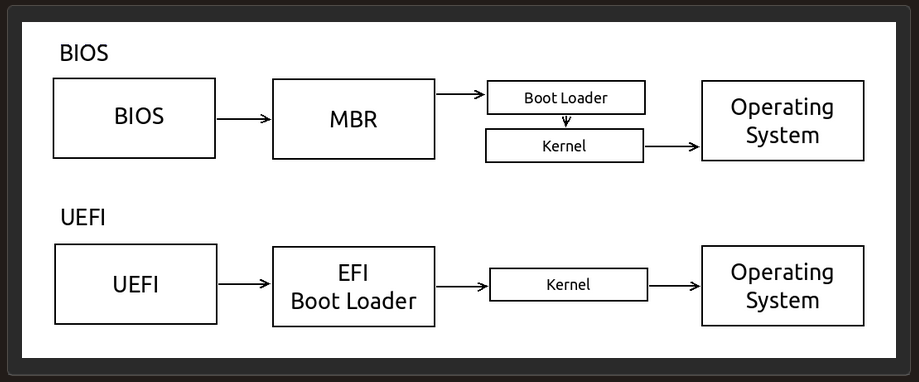

>**Primary refrence:** linux1st.com
> These notes are based on that material and supplements with my own experiments and researches.

# Section 101.2-Boot the System
Candidate should be able to guid the system through the boot process.

### Key knowledge areas:
- provide common commands to the bootloader & options to the kernel at boot time.
- demonstrate knowledge if the boot sequence from BIOS/UEFI to boot completion.
- understanding of `SysVinit` & `Systemd`.
- awareness of Upstart.
- check boot events in the log files.

### Terms
- dmesg
- journalctl
- BIOS
- UEFI
- bootloader (Grub)
- kernel (linux core)
- initramfs (initialization program)
- init
- SysVinit
- Systemd

# Table of contents
- [Section 101.2-Boot the system](#section-1012-boot-the-system)
  - [Key knowledge areas](#key-knowledge-areas)
  - [Terms](#terms)
---

### 101.2 - Part 1 =>

# The Boot Process
It is important to understand it because at this stage, we have very little control over the system and we cannot issue commands to troubleshoot much. we should have a very good understanding of what is happening.

- 1- MotherBoard does a PowerOnSelfTest (POST).
- 2- MotherBoard Loads the Bootloader.
- 3- Bootloader loads the Linux Kernel based on its configs and commands.
- 4- The Kernel loads & prepares the system (root file system) & runs the initialization program (systemd).
- 5- init program start the service such as a webserver, Gui, networking, ntp, etc.

**As** we discussed in 101.1, the Motherboard firmware on the motherboard can be BIOS or UEFI.

## BIOS (basic-input-output-system):
- older
- limited to one sector of the disk & needs a multi-stage bootloader
- can start the bootloader from internal/external HDD,CD,SSD,USB,NetworkServer
- if booting from the HDD, the master boot record (MBR) will be used (1 sector).

## UEFI (unified extensible firmware interface)
- modern and fancy
- specifies a specific disk partition for the bootloader, called EFI system partition (ESP)
- ESP is FAT(file allocation table) and mounted on */boot/efi* & bootloader files has .efi extentions.

**You** can check `/sys/firmware/efi` to see if you are using a UEFI system or not.

## BootLoader
BootLoader initializes the minimum hardware needed to boot the system. then it locates and runs the OS.
**Technically** you can point your UEFI to run anything you want but typically, under GNU/Linux systems we use GRUB. 
Grub can be used to run any specific program you need, but it Generally runs the OS(Kernel).

## Kernel
**is** the core of your operating system, it basically is Linux itself. your bootloader loads the kernel in the memory and runs it. but the kernel needs some initial info to start; things like drivers, which are necessary to work with the hardware. Those are stored in **initrd/initramfs** alongside kernel and used during the boot.

**You** can also send parameters to the kernel during the boot using the grub configs. for example sending a `1` ot `S` will result the system booting in single user mode (recover), or you can force your graphical to work in 1024x768X24 mode by passing vga=792 to the kernel during the boot.

passing 1 or s to kernel is used for booting in single user mode and mainly for maintainance. and also vga=792 boots in low resolution to find out that the booting problem is caused by graphical issues or not.

## Boot Procedure

---

## BIOS vs UEFI Boot Procedure

### Why not booting the system directly from Firmware without bootloader?
- 1-because of old time limitations. it is pretty hard to start the whole operating system from a BIOS firmware with MBR size limitation, so we have to start the bootloader and tell the bootloader to load the Kernel.
- 2-if you have a problem in your kernel for any reason, for example doing an update or make a change which makes your kernel problematic. in that case your computer won't boot at all; but nowadays if you break the kernel, your computer boots into the bootloader and gives you the possability to do somthing with commands. So you can go & check your kernel, change your Kernel or use an older version of the kernel. this is good even if you have a dual boot computer. your computer finds out that there is another OS too & you can use it. in short: Bootloader gives us a better control over system.

### Linux vs GNU/Linux:
Linux itself is just a Kernel by technical point of view and is made based on the *posix* standard which defines a unix system. Linux is a unix like Kernel operating system; but it needs other tools to work properly. it needs a command line, it needs a copy command, a graphical interface & many other things for different purposes. **GNU** project provides most of them.

**So** the correct way to say what ubuntu is, what fedora is, what debian is, what redhat is, is to tell that it is a GnuLinux, because it has Kernel linux and with Gnu Tools. **But** for simplicity we call the whole thing Linux. So at this time when we say Linux, we specifically mean linux Kernel.

**So** bootloader loads the linux and linux should take control, but it needs some additional data like drivers and .... So there is a file system called **initramfs** which stands for *( initialization ram file system )*. it's like a disk in the memory which has some drivers and some needed things for kernel to start.

**So** when the system boots, firmware(BIOS/UEFI) loads the bootloader(GRUB), and bootloader loads the kernel and gives the *initramfs* to it. so now the kernel knows how to control the hardware and it can start everything and run them. if it is a webserver, it starts webserver services and if it is a desktop it starts a graphical system.

**But** it is not a very good architecture because you don't want to bloat everything into the kernel, so in modern systems & old systems, kernel only runs a process which is called **init** and nowadays **systemd**.

**init** runs and initializes everything else you need like webservers, like network time protocol (ntp) to set the time based on the internet server like ssh to make it possible to connect to the server using ssh command; like graphical interfaces or whatever you want.

> Most famouse bootloader we use these days is the Grub. we used to have somthing called `Lilo` but now it is not standard and is expired.

**So** Firmware(BIOS/UEFI) -> BootLoader(GRUB) -> Kernel + initProgram or Systemd.
