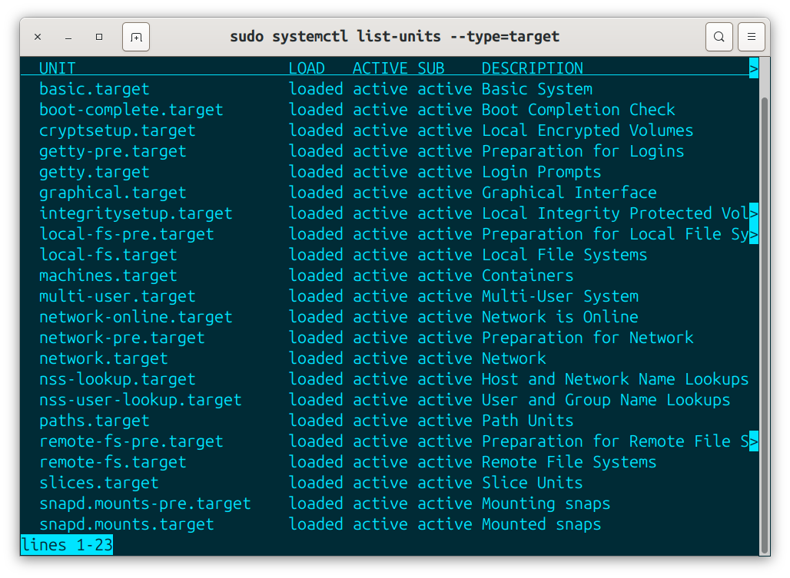
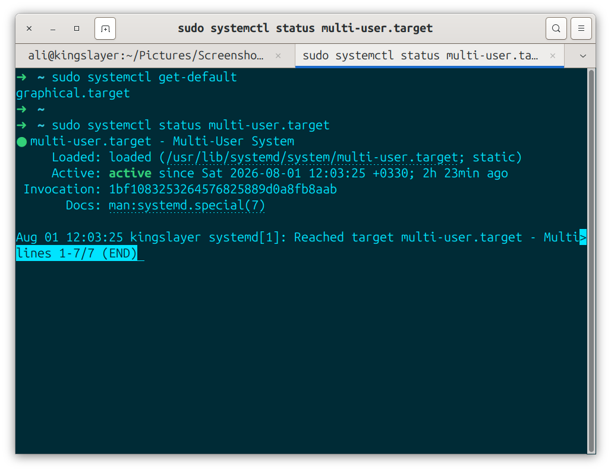
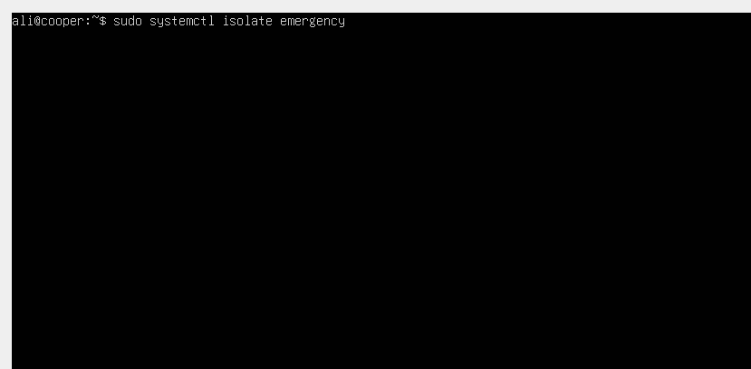
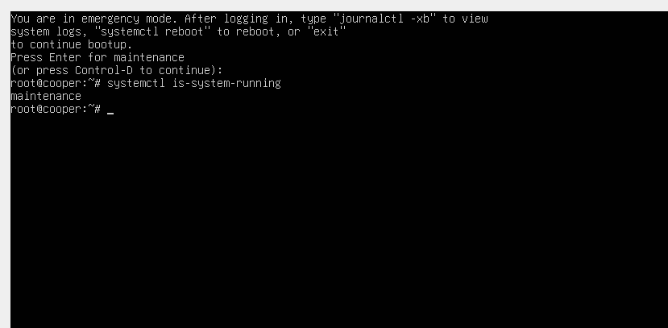
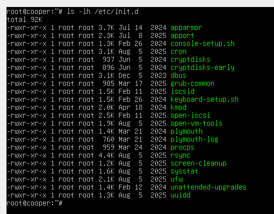
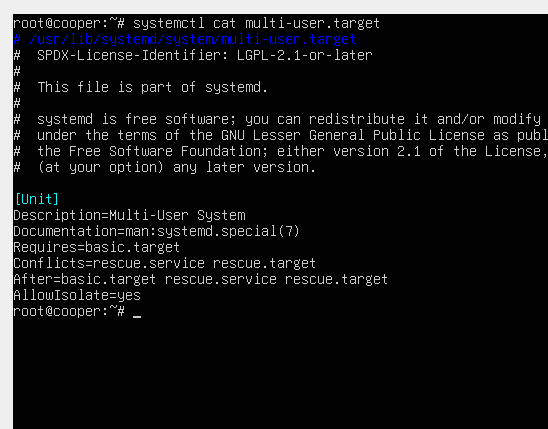

>**Primary refrence:** linux1st.com
> These notes are based on that material and supplements with my own experiments and researches.

# Section 101.3-Change Runlevels and Boot targets and shutdown or reboot the System

**Description**: Candidates should be able to manage the SysVinit runlevels or Systemd boot target of the system. This objective includes changing to single-user-mode, and shutdown or rebooting the system.

Candidates should be able to alert users before switching runlevels/boottargets and properly terminate processes.this objective also includes setting the default SysVinit runlevel or systemd boot target. it also includes awareness of Upstart as an alternative to SysVinit or systemd.

### Key Knowledge areas:
- set the default runlevel/boottarget.
- change between runlevels/boottargets including single-user-mode.
- shurdown & reboot from the commandline.
- alert users before switching runlevels/boottargets or other major system events.
- properly terminate processes.
- awareness of acpi.

### A partial list of the used files, terms & utilities:
- `/etc/inittab`
- shutdown
- init
- `/etc/init.d`
- `telinit`
- systemd
- systemctl
- `/etc/systemd`
- `usr/lib/systemd`
- wall

---

### 101.3 - Part 1 =>

# Runlevels
**runlevels** define what task can be accomplished in the current state (or runlevel) of a linux system. think of it as different stages of being alive.

## Systemd
**On systemd** we have different targets which are groups of services 



**And** we can check the default one or get the status of each of them.



**it is also** possible to isolate any of the targets or move to 2 special targets too:

- 1- rescue: Local file systems are mounted, no networking and root user only (maintenance mode).

- 2- emergency: only the root file system and in read-only mode, no networking & root-user only (maintenance mode).

- 3- reboot

- 4- halt: stop all processes and halt cpu activities.

- 5- poweroff: like halt but also sends an acpi shutdown signal (No lights!)




## SysVinit Runlevels
**On SysV** we were able to define different stages. on a Redhat based system we usually had 7:
- 0- Shutdown
- 1- Single-User-Mode (recovery); also called S or s
- 2- Multi-user without nerworking
- 3- Multi-user with networking
- 4- To be customized by the Admin
- 5- Multi-user with networking & Gui
- 6- Reboot

**And in Debian** based systems we had:
- 0- Shutdown
- 1- Single User mode
- 2- Multi User mode with Gui
- 3-5- To be Customized by the admin
- 6- Reboot

## Checking status & setting defaults:
**You Could** check your current runlevel with `runlevel` command. it comes from SysV era but still works on some systemd systems. the default was in `/etc/inittab`.
```bash
~ grep "^id:" /etc/inittab #on initV systems
id:5:initdefault:
```
It can also be done on grub kernel parameters.

**Or** Using `runlevel` and `telinit` command.
```bash
~ runlevel
N 3
~ telinit 5
~ runlevel
3 5
~ init 0 # shutdown the system
```
You can find the files in `/etc/init.d` and runlevels in `/etc/rc[0-6].d` directories where "S" indicates start and "K" indicates Kill.

**On Systemd** you can find the configs in: 
- `/etc/systemd`
- `/usr/lib/systemd`
As discussed in 101.2

## /etc/inittab
**Is replaced** by Upstart and Systemd but still part of the exam.
```bash
# inittab       This file describes how the INIT process should be set up
#               the system in a certain run-level.
#
# Author:       Miquel van Smoorenburg, <miquels@drinkel.nl.mugnet.org>
#               Modified for RHS Linux by Marc Ewing and Donnie Barnes
#

# Default runlevel. The runlevels used by RHS are:
#   0 - halt (Do NOT set initdefault to this)
#   1 - Single-user mode
#   2 - Multiuser, without NFS (The same as 3, if you do not have networking)
#   3 - Full multiuser mode
#   4 - unused
#   5 - X11
#   6 - reboot (Do NOT set initdefault to this)
#
id:5:initdefault:

# System initialization.
si::sysinit:/etc/rc.d/rc.sysinit

l0:0:wait:/etc/rc.d/rc 0
l1:1:wait:/etc/rc.d/rc 1
l2:2:wait:/etc/rc.d/rc 2
l3:3:wait:/etc/rc.d/rc 3
l4:4:wait:/etc/rc.d/rc 4
l5:5:wait:/etc/rc.d/rc 5
l6:6:wait:/etc/rc.d/rc 6

# Trap CTRL-ALT-DELETE
ca::ctrlaltdel:/sbin/shutdown -t3 -r now

# When our UPS tells us power has failed, assume we have a few minutes
# of power left.  Schedule a shutdown for 2 minutes from now.
# This does, of course, assume you have powered installed and your
# UPS connected and working correctly.
pf::powerfail:/sbin/shutdown -f -h +2 "Power Failure; System Shutting Down"

# If power was restored before the shutdown kicked in, cancel it.
pr:12345:powerokwait:/sbin/shutdown -c "Power Restored; Shutdown Cancelled"


# Run gettys in standard runlevels
1:2345:respawn:/sbin/mingetty tty1
2:2345:respawn:/sbin/mingetty tty2
3:2345:respawn:/sbin/mingetty tty3
4:2345:respawn:/sbin/mingetty tty4
5:2345:respawn:/sbin/mingetty tty5
6:2345:respawn:/sbin/mingetty tty6

# Run xdm in runlevel 5
x:5:respawn:/etc/X11/prefdm -nodaemon
```
**Format** = `id:runlevels:action:process`
- Id: 2 or 3 chars.
- Runlevels: Which runlevel this command refers to (empty means all)
- Action: Respawn, wait, once, initdefault (default runlevel as seen above), ctrlaltdel (what to do with Ctrl+Alt+Delete)

**All Scripts** are here:



**And start/stop** on runlevels are controlled from these directories:
```bash
root@funlife:~# ls /etc/rc2.d/
```

# Notes

**We Have** different stages of the system and a linux machine can traverse between them. for example if you are in a gui system with login, you can decide to switch back to multi-user. The Gui will go down but but multi-user system still accepts people to login. if you have a problem on your machine you can even say I don't want the multi-user and i want to go into only single-user-mode and see what is happening in the system.
**Or if** you have a webserver you don't need the gui so you'll omit this part & you'll start your webserver. these are different levels of the conciousness of a linux system being alive.

**This used to** be called runlevels on SysV. **Now on Systemd** we have boot targets. you already have seen boot targets.

**In root stage** we can give higher ranked commands with more access.
```bash
sudo su -
```

**Each Target** is combination of services. when we have a target it means we have some specific services are running there and we can arrange our targets and configure them or make them being dependent to eachother.

**We Can** see targets configuration files by:
```bash
sudo systemctl cat <target>
```
**In Each** target's config file we have a `[unit]` section, that gives us info about target:



**The Conficts** parameter means we cannot be on both targets simultaneously.

**The Good Thing** about systemd is as you saw each target have configurations, runs somethings, comes after somethings, requires somethings, conflicts with somthings and each target has some specific services and at the same time some services can be active with eachother, you can be in a networking config and gui config at the same time. you can configure them to go up or down.

**So** On a systemd you can have different targets & each target does somthing. you can config them to be on duty at the same time or bring one down or bring only networking down and these kinda stuff.

**To Get** default target we can use:
```bash
root@kingslayer:~# systemctl get-default
graphical.target
root@kingslayer:~# 
```

**This is how** you can arrange services on different levels & switch to them. for example i can create one target for myself and say servers up because in the config o can say run the webserver, run the dns or ftp server and it comes after multi-user and networking. so if those two targets are running, my target will work.

**Because of this** complication that everything is like a mesh & it's difficult to say i want to go to multi-user only, the systemctl has some very specific targets for itself: `rescue, emergency, reboot, halt, poweroff`.

**If you run** `systemctl is-system-running` on rescue or emergency mode, you'll see `maintenance` as the result.

**If we run** `systemctl isolate graphical.target` on rescue or emergency mode, it will read the graphical config and brings all the required services which includes `gdm3` or in other words login.

#### on SysV
**We could say** `init 0` to shutdown the system. in redhat systems was rc0 to rc6 & rc4 was to be customized.

#### /etc/init.d
**we used to have this directory**. in this directory we used to have some services. for example "gdm3" for graphical login.

**How we used to configure each runlevel?**

for example we need gdm3 to be running on fifth runlevel on a redhat. in SysV era we used to go on `/etc/rc5.d/`(this directory tells what happens on level 5)

if we were on Systemd we could see a `S01gdm3`. the S in the beginning meant start gdm3 or if you got on `rc6.d` you would see units with `K` at the beginning othe them which meant Kill. if we wanted to start/stop a unit we would create a file with `K01` or with `S01` to start it with priorty `01`.

#### /etc/inittab
we used to configure how to boot the system or which level is the default runlevel.