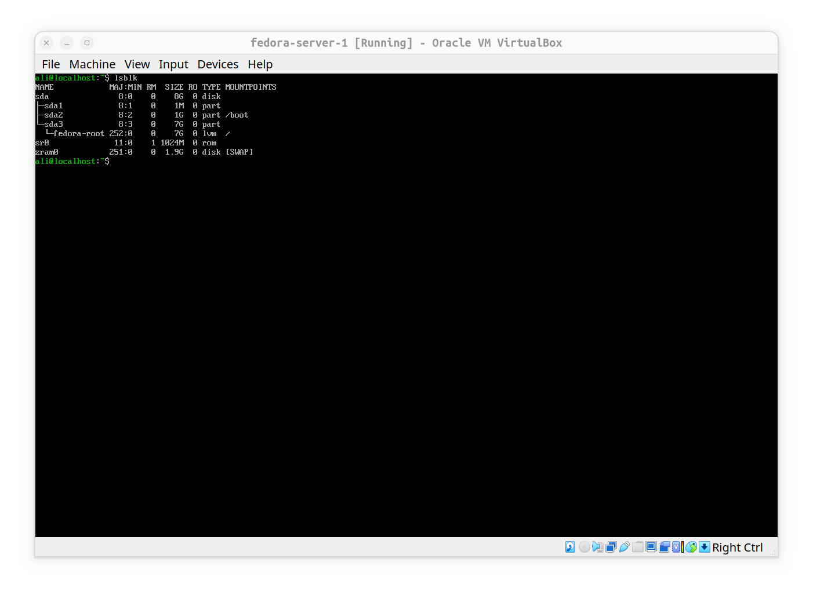
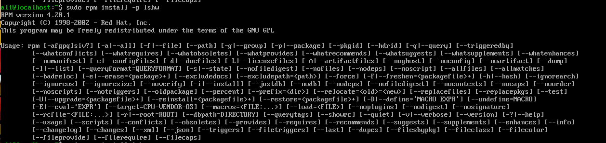
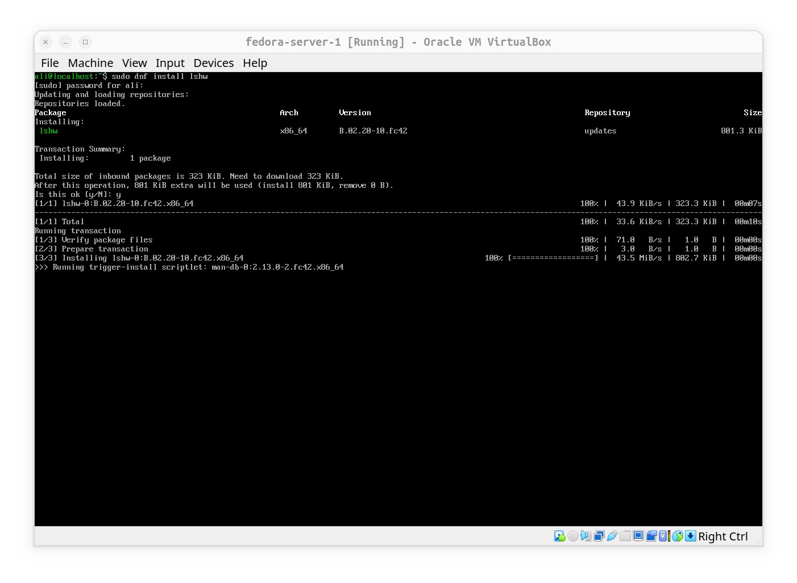

# Practice NO.1: fedora-server installation of `lshw` challanges.

**This** is more like an experiment than a practice. I usually use my ubuntu desktop to do stuff that Jadi does in his lectures, but this time i decided to open my `fedora-server` to do practices.

Commands that worked:

- ### 1- `lsusb`


- ### 2- `lspci`


- ### 3- `lsblk`


- ### 4- `lshw`

the real challange happend here, I typed and entered lshw command, but I had a `command not found` output. I thought a bit and decided to install it using fedora server package manager which i though was RPM; so I typed:
```bash
sudo rpm install lshw
```
and I totally expected to see it works like apt in debian based distros. BUT what I saw was interesting:

 

**it** didn't say I don't exist, but printed a help page which was complicated to understand.

**but then** I googled and saw this explaination:
While RPM is the packaging format, yum is the command you will use to do the installation. For example, yum will resolve and download the dependencies for the package you want to install; rpm will simply complain if you want to install a package that does not have all its dependencies installed.

**What i learned**: RPM is a package format for redhat distros and is sensetive to packages dependencies, but to install packages, we have to use tools like **yum** or **dnf**.

### finally the installation is successful:


### the Result of `lshw` command on virtual fedora-server:


## RPM, Yum, Dnf
*(RedHat Package Manager)* is free and open-source package management system. the name RPM refers to the *.rpm* file format and the package manager program itself and the command tool for installing, removing and ... RPM itself couldn't resolve dependencies of packages when installing or removing, so it used to output error until dependencies are manually installed. so although `rpm` could install software directly from a .rpm file, it does not resolve dependencies automatically resolve package dependencies. so if a library or package is missing the installation may fail until those dependencies are installed manually.

**To** simplify software management, RedHat-based distributions provide higher level package management tools like **yum** and its successor **dnf**. these tools work on top of RPM and automatically download packages from online repositories, resolve dependencies, install required libraries, update software and remove packages safely.

**In other words** RPM is underlying package format and installation engine, while yum and dnf are package management tools that make working with RPM packages much easier. so consider it like this:

1- **.rpm** a shipping box containing a program.

2- **rpm** a worker who opens and installs that single box.

3- **yum/dnf** a warehouse manager who finds the box, orders any missing parts and installs everything automatically.

**and in short,** *rpm* is installer and format of package, and **yum/dnf** are dependency aware package managers built on top of RPM.
