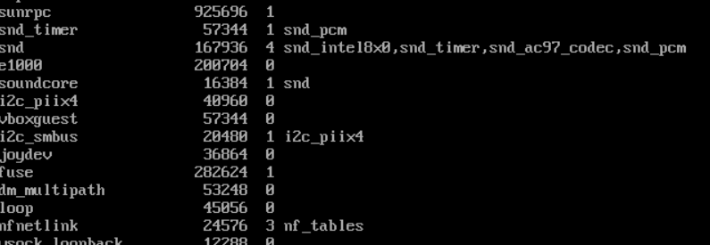
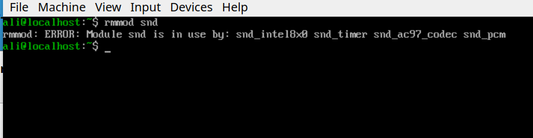
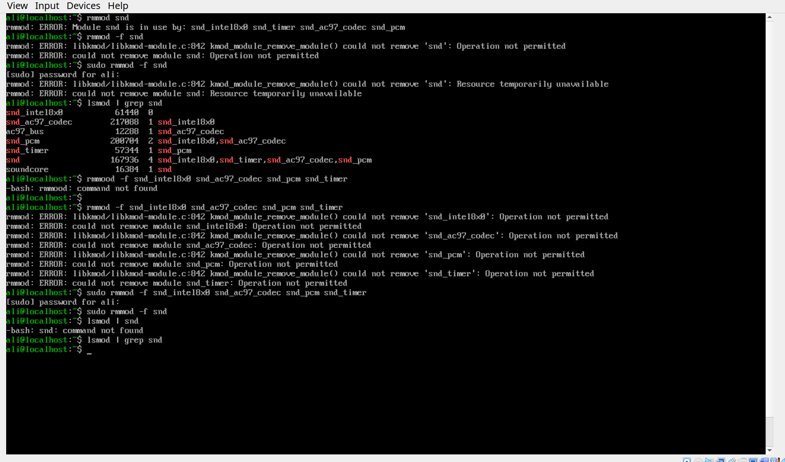
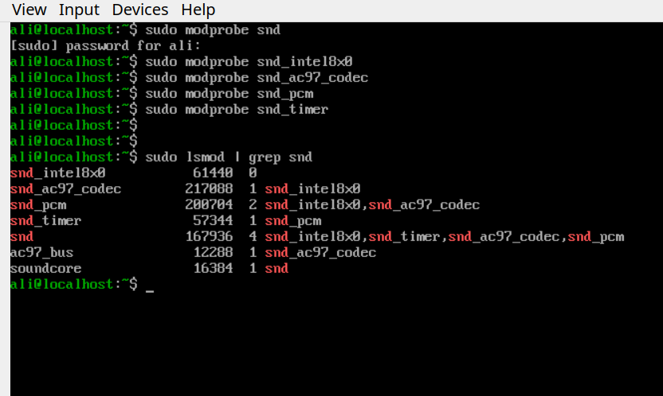

# Practice NO.2: Work with loadable kernel modules.

1- **Find** a module:

2- **I** choose `snd` module, it is used by 4 other modules so it is a bit harder to remove it and as you can see error says module is in use:

3- **As** you saw, it is impossible to remove it by just `rmmod` command, but we also have a switch for `rmmod` to force delete that module, but even if we do this by sudo access or -f switch, it says that the module is not removeable because it is in use by 4 other modules. so I had to remove those four modules accordingly to their dependency to be able to remove `snd`.

4- **Now** I'll put those modules back, but with `modprobe` instead of `insmod` because finding those driver files is a headache:

