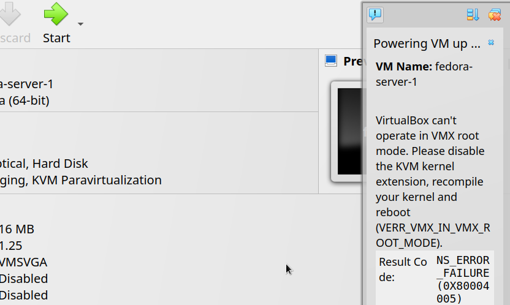
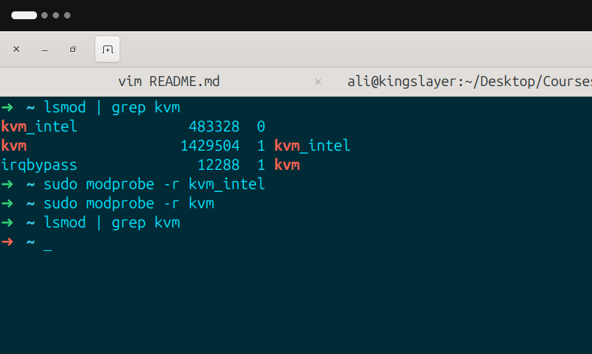
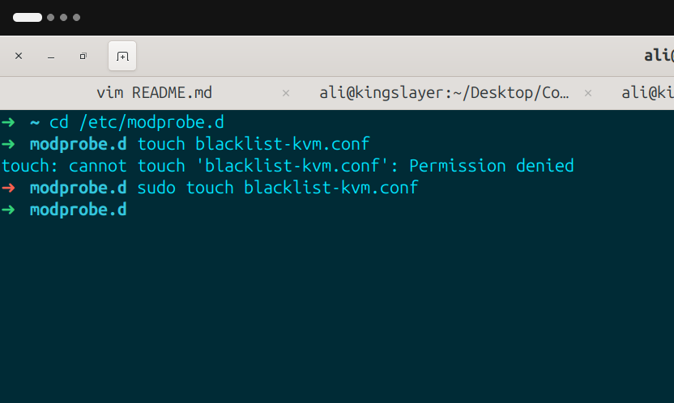
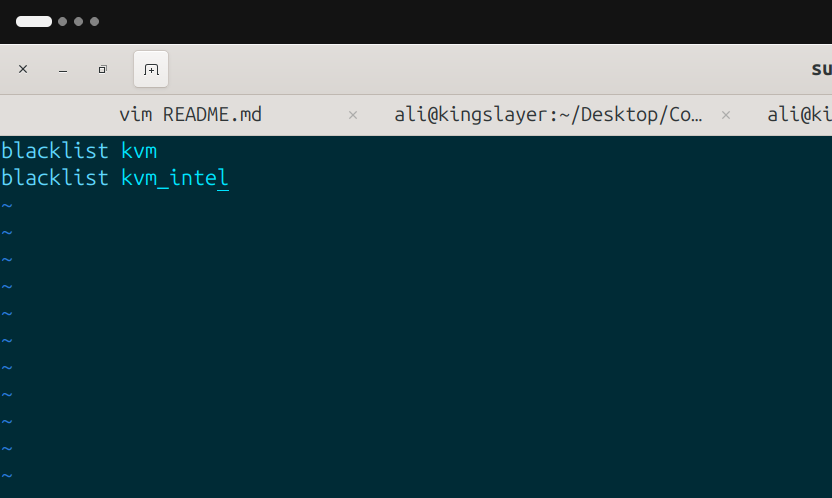

# Practice NO.3: Why I can't start my virtual machines on VirtualBox by Oracle?

1- **Creating** a virtual machine on Virtualbox has been explained on chapter 100-intro, but some Intel processor users get this error:

2- **Backthen** I was confused and didn't really knew what is a kernel extension. so I googled and found out that i have to disable intel's kvm module on kernel:

**After** I disabled these modules, i could see that VirtualBox starts and boots my VMs.

3- **But** the next day when I gone into VirtualBox and started a vm, I faced the same error like yesterday, and that was because disabling a module doesn't mean that it is not gonna get loaded after a reboot or..., so I googled again and foundout that i can put them in a black list in `/etc/modprobe.d` so they don't get loaded again after a reboot:

- 1- create a config file in `/etc/modprobe.d`:

- 2- open config file with an editor and add `kvm` & `kvm_intel` in the created config file with `blacklist` before them:

**So** now kvm module does not get loaded until you explicitly do it.
