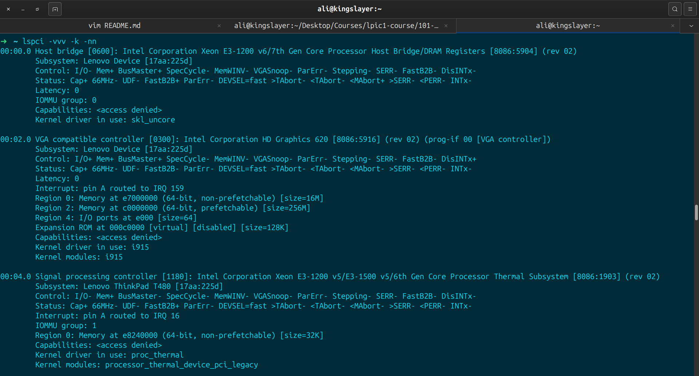
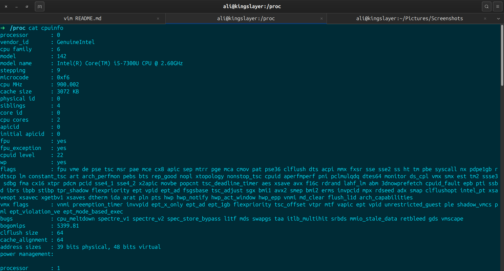
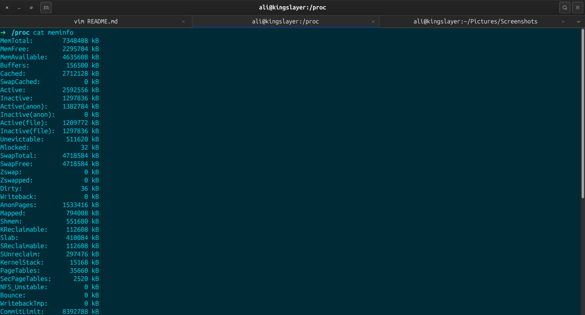
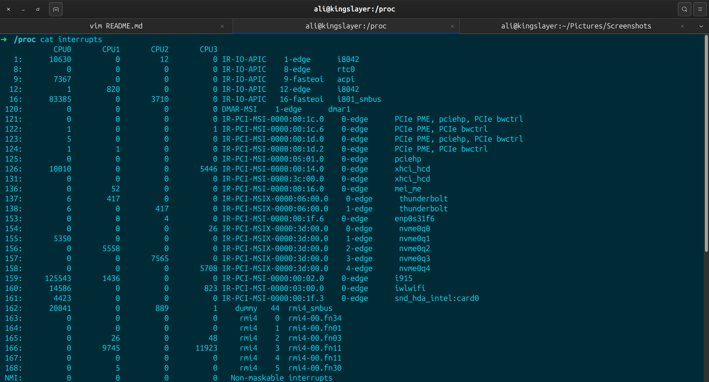

# Exercise for LPIC-1 Objective 101.1 (exam created with ai):

(Determine and configure hardware settings):
On a running Linux system (physical or virtual), perform the following tasks without looking up commands first (try to recall or discover them):

1- Identify all PCI devices on the system and display detailed information about them (including vendor/device IDs and kernel drivers in use).

2- Explore the /proc and /sys filesystems to find:
- 1-CPU information
- 2-Memory (RAM) details
- 3-Interrupt (IRQ) assignments for devices

# Answers
1- pci devs with vendor and device id and kernel drivers in use =>

2-1- cpu information =>

2-2- memory info =>

2-3- interrupts =>

