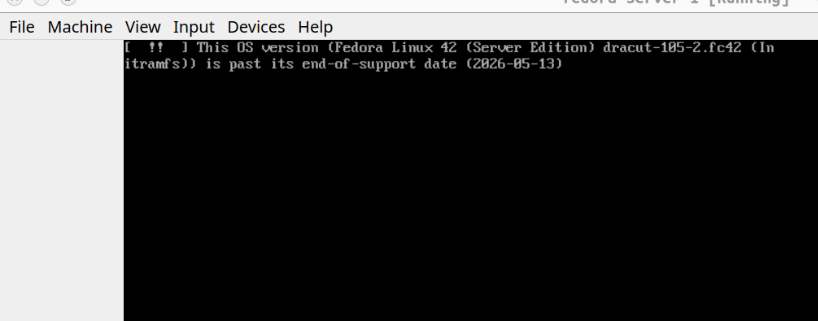
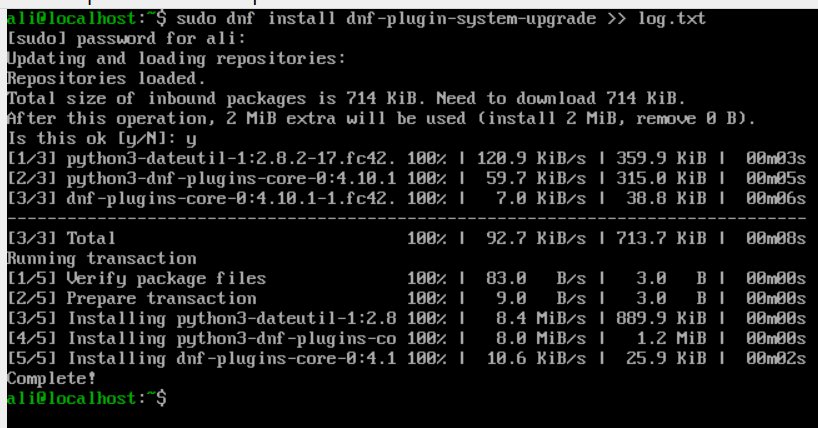
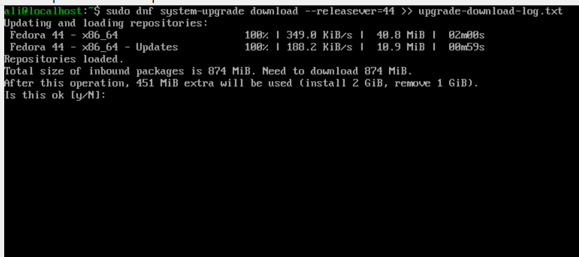
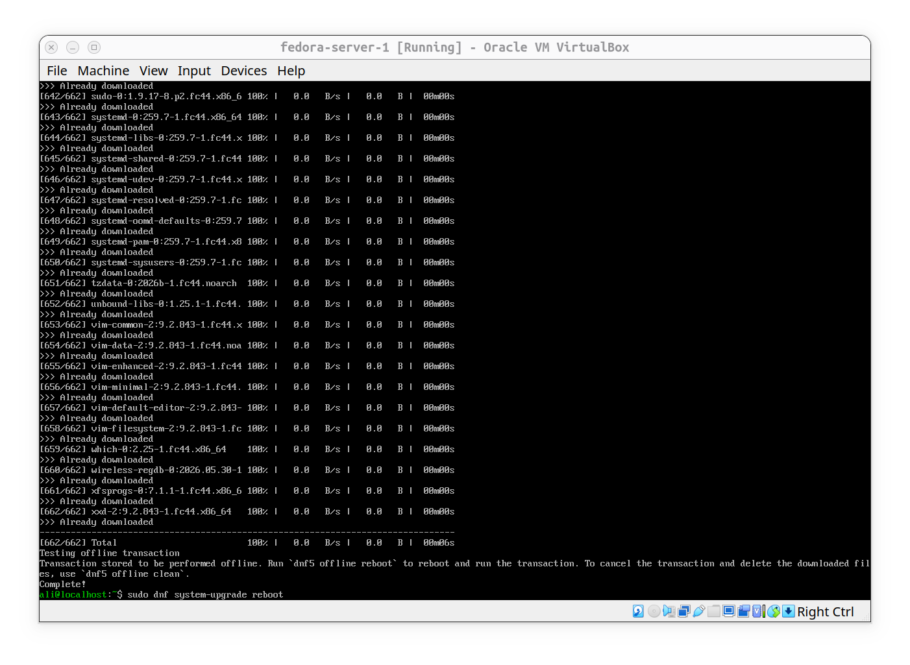
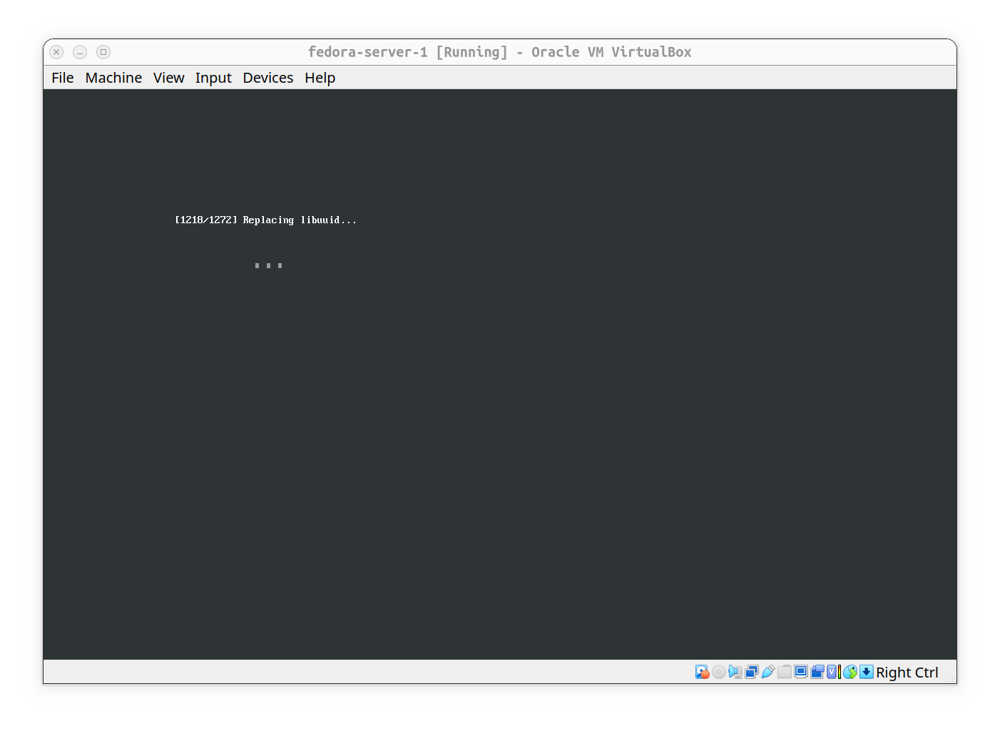
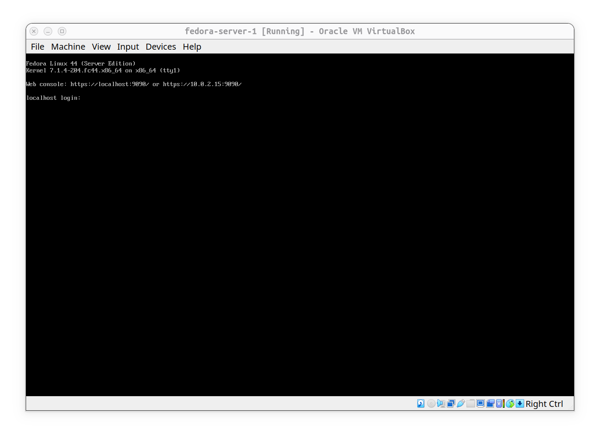

# Experiment: Fedora 42 End Of Life Warning at Boot

## Observation:
During the boot of a Fedora 42 Server VM the following message appears early in initramfs stage:



## Quick Research (ai):
- Fedora 42 released 15 apr 2025.
- Original planned EOL: 13 May 2026.
- Actual offical EOL: 27-28 May 2026 (slight delay).
- Message issued by dracut / initramfs before real root is mounted.

## Why upgrade?
- Unsupported releases recieve no security update
- running EOL systems in production is a risk.

## Related topics 
- 101.1 & 101.2 system architecture and boot process.
- distro lifecycle management.
- Importance of keeping systems on supported releases.

## Solution:

#### 1- first verify that the plugin for systemUpgrade is installed and prepared:


```bash
sudo dnf install dnf-plugin-system-upgrade
```

#### 2- Download the latest or arbitrary release:


```bash
sudo dnf system-upgrade download --releasever=44
```

#### 3- after Download being completed, it needs a reboot:


```bash
sudo dnf system-upgrade reboot
```

#### 4- after reboot this page appears:



#### 5- after installation of upgrade got completed we're done:


