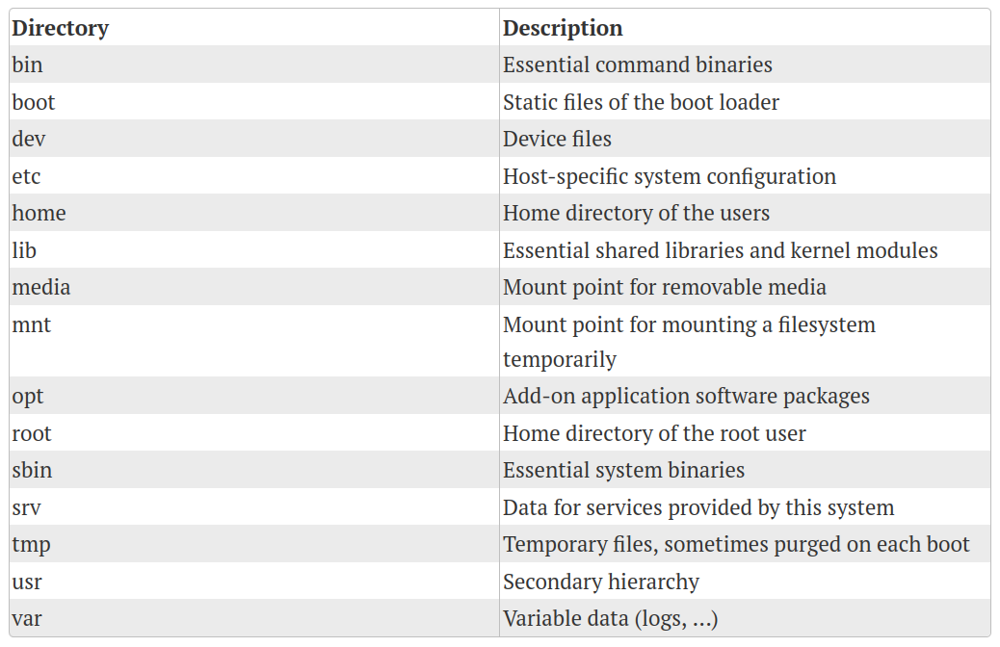
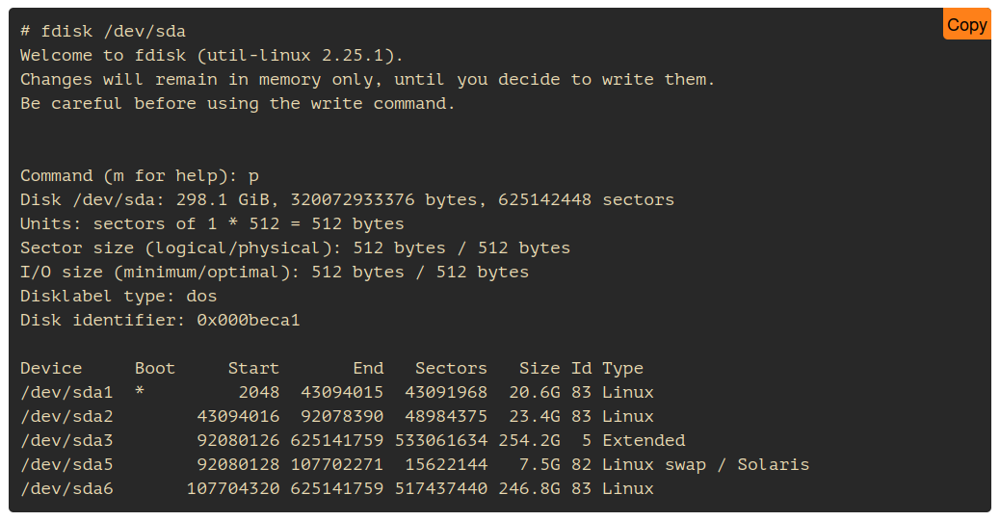
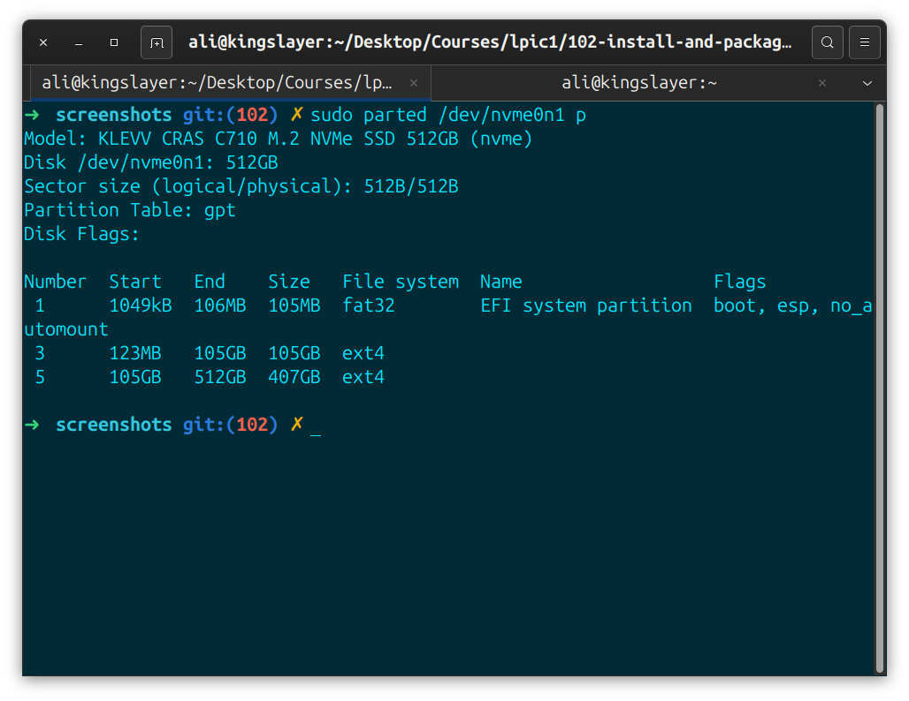
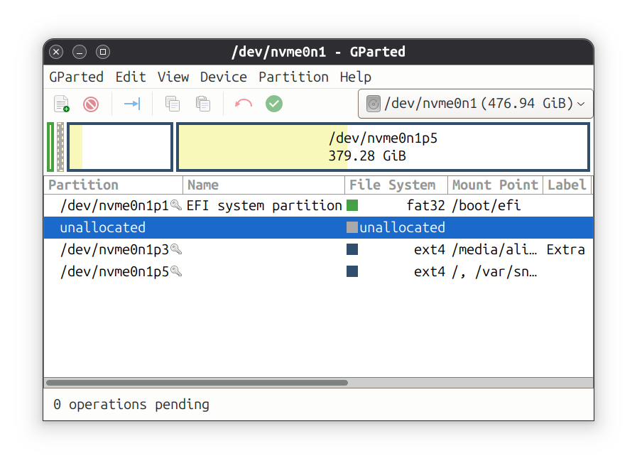

>**Primary refrence:** linux1st.com
> These notes are based on that material and supplements with my own experiments and researches.

# Section: Design Hard Disk Layout

**Candidates should ne able to design a disk partition scheme for a linux system.**

### Key Knowledge Areas:
- allocate file system & and swap space to separete partitions or disks.
- tailor the design ti the intended use of the system.
- ensure the boot partition conforms to the hardware architecture requirements for booting
- knowledge of basic features of LVM.

### The following is a partial list of the used files, terms & utilities:
- root file system
- /var file system
- /home file system
- /boot file system
- EFI system partition
- swap space
- mount points 
- partitions

---

### 102.1 - Part1:

**Like any contempotrary** OS, linux uses files & directories to operate. but unlike windowns doesn't use "A: , F: , C:"....
In linux everything us un one big tree, starting with `/` (called root). any partition, disk, CD, USB, network drive... will be placed somewhere in this huge tree.

**Most of the** External devices (USB, CD) are mounted at /media or /mnt.

# Unix Directories: 
this may be your enlightening moment un linux journey. Understanding file system Heierarchy standart (FHS) can help you find your programs, configs, logs & more without having prior knowledge about them. this table below has been the standard and the latest revision since 2015

### FHS standard:

# Part 1 - Notes

**In FHS** or File System Hierarchy Standard
- in filesystem hierarchy design, everything is like a huge tree on `/` directory.
- shared libraries are libraries that other programs may use. also there are kernel modules as well.
- When we plug in flash disks, they may appear in `media/md` & for example network devices may appear in `/mnt` & sometimes `/run.`

**Sometimes you install** a server and you go and install very specific program or you install elasticsearch for example. it is advices to install it on `/opt` so it will be separated from your server. thats why we use `/opt`

**`/`** is called root but it is separated from `/root`. `/root` is the home directory of the root user.

**`/bin`** vs **`/sbin`**: sbin is special system bineries but /bin is used for command binaries.

**It is dangerous to** edit files in sbin.

**`/srv`**: is an special file system in which you put your things to be served here.

**`tmp`** some apps to work, need a dir for runtime usage. most of files in tmp are gone after reboot.

**`/usr`**: temporary hierarchy/

**/var** only variable files. mostly for logs.

---

### 102.1 - Part2 =>

# Partitions
**in Linux world** devices are defined at /dev/ & and for different types of disk, there are different conventions:
- PATA (obsolete): /dev/hdc
- SATA & SCSI: /dev/sda
- sd/emmc & bare NAND/NOR devices: /mmcblk0 & their partitions are available as: /dev/mmcblk0p0
- NVME: drivers: /dev/nvme0 & their partitions are available: /dev/nvme0n1

**You Have to partition the disks**, that is to create smaller parts on a big disk. these are self-contained sections on the main drive. OS sees these as standalone Disks. we recognize them as /dev/sda (first partition of the first SCSI disk)- `/dev/hdb3` (3rd partition on the second disk).

### BIOS
**Systems were using** MBR & could have up to 4 partitions on each disk, although instead of creating 4 primary partitions, you could create an extended partition & define more logical partitions inside it.

**Note**: an extended partition is just an empty box for creating logical partitions inside it.

**So**:
- /dev/sda3 is the third primary partition on the first disk.

- /dev/sdb5 is the first logical partition on the first disk.

- /dev/sda7: is the 3rd logical of the first physical disk.

### UEFI 
**Systems** use GUID partition table => (GPT) which supports 128 partitions on each device.

**Note**
if you define extended partition on a BIOS system, that will be /dev/sdx5 (1-4 for primary and 5th for extended)

**Linux systems** can mount these partitions on different paths. so you can have a seprated disk with one huge partition for your /home & another one for your /var/logs or /home.

### The newer GUID partition table (or GPT): 
solves these problems. if you format your disk with gpt you can have 128 primary partitions (no needed for extended or logical)

# Commands
## Parted

## fdisk

**Note**: Parted doesn't understand GPT

### Gparted
**a graphical** tool for managing disks & partitions

# LVM
in many cases you need to resize your partitions or even install new disks and add them to your current mountpoint: increasing total size. (LVM is designed for this).

**LVM helps you create** on partition from different disks & add or remove space from/to them. the main concepts are:
- **Physical Volume**: A whole drive or partition it is better to define partitions and not use whole disks unpartitioned.
- Volume Group(VG) this is the collection of one or more PVs. os will see the VG as one big disk, PVs in one VG, can have different sizes or even be on different physical disks.

**Logical Volume**: OS will see lvs as partitions. you can format an lv with your OS and use it.

# Design Hard Disk Layout
disk layout & allocation partitions to directories depend on your usage. first we will discuss swap and boot and then will see three different cases.

### Swap
swap in linux works like an extended memory. the kernel will page memory to this partition/file. it is enough to format one partition with swap file system & define it in (/etc/fstub) (you will see this in later chapter 104).

### /boot
older linux systems were not able to handle huge disks during boot (say terabytes) so the /boot partition was separated, this sepration comes in handy in situations such as recovering broken systems. you can even make /boot read-only. most of the time having 100mbs for /boot is enough, this partition can be on a different disk or separated partition.

this separation should be accissable by BIOS/UEFI during boot (No Network Drive).

**On UEFI systems** there is a /boot/efi mount point called efi system partition or ESP. this contains the bootloader & kernel and should be accessible by the uefi firmware during the boot.

## Case one: Desktop Computer
on a desktop computer, it is good to have one swap, one /boot and allocated all other space to `/`.

## Case two: Network workstation
as any other system "/boot" should be local (a physical disk is connected to the machine).
and most of the time, the `/` is also local. but in a network station, /home can be mounted from a network drive (NFS, SMB, SSH) this lets users sit at any station, login and have their own home mounted from a network drive. swap can be mounted from network or local

## Case three: Server
on servers /boot is still local and based on usage, /home can be local or network. in many cases, we separate the /var cuz logs and many other files are there & being updated so it is good to separate it or even put it on more advanced storage like (RAID disks) to prevent data loss. some people also separate the `/usr` and write-protect it or even mount the /usr from networks so they can change/update one file on the network storage and all the servers will use the new file (if you remember) /usr contains important executeables like apache webserver

### About Z-ram
- Debian use swap partition
- ubuntu 22.04 use a swap file
- fedora 36: zram in short. zram is a virtual disk on your ran which can be used as swap space or be mounted anywhere you like: a common example is `/tmp`. 