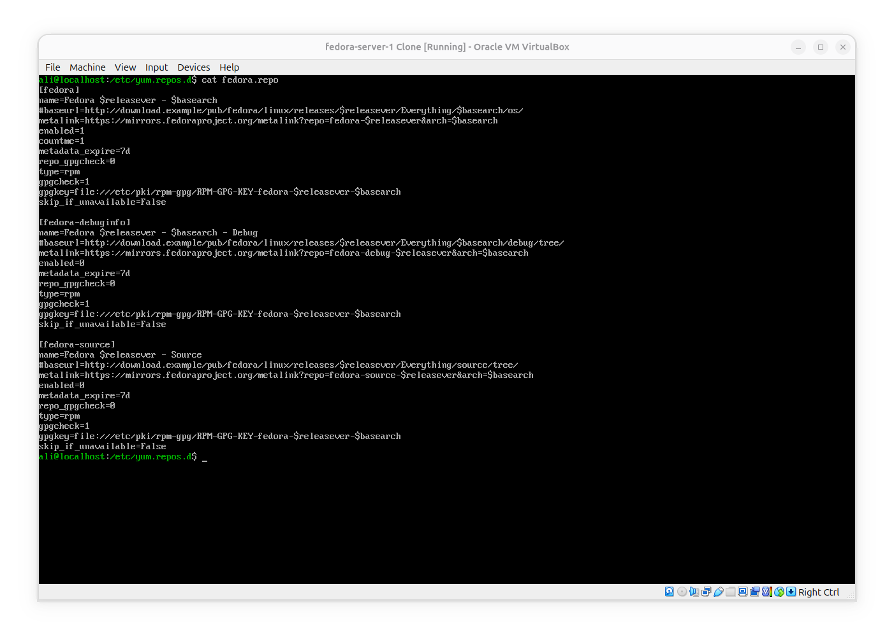
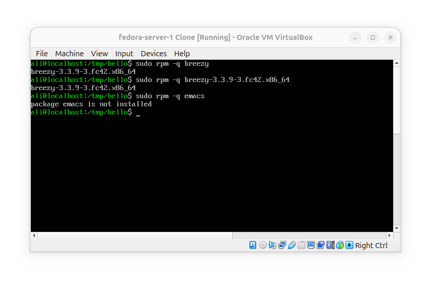
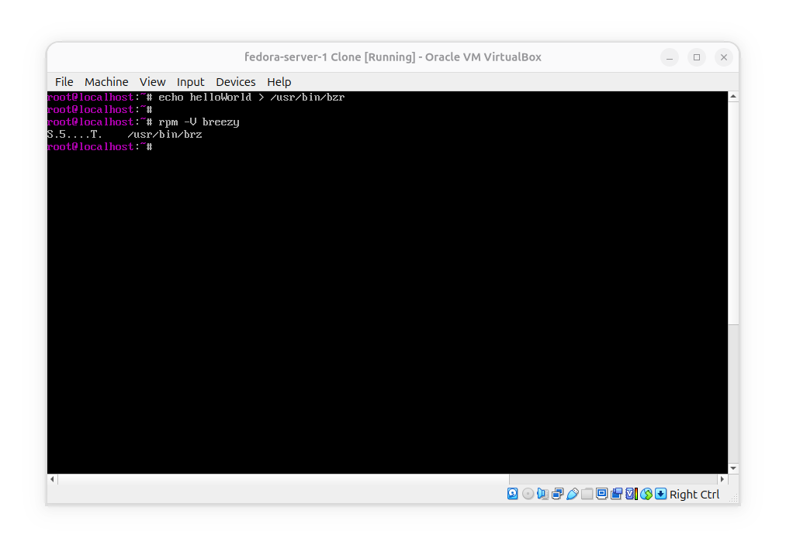
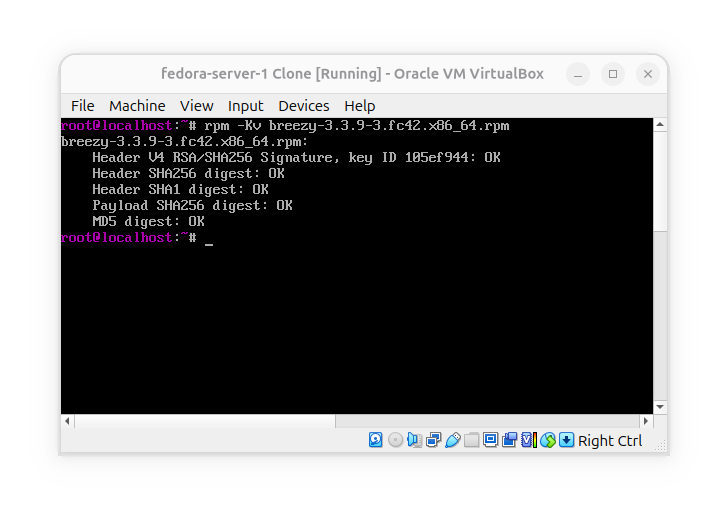

# Use yum and RPM package management
Candidates should be able to perform package management using RPM, Yum and Zypper.

### Key Knowledge areas
- Install, re-install, upgrade and remove packages using RPM, YUM, ZYPPER.
- Obtain information on RPM packages such as version, status, dependencies, integrity, and signatures.
- Determine what files a package provides as well as find which package a specific file comes from.
- Awareness of `dnf`.

### Terms and Utilities
- `rpm`
- `rpm2cpio`
- `/etc/yum.conf`
- `/etc/yum.repos.d/`
- `yum`
- `zypper`

### Table of Content
- [RPM and YUM](#redhat-package-manager-rpm-and-yellow-dog-update-manager-yum)
  - [YUM](#yum)
    - [Yum Downloader](#yumdownloader)
  - [RPM](#rpm)
  - [Install & Update](#install-and-update)
  - [Query](#query)
  - [Verify](#verify)
  - [Uninstall](#uninstall)
  - [Extract RPM Files](#extract-rpm-files)
- [Zypper](#zypper) 
- [Other Tools](#other-tools)
- [Notes](#notes)

# Redhat package manager RPM and yellow dog update manager YUM
**Are used** by fedora, Redhat, centOS to manage packages. the package format for redhat based distros is called "RPM" and can be managed by `rpm` tools; but if you want to use repositories to install, upgrade, search and even upgrade the whole system you can use `yum` command. if you want to go deeper into understanding repositories you should refer to 102.4.

## Yum
**Is** the package manager used by redhat based systems; its configuration files are located at `/etc/yum.conf` and `/etc/yum.repos.d/`. Below is a sample of `yum.conf`:
```bash
➜  ~ cat /etc/yum.conf
[main]
cachedir=/var/cache/yum/$basearch/$releasever
keepcache=0
debuglevel=2
logfile=/var/log/yum.log
exactarch=1
obsoletes=1
gpgcheck=1
plugins=1
installonly_limit=3
```

And here is a sample of an actual repo file on a fedora system:



we use yum like:
```bash
yum <OPTION> <COMMAND> <PKGNAME>
```
One of useful options to use on yum is `-y` which says yes to every Y/n questions while doing operations.

**Some yum commands**:
- `update`: Updates the repositories and updates the name of packages or all if nothing is specified

- `install`: Install a package

- `reinstall`: Reinstall a package

- `list`: Show a list of packages

- `info`: Show information about a package

- `remove`: Remove an installed package

- `search`: Search repositories for a package

- `provides`: Check which package is providing a specific file

- `upgrade`: Upgrades packages and removes the obsolete ones

- `localinstall`: Install from a local `rpm` file

- `localupdate`: Updates from a local `rpm` file

- `check-update`: Check repositories for updates to the installed packages

- `deplist`: Shows dependencies of a package

- `groupinstall`: Installs a group; say "KDE plasma workspaces"

- `history`: Show history of the usage

**Fact**: fedora actually uses `dnf`, so when you enter a command with `yum` the system actually translates your command to `dnf` equivalent of that command.

### yumdownloader
This tool will download rpms from repository without installing anything; and if you need to download all the dependecies too, you can use `--resolve` option:
```bash
yumdownloader --resolve bzr
```

## RPM
`rpm` can run actions on individual RPM files. You can use it like this:
```bash
rpm <ACTION> <OPTION> <RPMFILE.rpm>
```

**Common RPM Actions**:
- `-v`: For verbose output
- `-i` or `--install`: Installs a package
- `-e` or `--erase`: Removes a package
- `-U` or `--upgrade`: Installs/Upgrades a package
- `-q` or `--query`: Checks if the package is installed
- `-F` or `--freshen`: Only updates if it's installed
- `-V` or `--verify`: Checks the integrity of installation
- `-K` or `--checksig`: Checks the integrity of an rpm package

**Note** that each action may have its own options.

## Install and update
In most cases you can use `-U` option which upgrades or installs a package. Note that RPM does not use a database of automatic package installation so it cannot remove the automatic installed dependencies.

If you have an `.rpm` with all of its dependencies you can install them using:
```bash
rpm -Uvh *.rpm
```
this will tell RPM not to complain about the dependencies if it's present in other files. here `-h` creates hash signs to show the progress, `-U` installs or upgrades, and `-v` makes it more verbose.
In some cases if you know what you are doing you can use `--nodeps` to prevent the dependency check or use `--force` to force installation/upgrade despite all the issues and complains.

## Query
A normal query is like this:



Also you can use these options for query:
- `-c` or `--configfile`: show the package's config file
- `-i` or `--info`: detailed info about a package
- `-a` or `--all`: show all installed packages
- `--whatprovides`: show which package provides this file
- `-l` or `--list`: show list of files a package has installed
- `-R` or `--requires`: show dependencies of a package
- `-f` or `--file`: query package owning a file

## Verify
You can verify your package's installation to see if it is done correctly. you can also use `-v` to see a verbose output. this is an output after `/bin/bzr` got edited manually:



After editing the binary You can see that:
- 1- `S`: Size differs
- 2- `5`: md5 sum differs
- 3- `T`: mTime differs

This is part of `man rpm`'s `-V` section:
```bash
    S Size differs
    M Mode differs (includes permissions and file type)
    5 digest (formerly MD5 sum) differs
    D Device major/minor number mismatch
    L readLink(2) path mismatch
    U User ownership differs
    G Group ownership differs
    T mTime differs
    P caPabilities differ
```

You can also check the integrity of an rpm package like this:



The output above shows that the file is valid.

## Uninstall
```bash
[root@fedora tmp]# rpm -e tmux
error: Failed dependencies:
    tmux is needed by (installed) anaconda-install-env-deps-36.16.5-1.fc36.x86_64
```
there are two possibilities when erasing a package:
- 1- `rpm` removes the package without asking.
- 2- `rpm` won't remove a package that is needed by another package.

## Extract RPM Files
The cpio is an archive format like zip, tar or rar; you can use `rpm2cpio` to convert `.rpm` files to `.cpio` and then use cpio tool to extract them:
```bash
[root@fedora tmp]# rpm2cpio breezy-3.2.1-3.fc36.x86_64.rpm > breezy.cpio
[root@fedora tmp]# cpio -idv < breezy.cpio
./usr/bin/brz
./usr/bin/bzr
./usr/bin/bzr-receive-pack
./usr/bin/bzr-upload-pack
./usr/bin/git-remote-brz
./usr/bin/git-remote-bzr
[...]
```

# Zypper
The SUSE and OpenSUSE linux use ZYpp as their package manager engine; you can use YAST or ZYPPER tool to communicate with packages.

These are the main commands for Zypper:
- help: general help
- install: install a pkg
- info: display information about a package
- list-updates: show available updates
- lv: show repository information
- packages: list available packages from specific repos
- what-provides: show the owner package of a file
- refresh: refreshing repos info
- remove: remove a package from the system
- search: search for a package
- update: checks the repos and updates the installed package
- verify: checks a package and its dependencies


# Other tools
Yum and RPM are the main package managers for fedora, RHEL, centOS and ... but there are also other tools like PackageKit which is a graphical tool. it is also good to note that nowadays `dnf` suit is pretty popular and is pre-installed on fedora.

# Notes
- Main configuration files of yum are in these addresses:
```bash
/etc/yum.conf
/etc/yum.repos.d/
```

- Yum's main execution format is as below:
```bash
yum <OPTION> <COMMAND> <PACKAGENAME>
```

- in newer versions of fedora the main package manager is `dnf` and most of the yum's commands will automatically turn into dnf's equivalent.

- When you want to only download a package and for example move it to another system you use:
```bash
yumdownloader --resolve bzr
```
`--resolve` option is used to also get dependencies of a package

You can also use `dnf`:
```bash
dnf download --resolve bzr
```

- In redhat based systems you can see kernel version by running:
```bash
rpm -qa kernel
```
