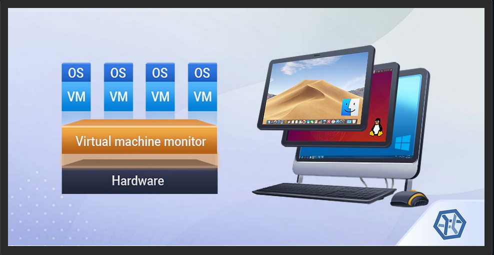
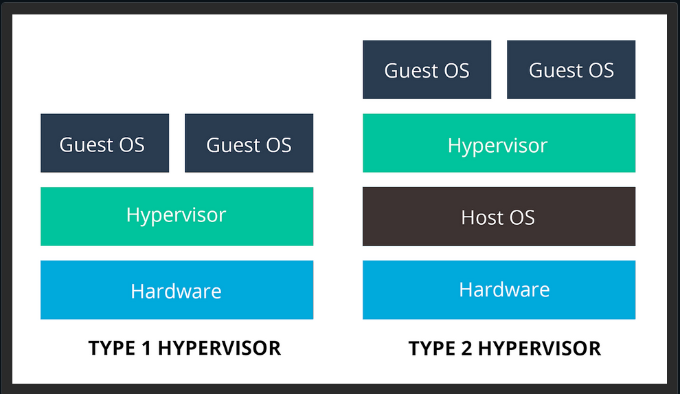
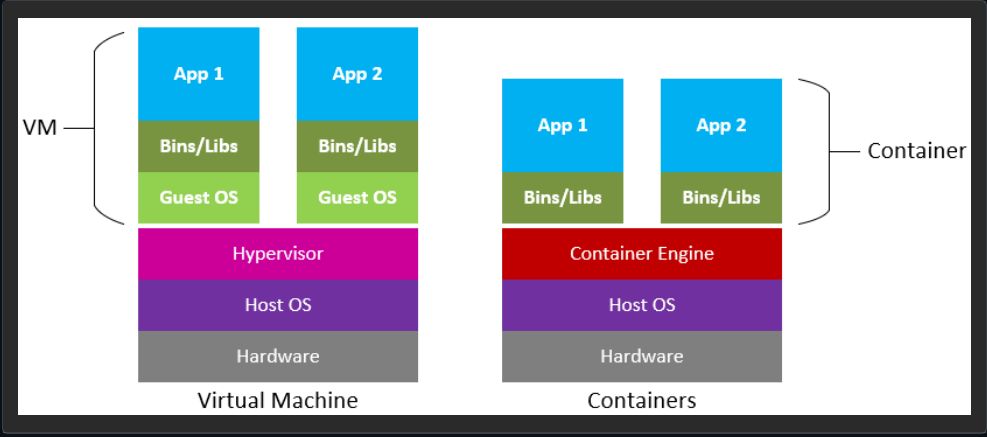
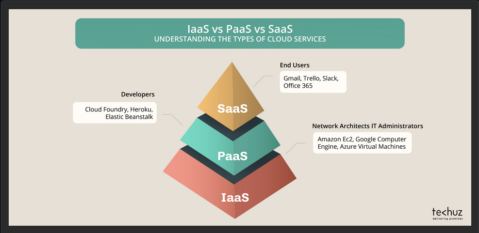

# 102.6 Linux as a Virtualization guest

Candidates should understand the implication of virtualization and cloud computing on a linux guest system.

### Table of content
- [Introduction](#introduction)
- [Type 2 hypervisors](#type2-hypervisors)
- [Type 1 Hypervisors](#type1-hypervisors)
- [Creating Virtual Machine](#creating-virtual-machine)
- [Guest specific configs](#guest-specific-configs)
- [Containers](#containers)
- [IaaS](#iaas)
- [cloud-init](#cloud-init)

### Key knowledge areas
- understand the general concept of virtual machines and containers

- understand common elements of virtual machines in an IaaS cloud, such as computing instances, block storage and networking.

- understand the unique properties of a linux system which have to be changed when a system is cloned or used as a template

- understand how system images are used to deploy virtual machines, cloud instances and containers

- understand linux extentions that integrate linux with a virtualization product

- awareness of `cloud-init`

### Terms
- VirtualMachine
- Linux container
- Application container
- Guest drivers
- SSH host keys
- D-bus machine-id


## Introduction



Virtual Machines are simulated computers. you can use virtual machines to create new computers on top of your running machine and install other OSs there. in some cases it is possible to run only parts of an OS on top of your current OS and this is called having containers.

To run virtual machines we need Hypervisor software (also called virtual machine managers or (VMM)). we have two types of hypervisors.

To check if your OS or CPU supports using hypervisors, check for `vmx`(for intel CPUs) or `svm`(for AMD CPUs) in `/proc/cpuinfo` in `flags` section.

Also You may need to turn hypervisor option on, manually on BIOS or UEFI.

Based on the CPU you should have `kvm` or `kvm-amd` kernel module loaded. if not:
```bash
modprobe kvm
```

If you see a `hypervisor` in `/proc/cpuinfo` means you are inside a virtualized linux machine.


## Type2 hypervisors



These hypervisors run on a conventional OS just like other programs do. A guest operating system runs as a process on host. Type 2 hypervisors abstract guest OS from the host OS. in other words type 2 Hypervisor act as the software between host and guest OS. it completely runs on the host OS and provides virtualization to the guest.

Two of most used type2 hypervisors are VirtualBox and VMware.


## Type1 Hypervisors
These hypervisors run directly on the host's hardware to control hardware and manage guest OSs. For this reason they are somtimes called bare-metal hypervisors. The first hypervisors which IBM developed in 1960s, were native hypervisors; these included the test software SIMMON and the CP/CMS OS; the predecessor of IBM z/VM. Some of most famous Type1 Hypervisors are KVM, Xen, and hyperV. KVM is built in since kernel version 2.6.20.

**Key features**:
- Direct Hardware access: bare-metal hypervisors interact directly with the Host's CPU, memory and storage which enhances performance and efficiency.

- High Security: with no intermediary operating system, they have smaller attack surface, making them less vulnerable to security threats.

- Resource management: They efficiently allocate resources to VMs, ensuring optimal performance for enterprise applications.

**Use cases**:
- Enterprise Data centers: they provide the performance and reliability needed for critical workloads.

- Cloud Infrastructure: Their ability to scale efficiently makes them suitable for cloud services.

- Virtual Desktop Infra (VDI): They can deliver desktops to users, centralizing management and reducing costs.


## Creating Virtual Machine
First we create the machine itself and we tell hypervisor that how much CPU, RAM and storage it needs. then we set a name for our machine and we install the guest OS. This can be done using:
- Installing from a CD/DVD

- Cloning an existing machine

- Using Open Virtualization Format (OVF) to move machines between hypervisors. this is a standard format for virtual machine definition and may include several files; in this case you can archive all of them into one open virtualization archive (OVA) file.

- It is also possible to create templates that are master copies to initiate new machines.

You may need to install some guest drivers or additions to help your hypervisor to have better control over your guest machine. these may include graphical drivers for VirtualBox or scripts to help VMware to control a guest machine or check its status.


## Guest specific configs
Some configurations are machine specific. for example a network card's MAC address should be unique for whole the network. if we are cloning a machine or creating them from templates, we at least need to change these configs on each machine before booting them:

- Host name
- NIC MAC Address
- NIC IP (if not using DHCP)
- Machine ID (delete `/etc/machine-id` or `/var/lib/dbus/machine-id` and run `dbus-uuidgen --ensure=/etc/machine-id`), these files may be softlinks to eachother.
- Encryption keys like SSH Fingerprints and PGP keys
- HDD UUID
- any other UUIDs on the system

**Note:** Some configs may be empty on templates, do not forget to fill them up.


## Containers



It is Also possible to virtualize only parts of an OS; this is called OS-level Virtualization.

OS-level is an OS paradigm in which the kernel allows the existance of multiple isolated userspace instances called containers. This can be done to run an application or a service or even run most parts of an OS for testing purposes.

**Containers vs VMs**:

Containers:
- lightweight: are smaller and faster to start than VMs.
- portability: they can run consistently across different environments (developing, testing, production).
- microservice support: containers faciliate the decomposition of applications into micro services.
Containers- ideal for microservices and cloud-native apps.

VMs:
- strong isolation: provides a higher level of security and isolation, making them suitable for multi-tenant environments.
- Diverse Os support: VMs can run different OSs on the same physical hardware.
- legacy applications: they are more suitable for apps that need a full OS environment.
- suitable for applications needing strong isolation and diverse OS requirements.


## IaaS



As the name implies, infrastructure as a service means offloading parts of your infra to other companies. this means buying services like electricity, cooling or even running hypervisors from another company and just renting Virtual Machines from them. this makes your life easier because for example adding more disk space now only mean paying a bit more for them on your machine Instead of buying new physical hardware and installing them. this is called cloud. you might even be able to move your machine from one continent to another with just a click. 

Samples of these cloud providers are AWS, Google Cloud or Microsoft Azure.

Different cloud providers might provide different level of infra or services, these are some examples:
- Load Balancing: distribute incoming requests between your servers.

- Block storage: Providing Disks to be configured by you and added to your machines.

- Object storage: Let's you save your data directly, like photos.

- Elasticity: Let's you configure an automated increase/decrease in your service capacity based on request volume.

- SaaS: Software as a service let's you to use software you need in the cloud as a service. think of having an online office suit for your company without installing anything on your workstation.


### cloud-init
There are programs like cloud-init which helps you initiate your cloud machine and automatically configure aspects like networking, storage and ssh keys and etc during the first boot-up with ease. This service can help you start machines based on templates on AWS, Azure and ... with ease.
