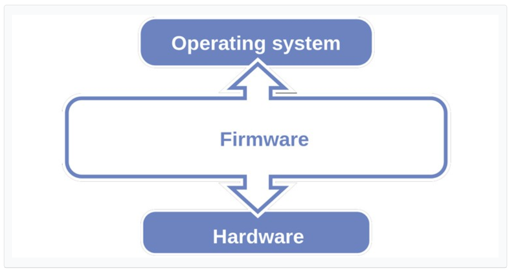
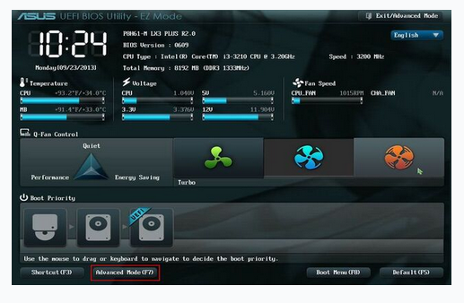
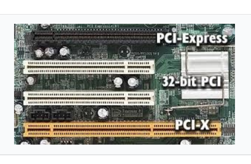
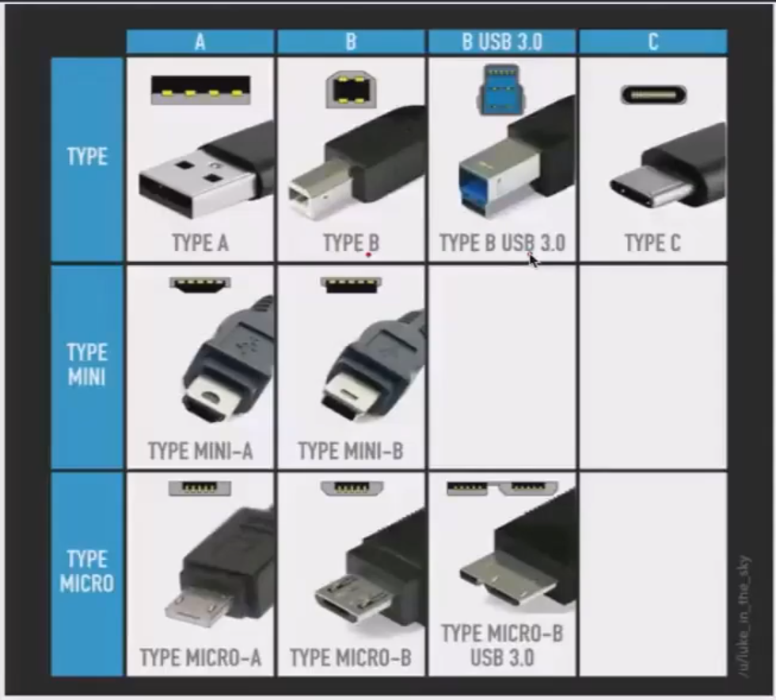
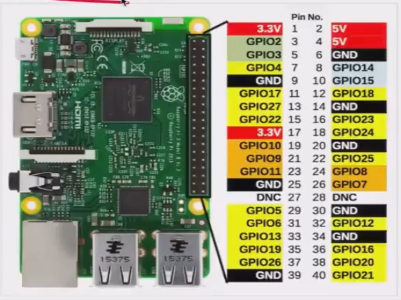
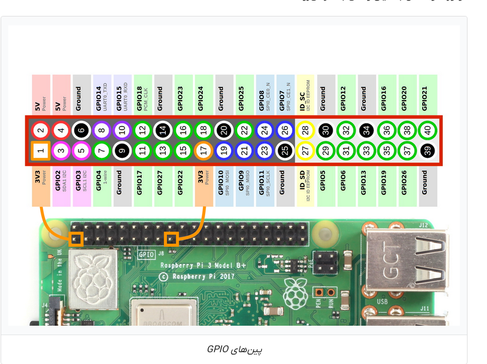

# 101.1 Determine and Configure Hardware Settings
**LPIC** starts from the hardest part, knowing how to install, configure partitions and detect hardware is from those sort of things that even some pro users don't know how to do it without outside help. in 70% of times, even if you're super professional, you don't deal with hardware.

### Section 101.1 Objectives:
- Enable & disable integrated peripherals.
- Differentiate between various mass storage devices.
- Determine Hardware resources for devices.
- Tools and utils to list various Hardware information like **lsusb & lspci**.
- Tools and utils to manipulate **USB** (Universal-serial-bus) devices.
- Conceptual understanding of **sysfs**, **udev**, **dbus**.
- **/sys**
- **/proc**
- **/dev**
- **modprobe**
- **lsmod, lspci, lsusb**

---

### 101.1 - Part 1 =>

## Operating System (OS):
**An** operating system (**OS**) is system software that manages Computer hardware, software resources and provides common services for computer programs. it sits on top of the Hardware and manages resources when another software ( sometimes called a **UserSpace** program ) asks for it. a real example could be a game asking for some space on RAM or graphic card.

## Firmware
**Is** a sort of software that launches the hardware. think of it as a *built-in* **OS** or driver for your hardware. every hardware and even motherboards need some firmware to be able to work. for example think of a keyboard that contains a built-in **Firmware** that allows it to be able to talk with our Operating system and tell it which key have we clicked.

**Motherboards** also use a built-in firmware to integrate Hardware ( like detecting sound or network card ).

### BIOS *( Basic input/output system )*
**Is** one of those old firmwares, in which you could do some limited settings and configurations from a *text-based* menu system and boot the computer from the bootloader which was located on the first sector of the first partition of the hard disk and was called **MBR** or ( *Master-Boot-Record* ). 

Nowadays most of the new systems use a 2-step procedure for boot, because MBR alone doesn't have enough space to store modern bootloaders; so what they do is to load the MBR into memory for **addressing** the cpu to the main bootloader.

### UEFI *( Unified Extensible Firmware Interface )*
**It** is newer, fancier and the standard firmware interface for nowadays modern systems; first it was started started as **EFI** in 1998 by Intel corp to make the booting process more secure and flexible. in this interface we have to register each bootloader; it uses a specific disk partition which is called ( EFI system partition *(ESP)* ) with **FAT** disk format which stands for (*File Allocation Table*) which doesn't have **MBR** size limit.

**On** linux systems we can find the Bootloader partition on */boot* directory which contains files with *.efi* extension, for example on an Ubuntu Desktop it may look like this:

**Now** we know that what does Motherboard firmware do, in short terms it simply recognizes Hardware in our computer and lets the bootloader to boot up the system and the Operating system to use the resources of our hardware to do what we ask for it on User space. 

## Hardware
**We** can have very different types of Hardware in our computer. in early days producers used to put the whole hardware on the motherboard, but with time passing, different users used to come up with different needs and expectations of their systems, so producers had to invent smart ways to cover users needs of different hardware and resources for their systems.

### Peripheral Devices
**Are** Hardware pieces to be used to add new in/output features or connections to computers. these components usually can get connected to the system using these repeatedly evolutioned ways:
- **PCI** *(Peripheral Component Interconnect)*: A motherboard expansion bus.
- **USB** *(Universal Serial Bus)*: The most common external connection standard.
- **GPIO** *(General purpose Input/Output)*: Pins used to directly control electronics.
- **PATA** *(Parallel Advanced Technology Attachment)*: Storage device interface.
- **SATA** *(Serial Advanced Technology Attachment)*: Modern replacement for PATA.
- **SCSI** *(Small Computer System Interface)*: A powerful older interface mainly used in Servers, Workstations, Enterprise storages and ....
 
examples of Peripheral Devices:
- Internal Hard Disk Drives (**HDDs**). mostly via: *SATA/PATA/SCSI*.
- External HDDs with fiber cable. mostly via: *USB/Firewire*.
- Network cards. example: *RJ45*.
- Wireless cards. example: *IEEE 802.11*.
- Bluetooth.
- Video Accelerators. for faster Graphical rendering. 
- Audio cards.

### PCI *( Peripheral Component Interconnect )*
**Was** a workaround to let users to add different Hardware boards and pieces to their computers flexibly, so they weren't forced to change the Motherboard entirely for a tiny Hardware upgrade like for example adding 2GBs memory space to their system.

**We** also have different types of PCI ports, for example PCI-32bits are older and most servers now use **PCI-E** or *( PCI Express )* for it's speed of data transaction.

Some typical PCI devices: 
- Sound cards.
- Network cards.
- Wi-Fi Adapters.
- Capture cards ( captures external sources like a Camera or Game console ).

### USB *( Universal Serial Bus )*
**In** the past, if you needed to connect literally anything to your Motherboard, you had to turn off the system, open up your computer, possibly change your motherboard or connect it via its ports, so you couldn't just do it on the fly when your system was working and etc. so **USB** came up and solved this issue and now you are able to connect many types of external devices via your USB ports to your computer even if it is on work.

**A** simple look at USB technology evolution can say how much it was useful:
- USB v.1: 12 Mbps.
- USB v.2: **480** Mbps.
- USB v.3: **20 Gbps**.

### GPIO *( General Purpose In/Output )*
**Using** GPIO ports, we can have different and arbitrary I/Os. though it is not serial and complex protocols cannot work on it like they do on PCI or USB, using its Pins we can directly control electronics. This technology is pretty popular in:
- Raspberry Pi
- Micro Controllers
- Embedded Systems

**An** example of GPIO pins on a Raspberry Pi:

**GPIO** pins can:
- Read sensors
- Turn LEDs on/off
- Control Motors
- Talk to electronic circuits.

**This** is more *electronics/embedded* world than normal desktop computing.
