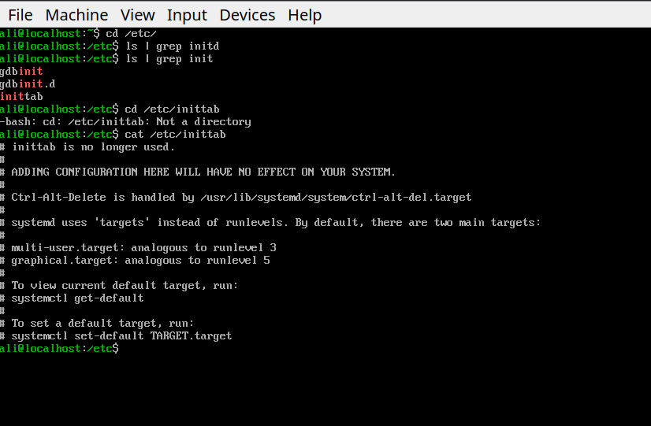

# inittab
**Was** the main configuration file when traditional linux init system which was SysVinit was in charge.

**Its** primary job was to tell init process (PID=1):
- which runlevel the system should boot into by default.
- which scripts or commands to execute when entering or leaving a runlevel.
- which processes should always be kept running (restart them if they exit).
- which actions to perform when events like **Ctrl+alt+del** or a power failure happens.

A typical `inittab` looked like this:
```bash
id:3:initdefault: #boot into runlevel 3 (multi-user text mode)

si::sysinit:/etc/rc.d/rc.sysinit #run system initialization script before anything else

l3:3:wait:/etc/rc.d/rc 3 #execute the runlevel's startup script and wait for it to finish.
	
c1:12345:respawn:/sbin/agetty 38400 tty1 linux	# start a login prompt (agetty) on tty1, and restart it whenever user logs out.
```
**Each line** follows this general format:
`id:runlevels:action:process`

id and runlevel is obvious but action meant: what init should do (respawn, wait, once, initdefault, sysinit, etc)

and process: the command or script to execute.

**Most** modern linux distros today use **systemd** which uses init files and targets (such as multi-user.target or graphical.target) to control startup behaviour. some SysVinit compatible systems may still provide an inittab but on most modern systems it is absent or ignored. for example on an fedora 44 server if you seek inittab you'll see:

