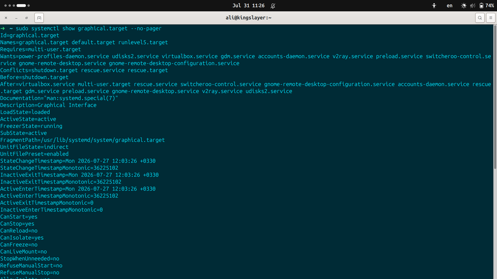

# Observe Graphical target

**The Goal** is to understand graphical target better; its properties, dependencies and purpose.
the first thing on my mind is to use systemd tool to observe graphical target information and properties by using command `systemctl show graphical.target`:

- 1-**As you can see** i've used `--no-pager` option so it won't show me the information in `less` mode.

- 2-**Id**: Id of this target is not in numbers but in string name.

- 3-**Names**: we can access this target by different names (default.target & runlevel5.target). i've notice that the structure is in a way that an old SysVinit user can understand it; that is why we have another name for this target indicating runlevel 5, because SysVinit used runlevels and not targets.

- 4-**Requires**: this property is saying that if you want me to start the *multi-user.target* should be loaded. if not i can't get started too. so multi-user target should at least be loaded so i can get loaded too. **In other words** this section lists the units that must be active for this unit to work.

- 5-**Wants**: this section is explicitely saying that for better experience of gui these services or targets should get loaded. most of them were'nt written into graphical target but for example gdm.service is display manager and for login screen, virtualbox is there because it requested to get started in graphical session and etc. **In other words** this section lists units that systemd tries to start, but they're not required.

- 6-**Conflict**: it is indicating that i cannot work if these services and targets are being used. for example if we enter rescue mode, then we cannot have both these targets together, so rescue mode alongside graphical mode is impossible. **In other words** this section lists units that are mutually exclusive with this unit.

- 7-**Before** means graphical target should get stopped before reaching the state wroten in Before. which is shutdown target and means system should leave graphical target before entering shutdown target. **In other words** this section specifies what should happen after this unit in the startup/shutdown order.

- 8-**After** only specifies ordering. it says that if those are started they must start before `graphical.target`. it does not cause them to be started. **In other words** specifies what should happen before this unit in startup/shutdown order.

# Conclusion
`graphical.target` is mainly an ordering and dependency target. it does not contain graphical interface itself; instead , it coordinates other services and targets needed for a graphical session.