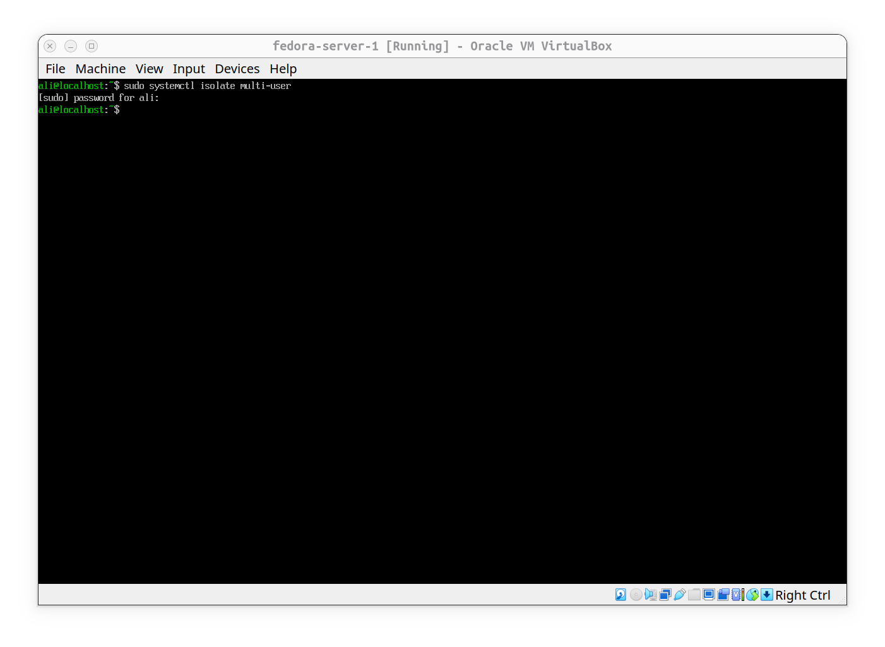
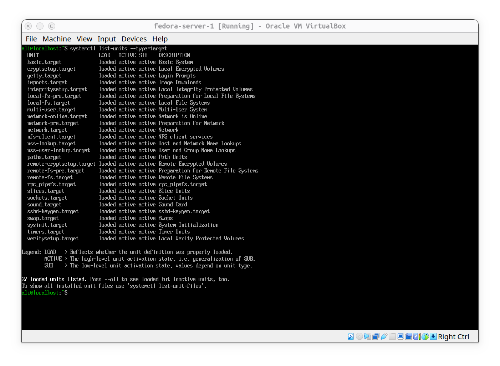
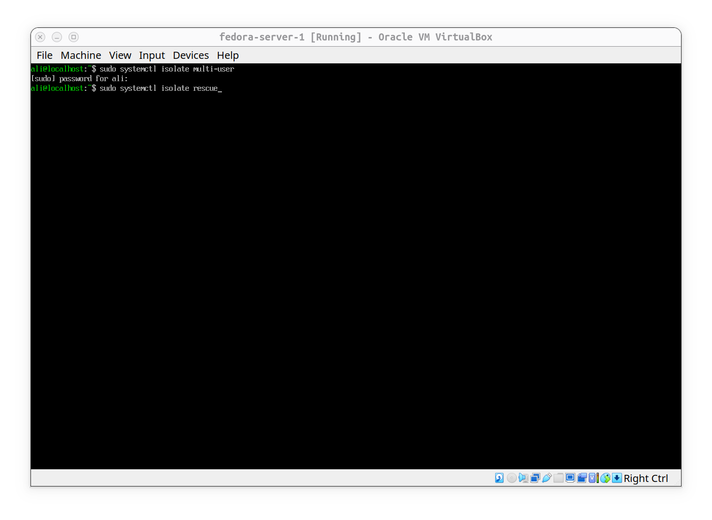
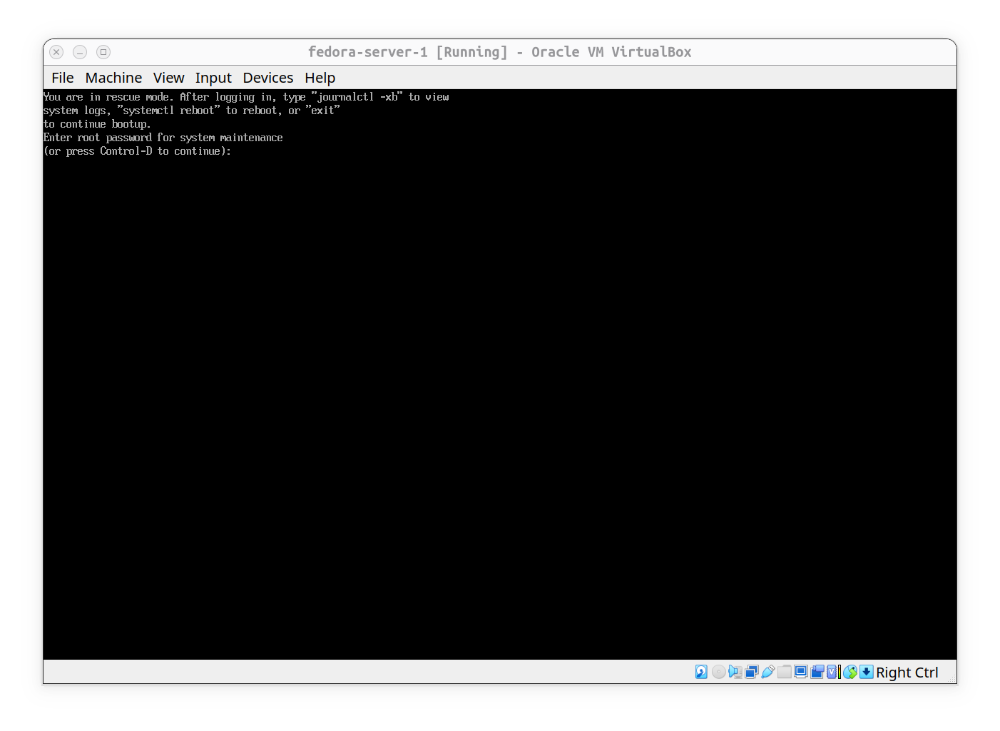
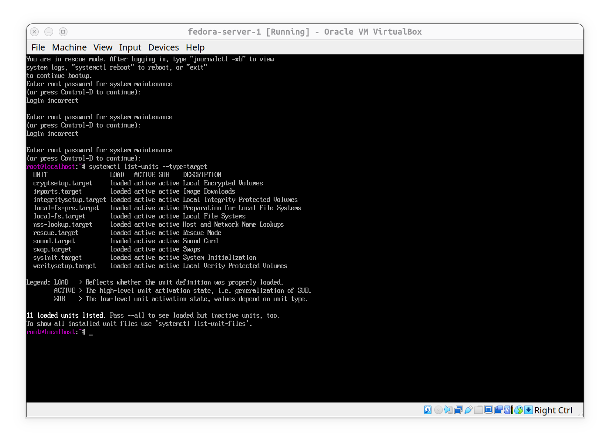
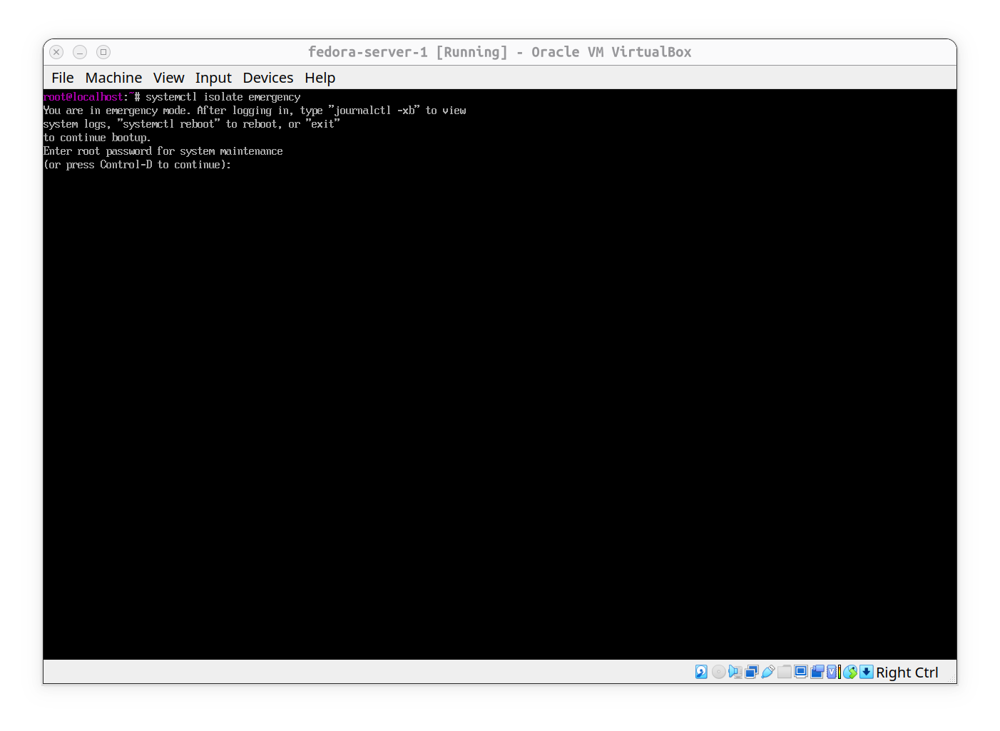
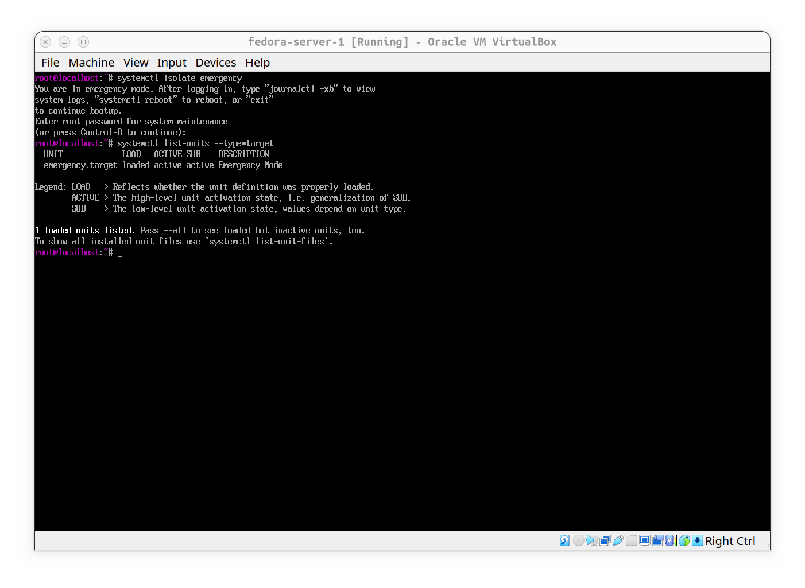
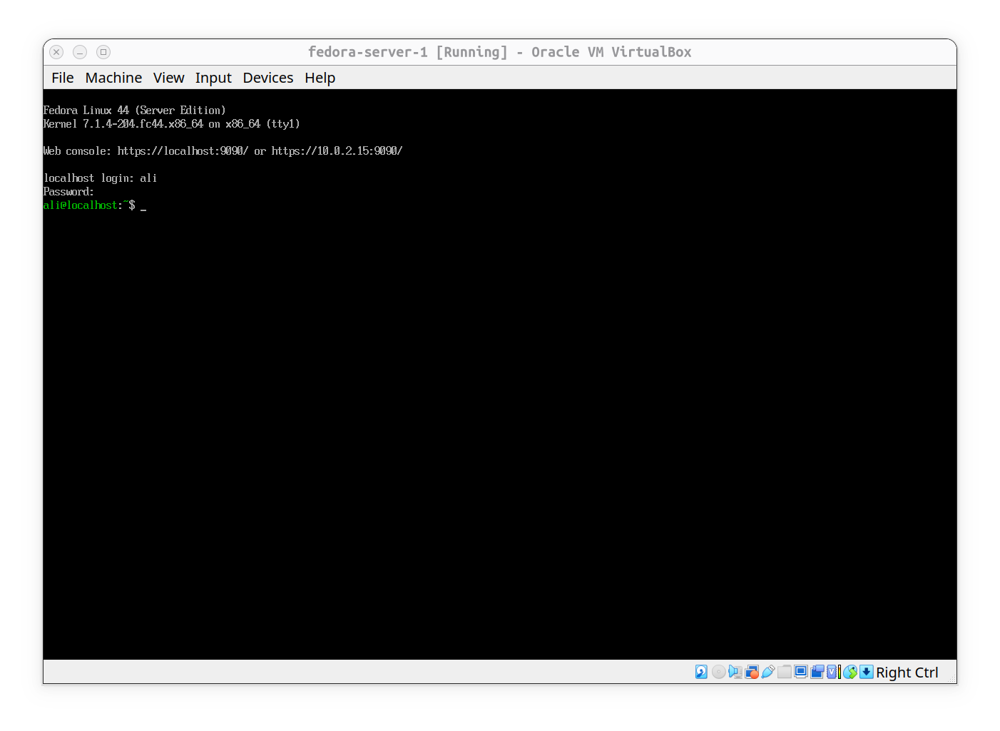

# Traversing Between BootTargets

**The Goal** is to know better how to move between boot targets and which targets are active in each mode.

- 1- **Multi-User**: since we are doing the practice on a fedora server, there is no graphical target, so if we try to isolate multi-user nothing special happens:

#### Loaded and active targets on `multi-user.target` are:

- 2- **Rescue**: in rescue mode (maintenance), Local file systems are mounted, but there is no networking and only root user can use it:

#### It asks for root password because as we said only root user can log into rescue mode:

#### Also there are less targets activated and running on rescue mode, for example we cannot see `network.target`:

- 3- **Emergency**: only root file system is available and in read-only mode. no networking and root user only. this target provides minimum enviroment needed to recover the system:

#### When switching on emergency mode, no any other targets are available and activated:

- 4- **We Can** Switch back to multi-user in one movement:

#### And as we can see everything got back to normal:

# Conclusion
Each boot target has some specific targets available. we do not have networking on rescue mode and we can't even write into a file in emergency mode. these boot targets mostly are used for maintenance and as we move from `multi-user.target` to `rescue.target` and finally `emergency.target`, we'll have less access and permissions, and fewer targets and services to use. this provides a simpler environment for troubleshooting and system recovery. 