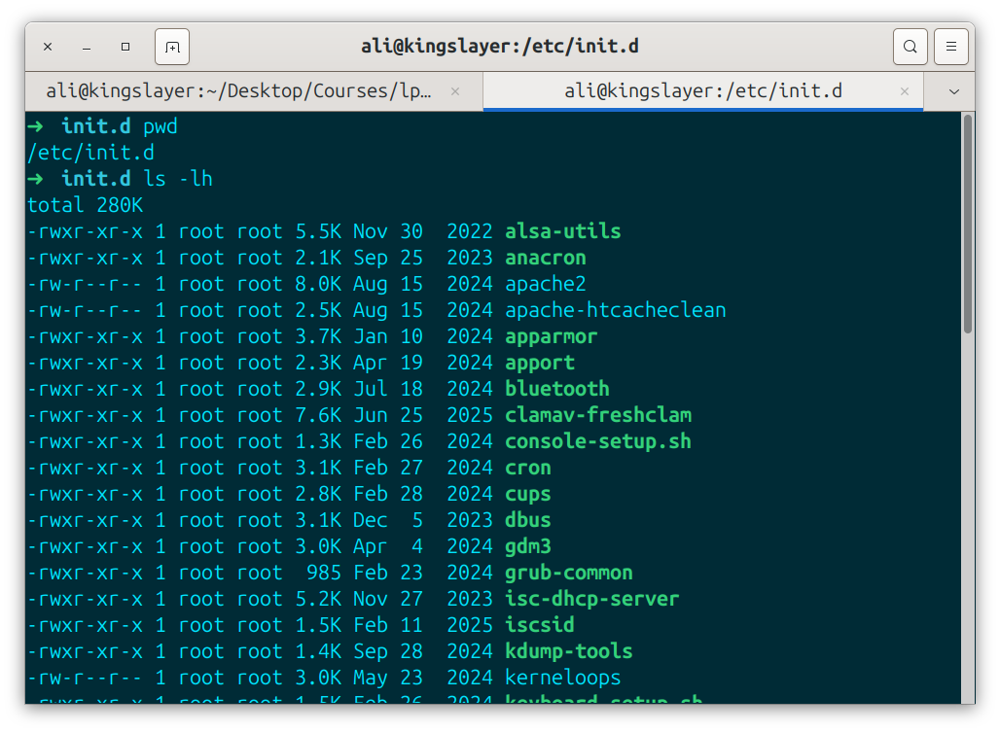
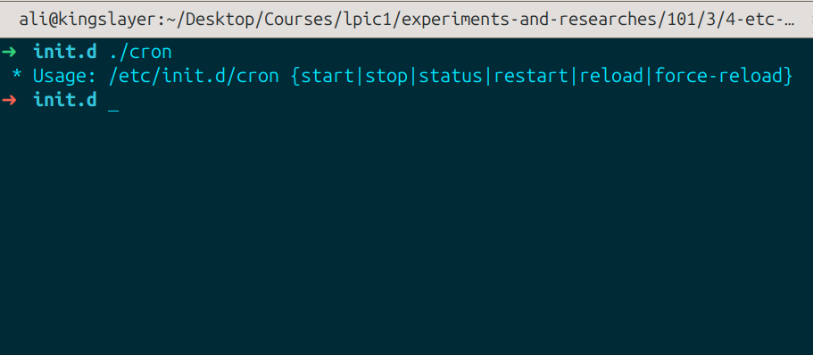
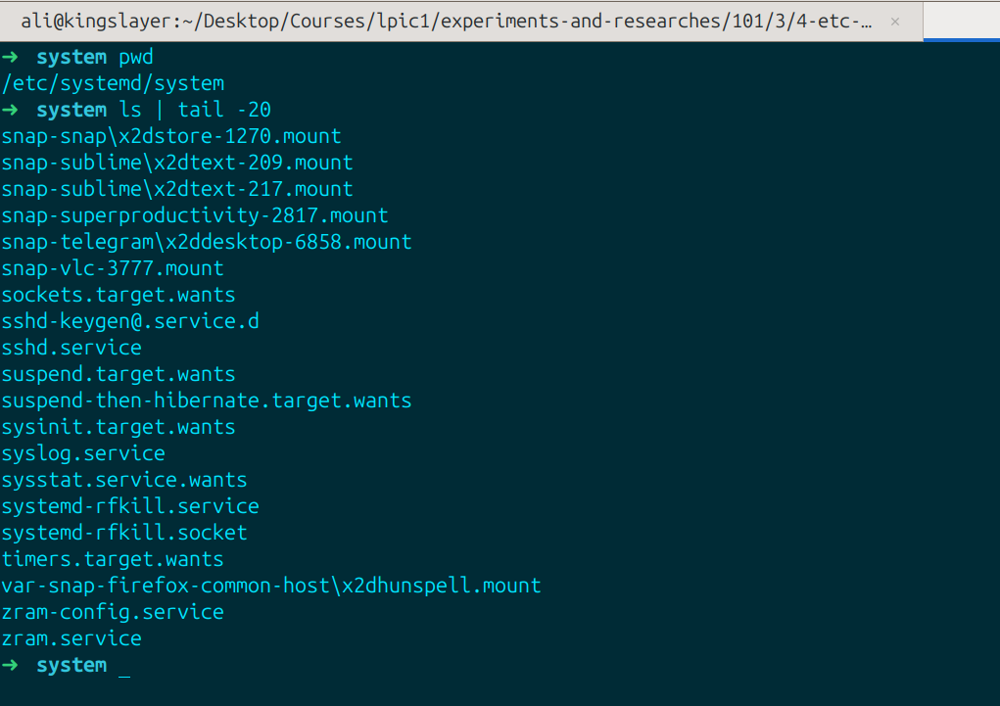
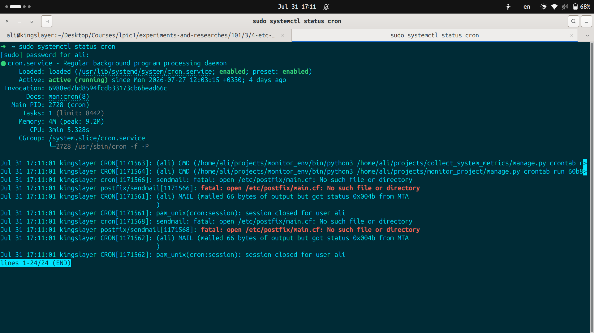
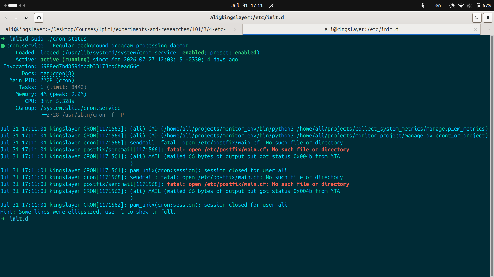

# /etc/init.d

#### Where does `/etc/init.d` come from and what is it?
it is a directory in linux systems that contains initialization scripts that used to start, stop and manage system background services. it belongs to the traditional SysVinit style of managing the system boot process and services.
most of the linux distros replaced SysVinit with systemd but kept `/etc/init.d` to remain compatible with older software.

#### How does it work? 
- Service Scripts: files inside this directory are written in shell script language to handle actions like "start", "stop", "restart" or "status" for programs like webservers or databases.

- Runlevels and links: the system connects these scripts to `/etc/rc*.d` foleders using shortcut links (symlink) so they run in the correct order when a system enters or leaves a runlevel during boot or shutdown.

- Manual use: An administrator can run these scripts directly from the command line using root permission(for example `sudo /etc/init.d/cron status`)

#### Does these scripts have .service files too?
Many services have native .service files. Older SysVinit scripts can also be managed and generated by systemd through its compatability layer, even if no native .service file exist. in the /etc/init.d. systemd spreads these .service files into three main directories based on how they were installed.

- `/etc/systemd/system`: for administrators and custom services you write yourself.

- `/run/systemd/system`: Temporary and volatile services created automatically on runtime.
- (debian)`/lib/systemd/system` & (RHEL)`/usr/lib/systemd/system`: Standard unit files installed by the distribution or package managers like (apt | dnf).

#### Does it make a difference using a service in systemd way or in traditional way?
- When following systemd way, we mainly use `systemctl` command; for example: 

- When following traditional way, we invoke the system shell script directly instead of using `systemctl`:

### Conclusion
Systemd kept `/etc/init.d` directory for compatability with older software, and using scripts to perform a task on a service usually produces the same result as using systemd tools on a service. also systemd replaced bash script wise service providing with service files that use a declarative structure to describe the desired state of a service so instead of bash scripting the systemd itself determines how to reach that state.