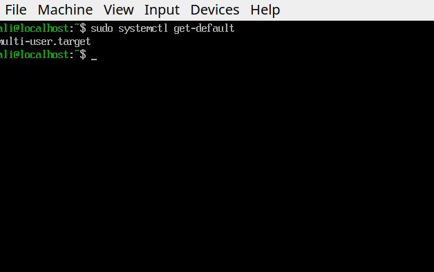
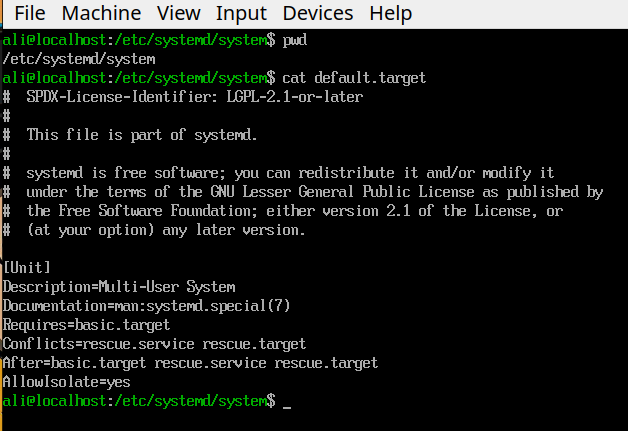
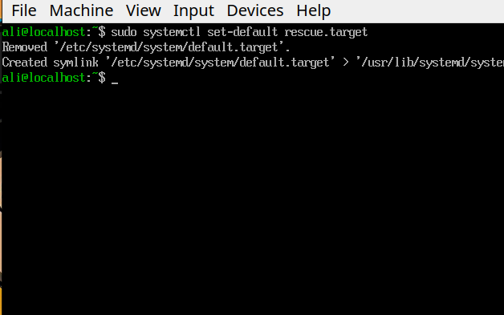
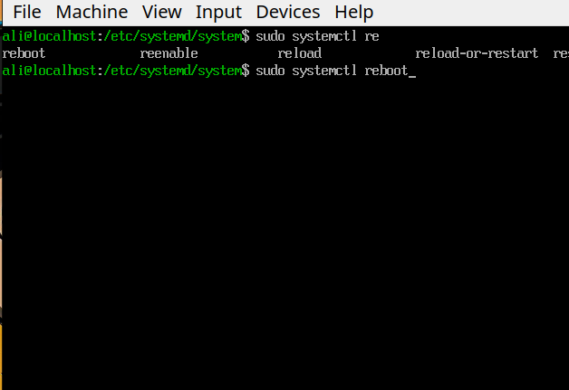
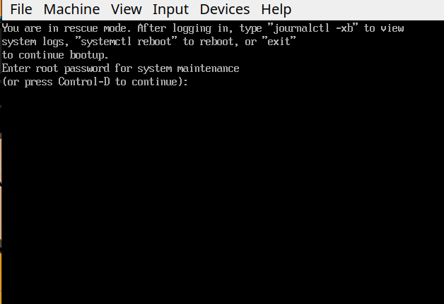
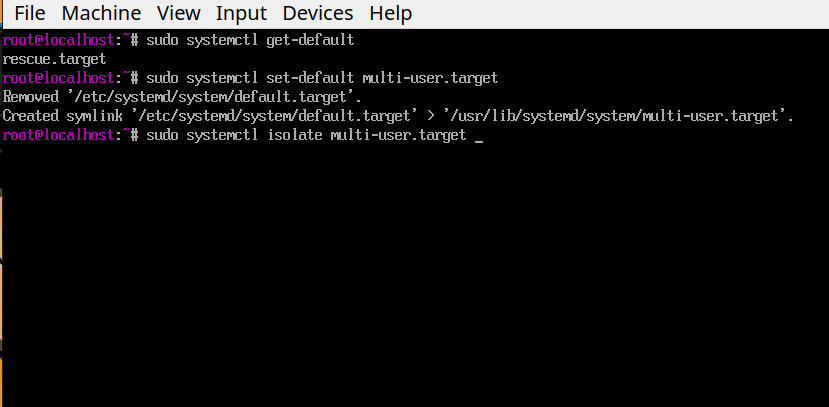
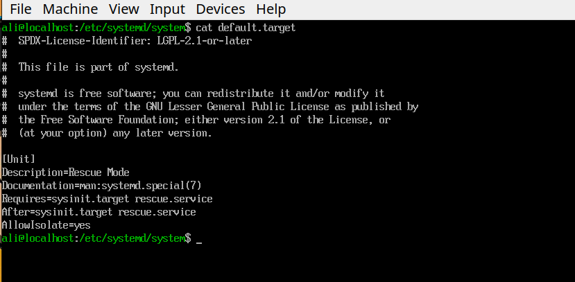

# Set Default Target

**The Goal** of doing this is to know better how to set default target for systemd.

- 1- See current default target:

- 2- Inspect the `default.target` unit file:

- 3- Set default target to rescue mode:

- 4- Reboot the system to see if it works:

- 5- We successfuly boot into rescue mode:

- 6- Change back the default target into "multi-user" and isolate multi-user:

# Conclusion
**When we change** default target, `systemctl set-default` updates the `default.target` symbolic link in `/etc/systemd/system` so that it points to a different target unit (for example: `rescue.target`) in the `/usr/lib/systemd/system` directory, therfore `default.target` changes from this:

**into this**:

