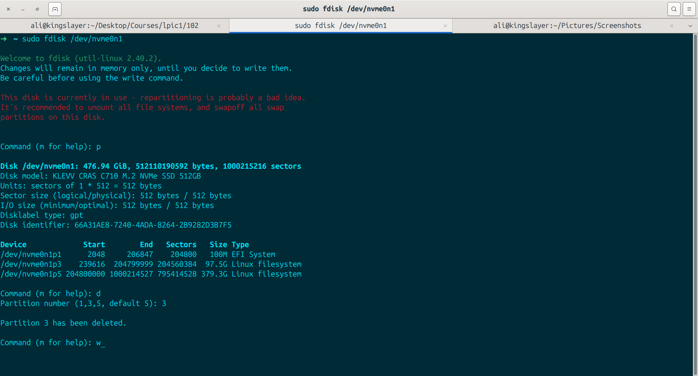
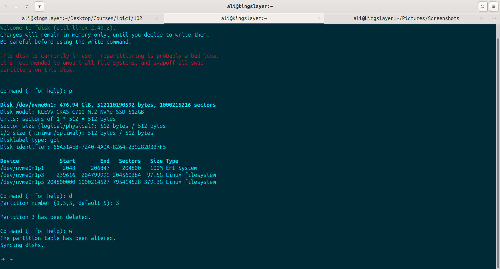
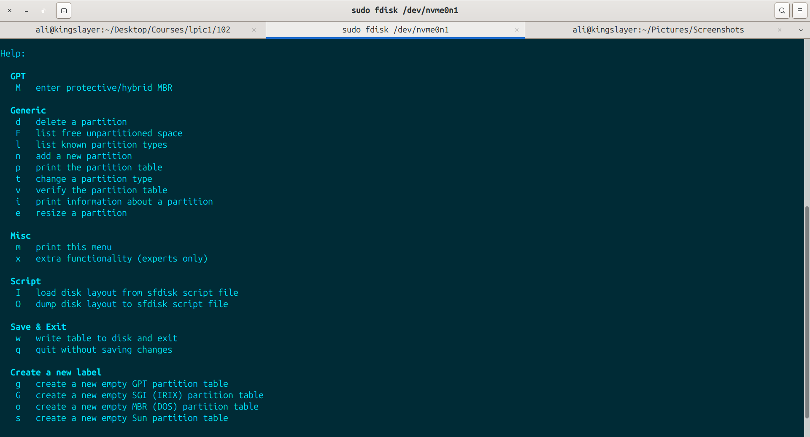
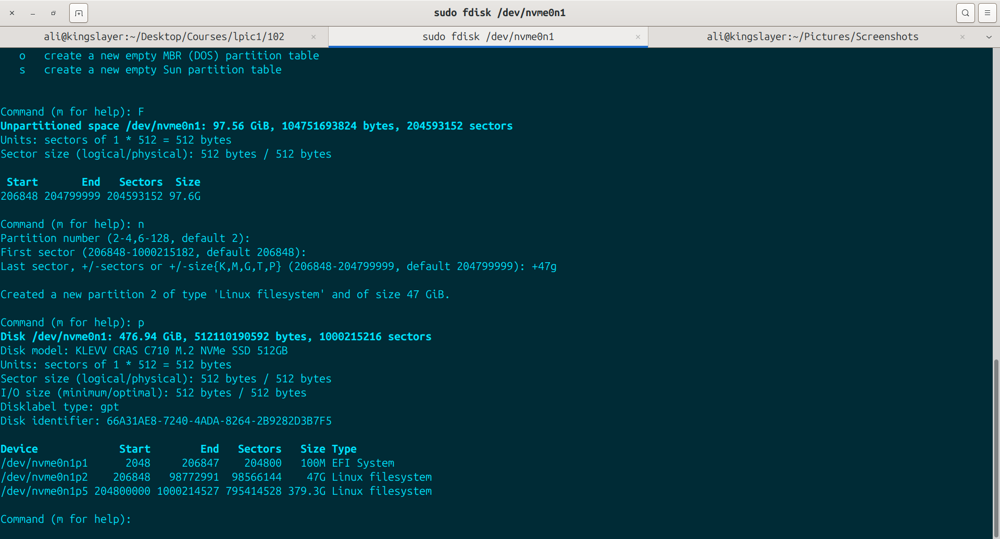
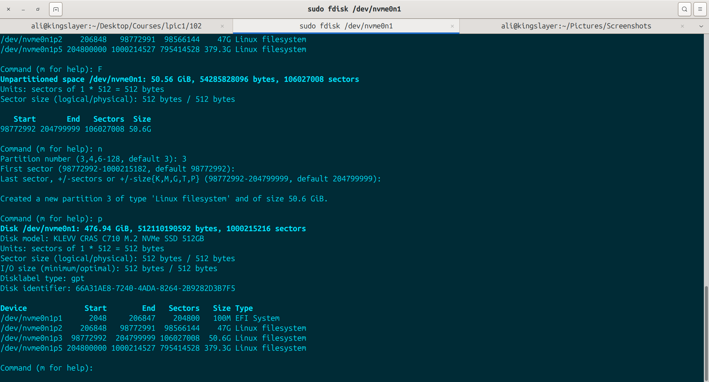

# Separeate a gpt partition into two by fdisk
I had an **unused** partition in my disk so i decided to seperate it into two to better use them:

- Delete The Partition:

- Then I have write the changes with command `w`:

- Then I took a look to manual to find the command for cognizing free unallocated space on disk which was `F`:

- After i saw i have 97gbs free space, i used `n` command to create a new partition with 47gbs space:

- Now as you can see i created two partitions with 47gbs and the other with ~50gbs:

## Now that i created two separated partitions, i need to create filesystems for them too. i will do it in another exercise called "2-create filesystem"**
