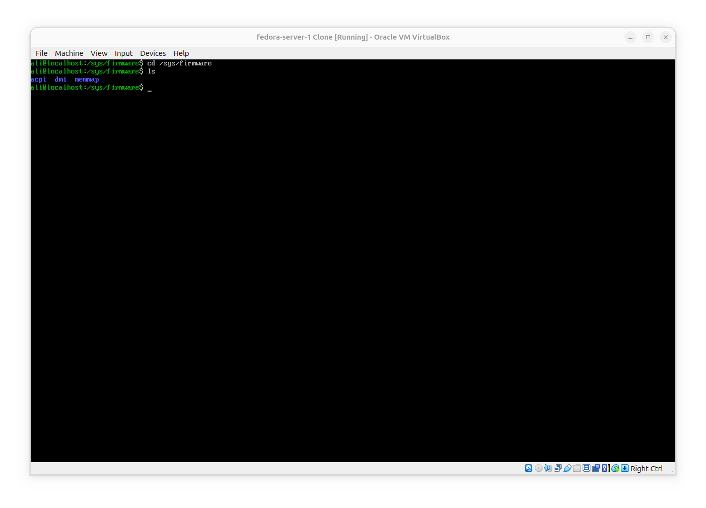
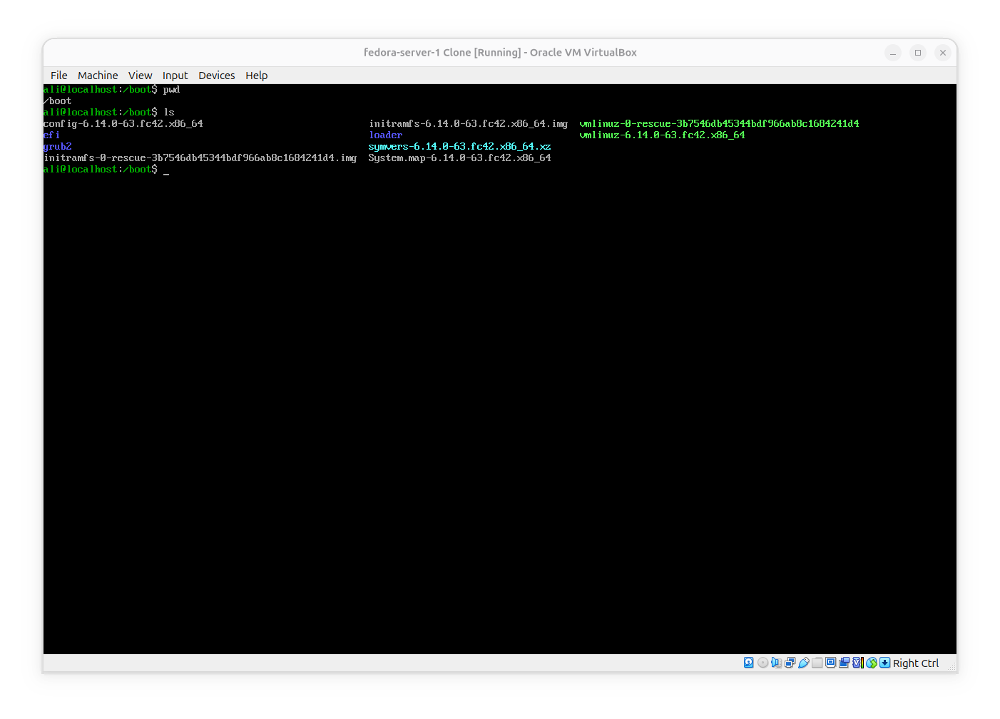
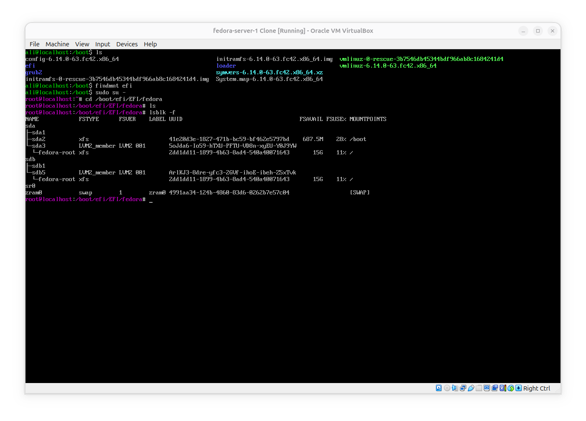
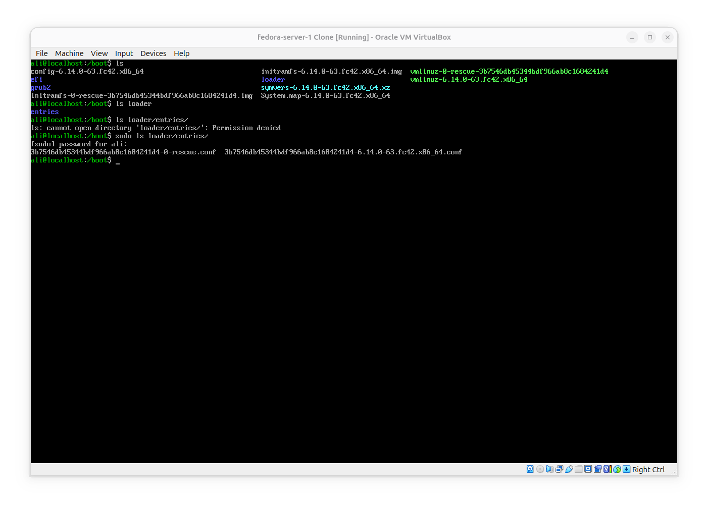

# Explore Boot Setup
**The Goal** of this experiment is to Understand more about Boot setup.

## Check wether the vm is booting with BIOS or UEFI
- 1- Enter `/sys/firmware`, if there is a directory named "efi", the vm is using UEFI and if not it is BIOS:

## Explore `/boot`:

- 1- As you can see there is a directory named efi. I could not see an efi directory in `/sys/firmware` so i concluded that the system is BIOS, but why there is an efi folder in boot directory?

**Turns out** that if there is a `/boot/efi` it doesn't mean the system is UEFI. the directory is empty and is not a mount point for any ESP or simply a disk and the cause of its existance may be that the OS was installed with UEFI support in mind. also there is no any ESP among partitions:

- 2- **I already learned about** content inside /boot, but `symvers` and `loader` are still unfamiliar, so i do a research:

**the symvers-<kernelversion>.xz**: it is not normally used for system boot, but it contains information about symbols exported by the kernel and is mainly used for building kernel modules because it helps the kernel's build system to check wether a module was built against compatible kernel symbols.

**/loader**: we can find `/entries` inside it. entries dir can contain **Boot Loader Specification** or (BLS) describing installed kernels. for example an entry can tell the bootloader 1- which kernel to load, 2- which initramfs to load and 3- what kernel parameters to use. so entries folder are individual descriptions of how to boot each installed kernel.

## Conclusion
- 1- A BIOS system may still have complatability options for a newer system firmware like UEFI.
- 2- VM uses BIOS as default firmware
- 3- symvers is a file exported by kernel to check wether a Module has been built (not) against compatible kernel symbols.
- 4- `loader/entries` are designed for boot loader with describtions about kernel, initramfs and kernel parameters to use which are called **BLS** entries.
