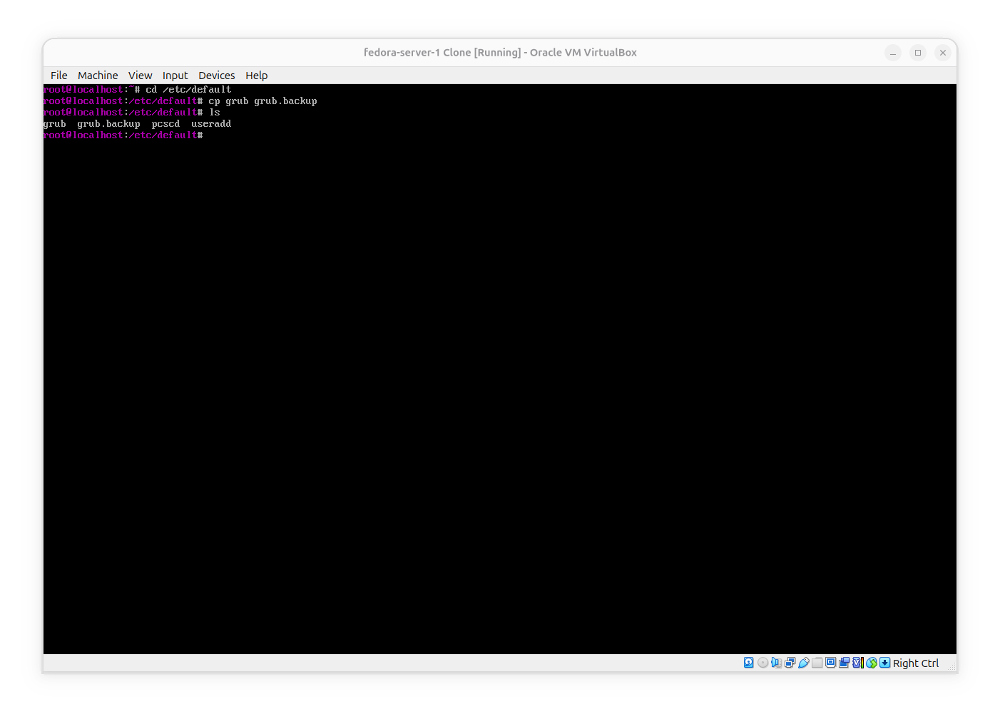
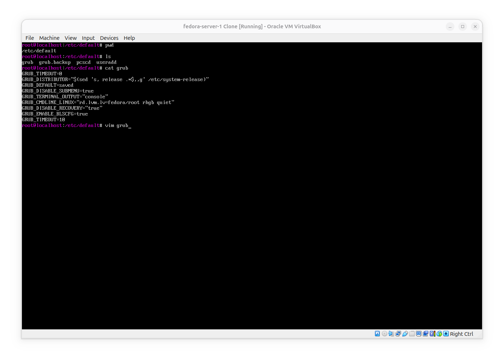
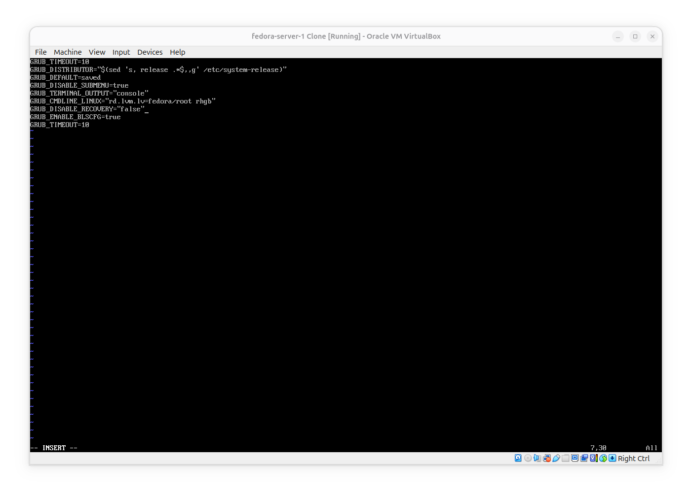
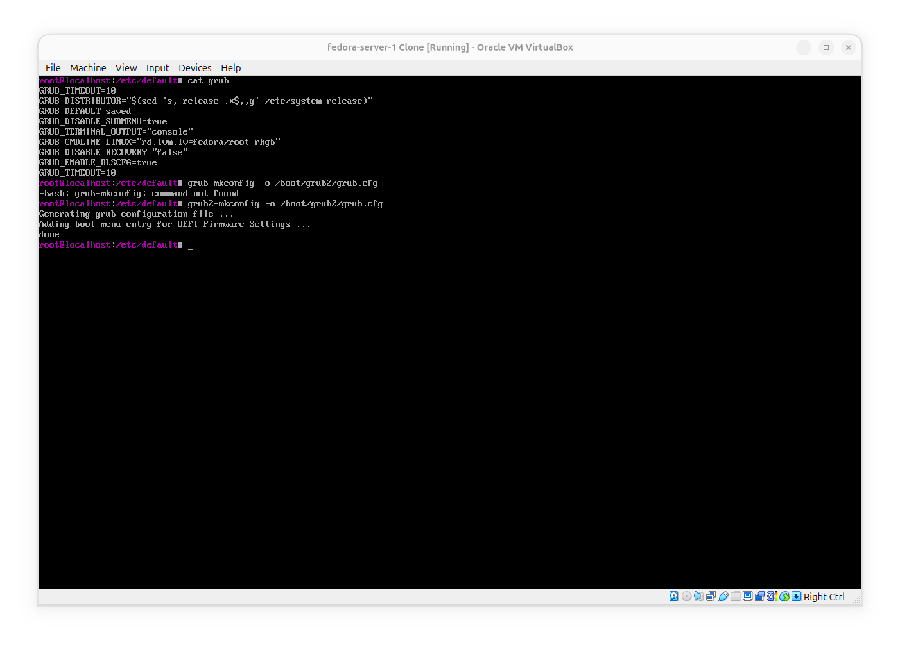
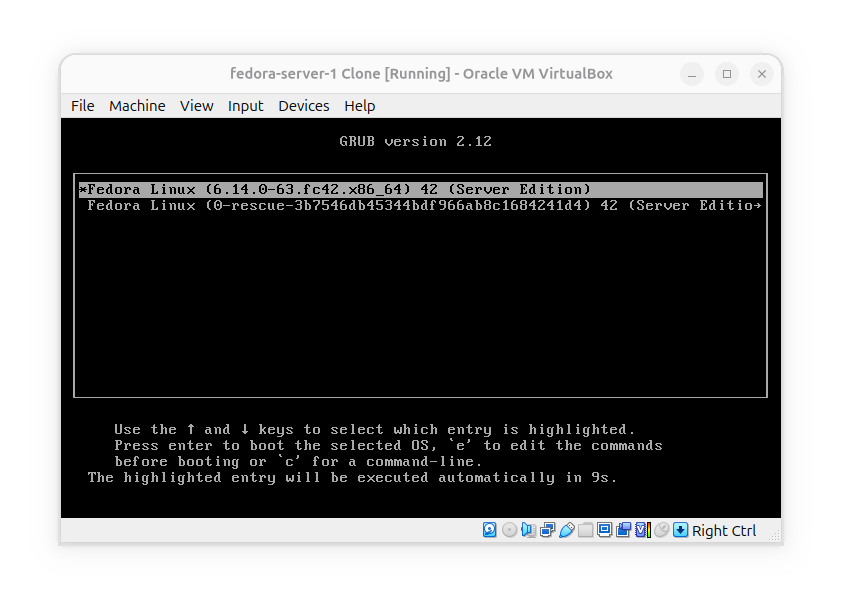
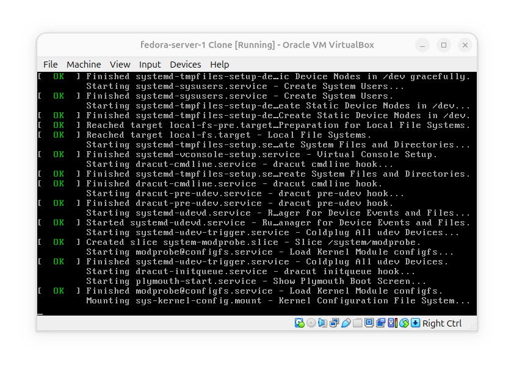

# Modify GRUB Configuration

**Goal**: Understand how does changing grub configuration affect the boot menu.

### 1- Create a backup for main settings:

### 2- Change the Timeout, recovery settings and kernel parameters:

**What I Did?**
- 1- Change timeout of grub to 10 seconds to be able to see the menu.
- 2- Set `GRUB_DISABLE_RECOVERY` to false to be able to see recovery entries.
- 3- remove `quiet` from kernel parameters to be able to see boot logs.

### Create the config:

**What happend?**: first I tried to create config with `grub-mkconfig` but what I was missing was that on grub2 we must use `grub2-mkconfig`.

## Reboot and see the results:

**What I saw**: I was able to inspect grub version 2.12 menu with two entries (one for normal boot and one for recovery mode) for 10 seconds.

By removing `quiet` from kernel parameters i'm also able to see boot logs on screen.
