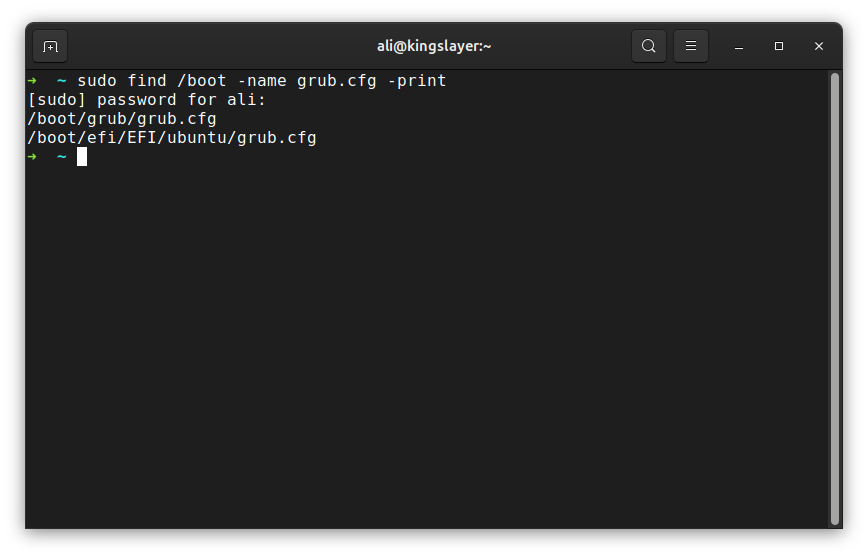
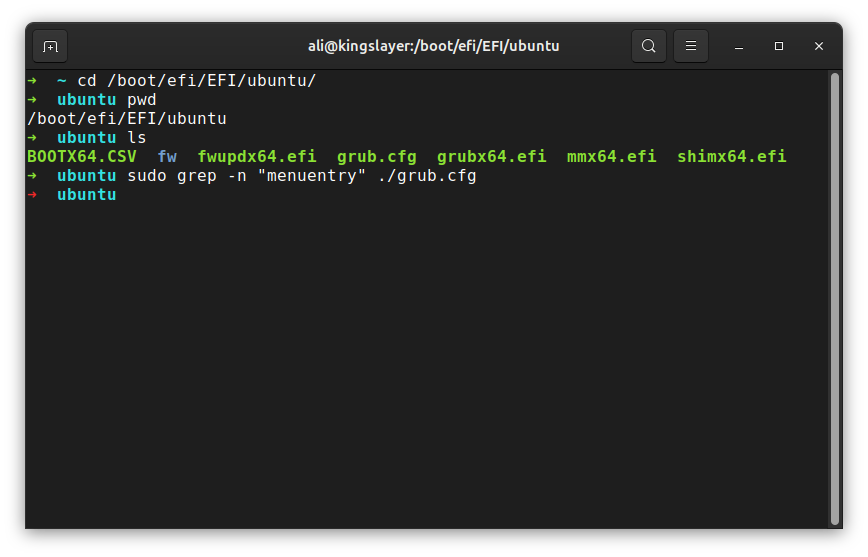
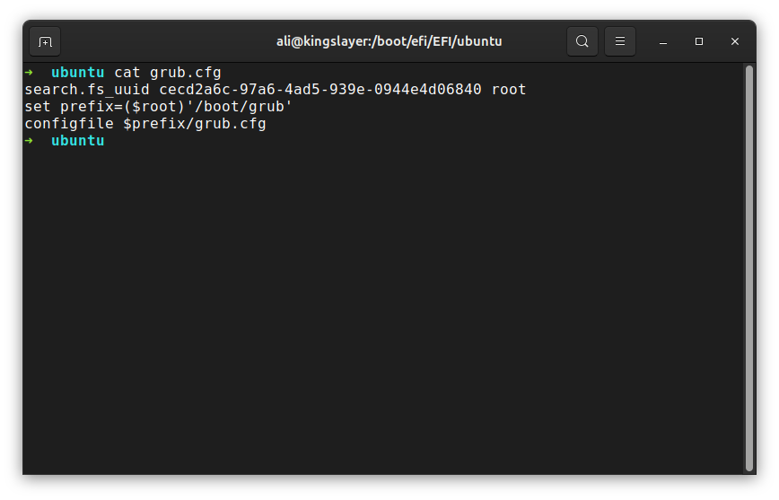
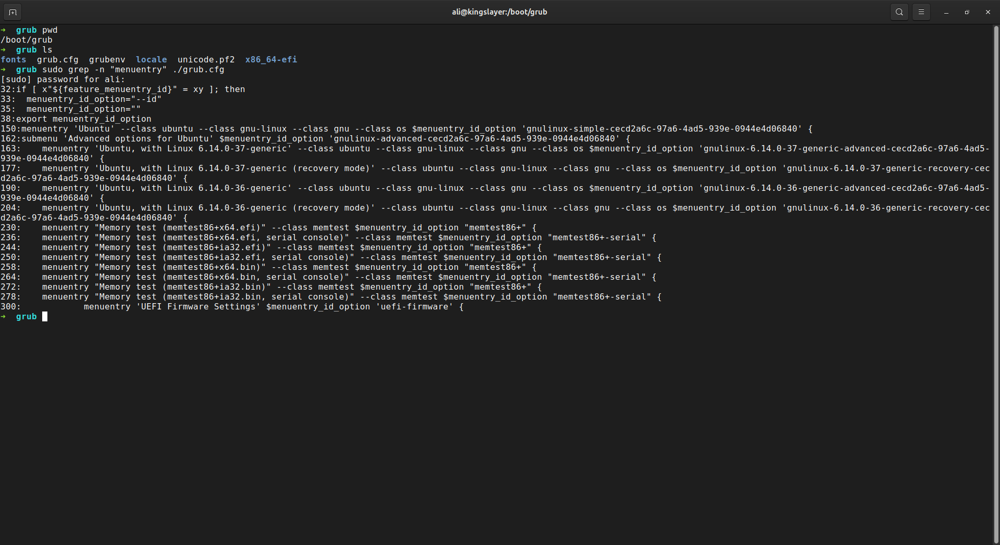
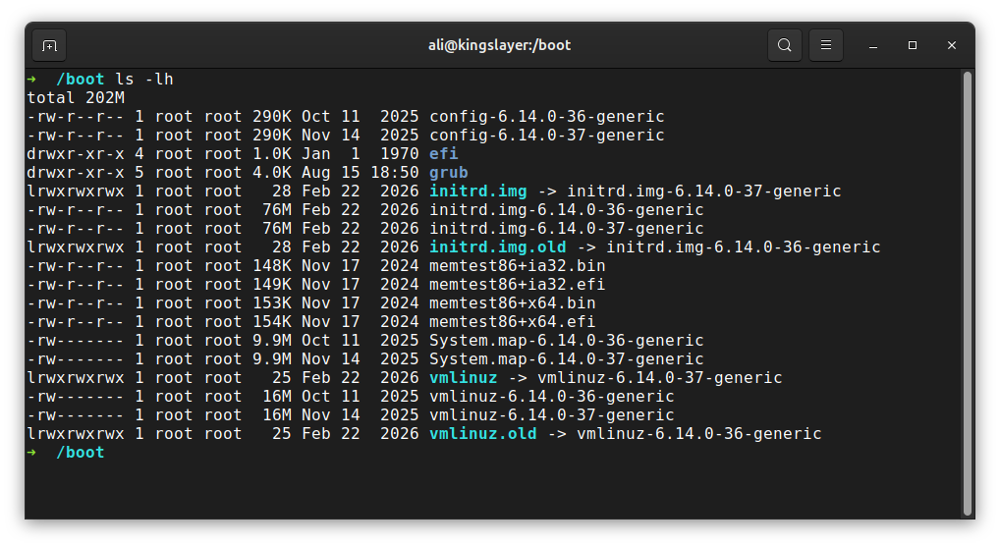

# Understand a GRUB Menuentry

**The Goal** is to understand what does grub need to boot linux.

### Find where is grub.cfg



**As you can see** there are two locations on boot directory where `grub.cfg` is stored, one of the files is on `grub` directory and another on `/efi/EFI/ubuntu`, we will start from efi because i use an UEFI system:



**Here i Tried** to find a menuentry using `grep` but why it found nothing on `grub.cfg`?

### Check `efi/EFI/ubuntu/grub.cfg`:



**What is happening here**?
- `search.fs_uuid cecd2a6c-97a6-4ad5-939e-0944e4d06840 root`: tells the bootloader to find this filesystem by uuid and use it as root.

- `set prefix=($root)/boot/grub`: points to `grub` directory stored in `/boot` directory. it tells GRUB that the grub files are here.

- `configfile $prefix/grub.cfg`: using this line it tells bootloader to use `/boot/grub/grub.cfg` as config file.

**But why?**: because EFI system partition or `/boot/efi` is mainly for bootloader files while the full configuration lives in `/boot/grub/grub.cfg`. so `EFI/ubuntu/grub.cfg` is a small redirect that tells GRUB to find linux filesystem and then load the real `grub.cfg` from `/boot/grub/`. so grub uses this file as a pointer to actuall `grub.cfg`.

### See Menuentries in `/boot/grub/grub.cfg`:



**As you can see** there are menu entries for memory test in addition of entries for loading the OS with previous kernel versions (36 & 37) in a submenu called `Advanced options for ubuntu` which has both recovery and normal boot options for each kernel version.

### Complete Default menu entry
```bash
menuentry 'Ubuntu' --class ubuntu --class gnu-linux --class gnu --class os $menuentry_id_option 'gnulinux-simple-cecd2a6c-97a6-4ad5-939e-0944e4d06840' {
        recordfail
        load_video
        gfxmode $linux_gfx_mode
        insmod gzio
        if [ x$grub_platform = xxen ]; then insmod xzio; insmod lzopio; fi
        insmod part_gpt
        insmod ext2
        search --no-floppy --fs-uuid --set=root cecd2a6c-97a6-4ad5-939e-0944e4d06840
        linux   /boot/vmlinuz-6.14.0-37-generic root=UUID=cecd2a6c-97a6-4ad5-939e-0944e4d06840 ro   crashkernel=2G-4G:320M,4G-32G:512M,32G-64G:1024M,64G-128G:2048M,128G-:4096M
        initrd  /boot/initrd.img-6.14.0-37-generic
}
```

**In example above** we can see that a menuentry in an actuall system is not that easy to be read. for me personally thare are only 3-4 lines i can understand:

- 1: Search for this disk by uuid and set it as root (where `/boot` is located):
```bash
search --no-floppy --fs-uuid --set=root cecd2a6c-97a6-4ad5-939e-0944e4d06840
```

- 2: Use linux kernel located in this directory and open this volume as its root file system in read-only mode:
```bash
linux   /boot/vmlinuz-6.14.0-37-generic root=UUID=cecd2a6c-97a6-4ad5-939e-0944e4d06840 ro 
```

- 3: Use the initramfs image located in this directory:
```bash
initrd  /boot/initrd.img-6.14.0-37-generic
```

**As you can see** the latest version of `vmlinuz` and `initrd.img` in boot directory are linked to files used above:



## Conclusion
- Grub configuration file located in `/EFI/ubuntu/` is actually a pointer to the actuall configuration file located in the same old `/boot/grub/`.
- In a GRUB menu we also have submenus with more options to boot. for example recovery mode or previous kernel versions.
- In an actuall menu entry of grub version 2 we have capabilities like finding a disk by uuid and using it as root (Where `/boot/` is located).
- Using `find /boot -name grub.cfg` we can find all `grub.cfg` located in `/boot` directory.
- Using `sudo grep -n "menuentry" /boot/grub/grub.cfg` we can find menu entries in a grub.cfg with line number prefixed.
