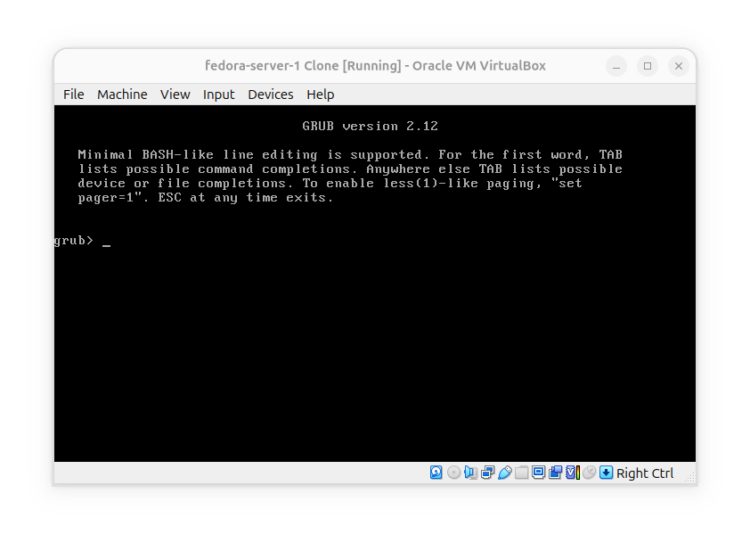
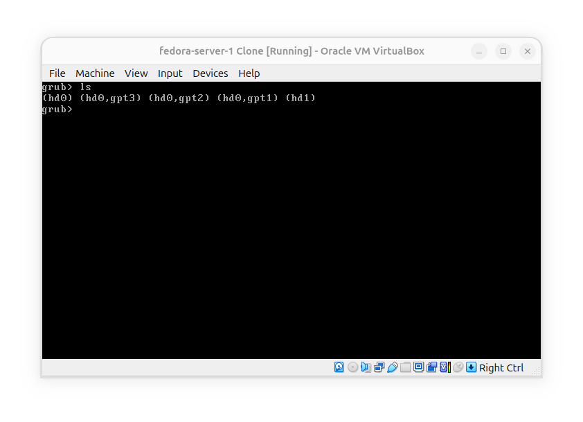
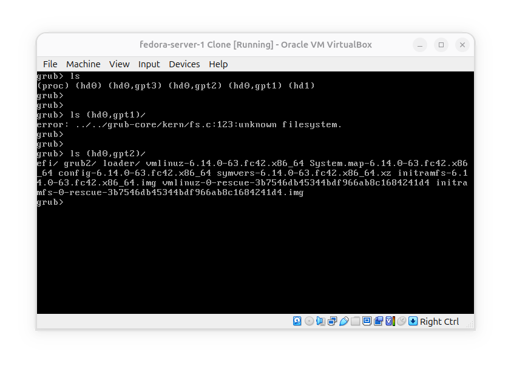
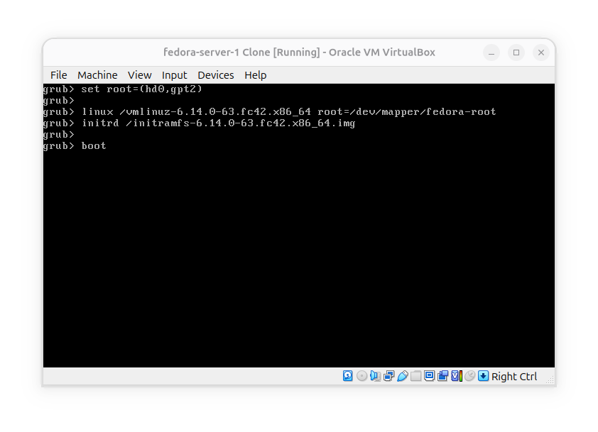
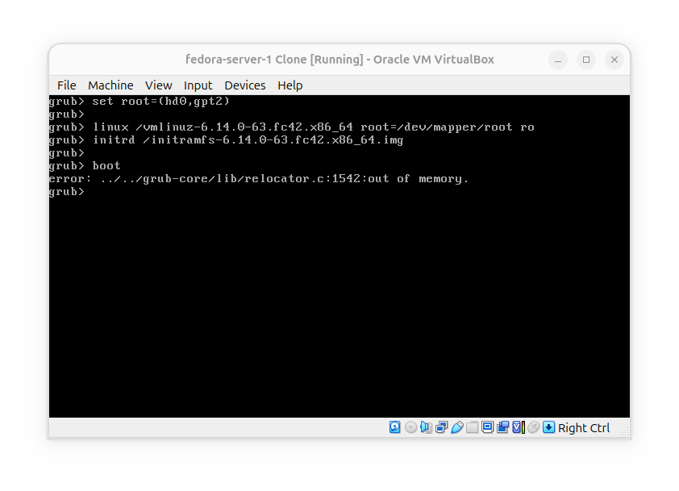
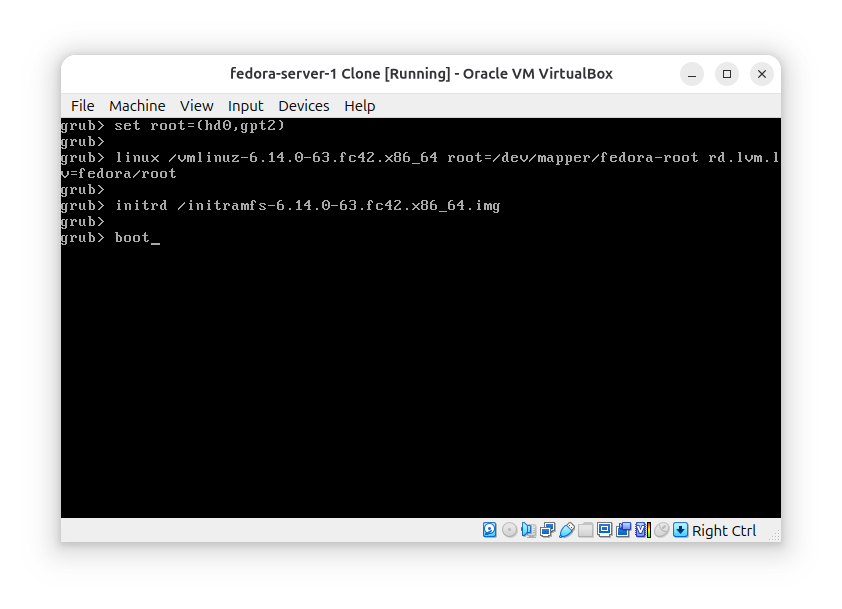
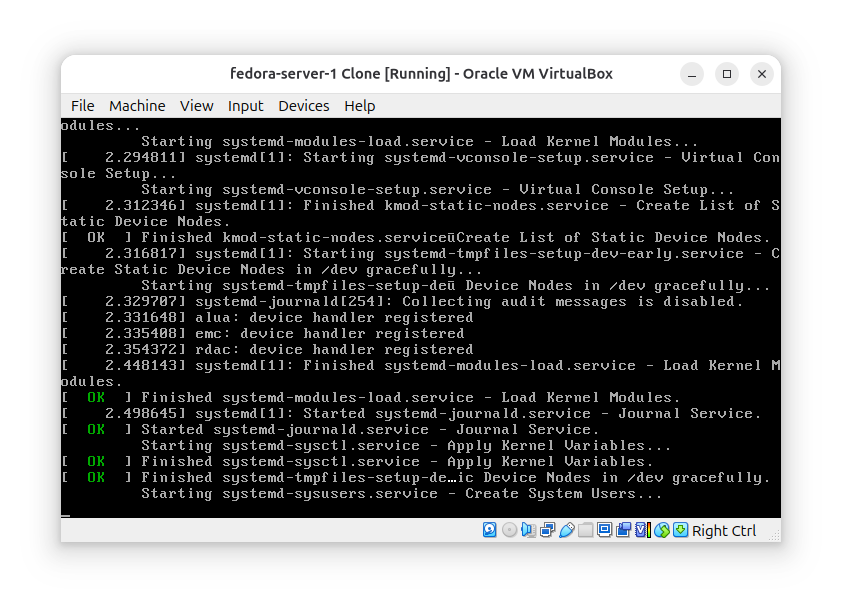

# GRUB Manual Boot

**Goal** is to understand how can I boot a system without an automatically generated Menu entry.

### Enter Grub shell

**The first** you see grub menu press `c` to enter GRUB shell and see an environment like this:

### Find /boot partition

**After entering** grub shell we can use `ls` command to list the partitions:

**What we have here** are two disks:
- hd0 with 3 partitions: gpt1, gpt2 and gpt3
- hd1

List each partition/disk to see which one is `/boot` partition:

As you can see the first partition (gpt1) filesystem was not recognized by Grub, but second one contains `/boot` contents, now we want to boot the system using this content.

### Boot the system manually:

When booting linux from Grub we need to provide:
- 1- the `/boot`
- 2- Kernel and root filesystem
- 3- initramfs image.

but what happens here is interesting:

Grub keeps saying that you are out of memory, and error comes from grub's `relocator.c`, so this was Grub relocator error happening before kernel and initramfs take control of the boot process. in this error grub reported its relocator could not find a suitable physical memory region for the kernel/initramfs during the boot handoff and did not necessarily mean that all available ram was exhausted.

After about an hour of investigating this error, its exact cause remained undetermined. The error was not explicitly resolved; however, I later remembered that I had configured an LVM logical volume spanning two disk partitions for use as the root filesystem.

So I searched for possible causes and for kernel aurguments for booting an lvm-based root filesystem and i found that `rd.lvm.lv=fedora/root` tells initramfs to activate the `root` logical volume from the `fedora` volume group. after adding this argument, the system booted successfully:

however I cannot conclusively say that this argument is responsible for resolving earlier GRUB "out of memory" error, since that error occured before kernel and initramfs taking control.

!Update: the earlier "out of memory" error from grub happens independently from providing `rd.lvm.lv` or not, the exact cause have not been yet determined.
