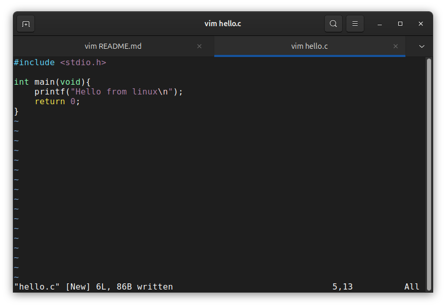
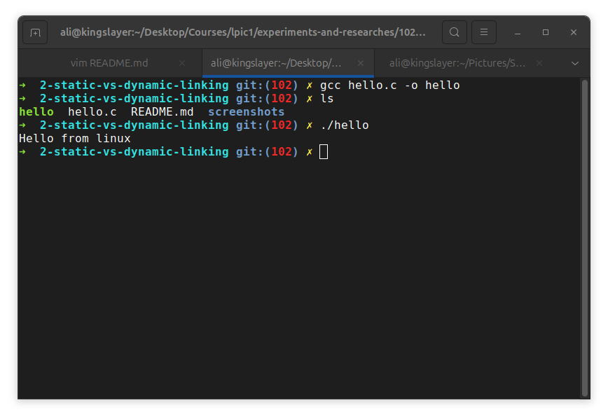
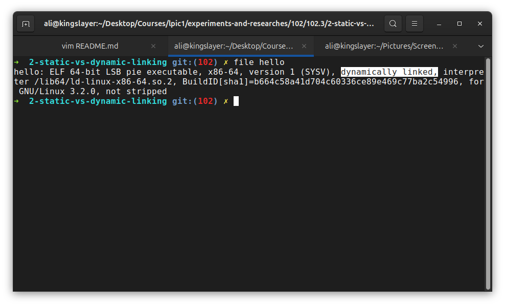
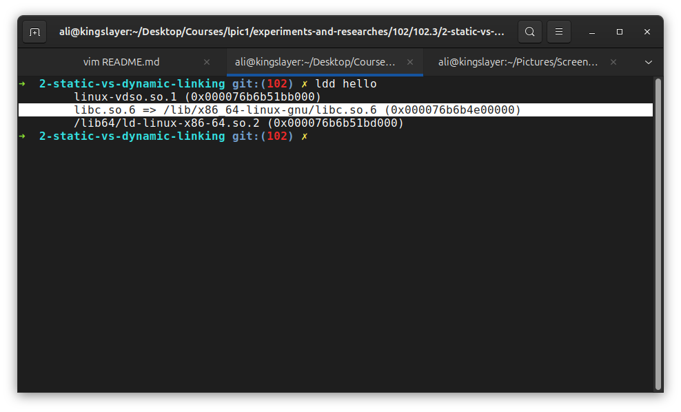
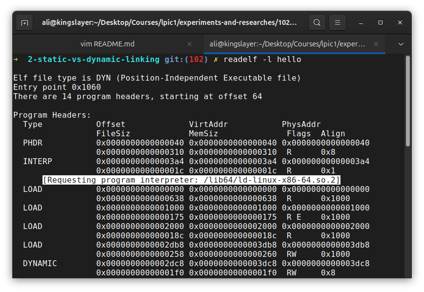
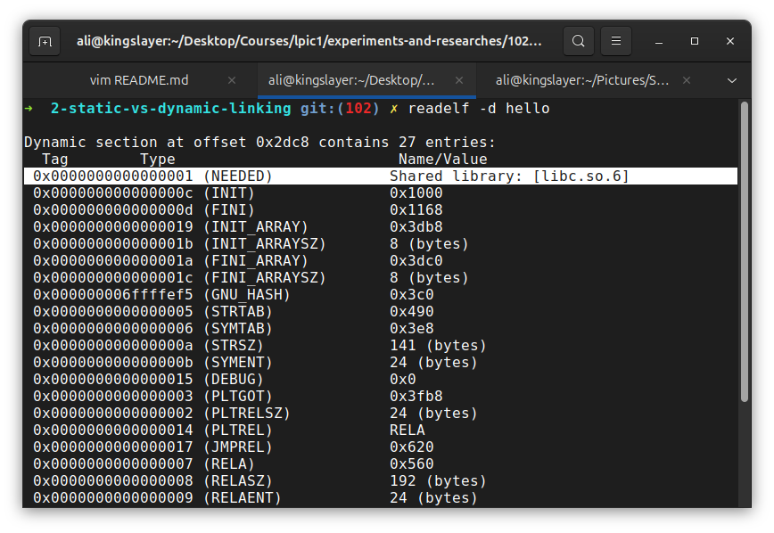
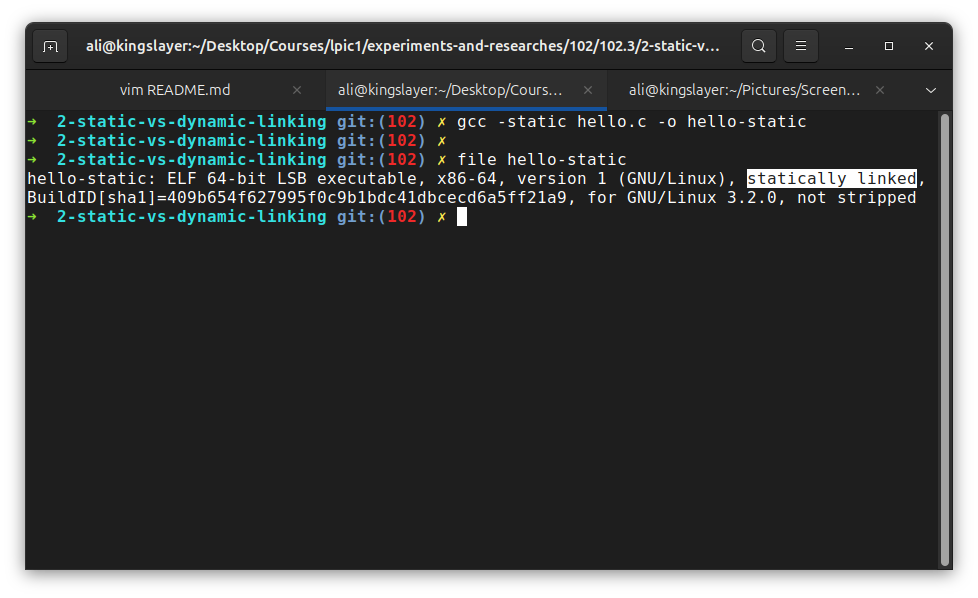
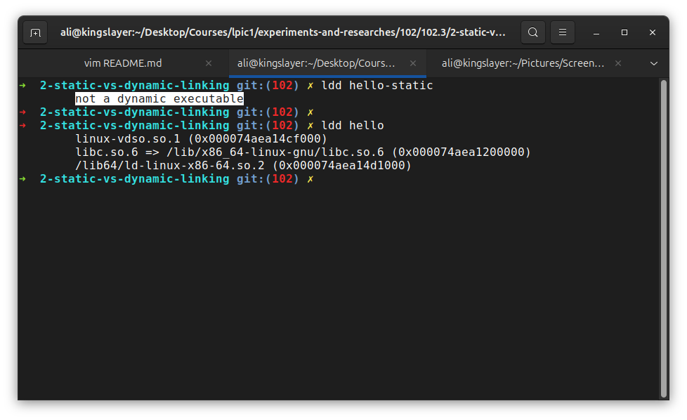
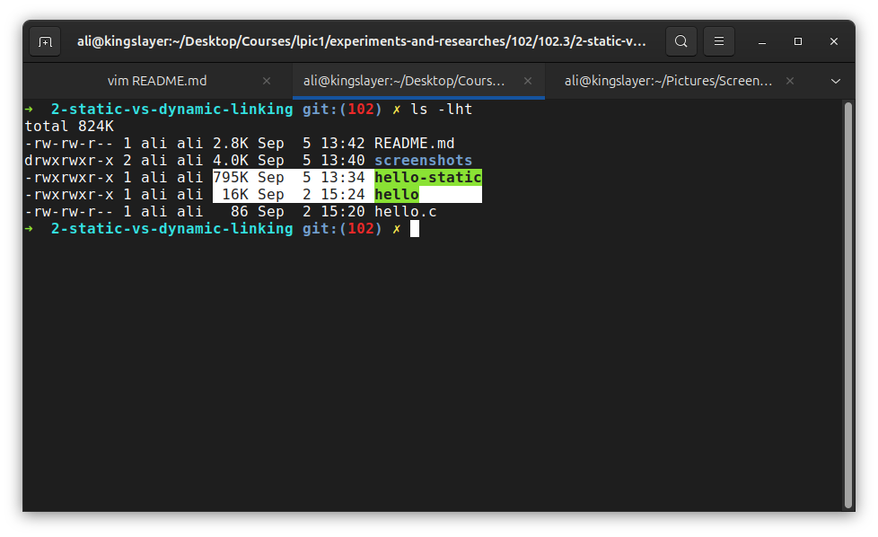

# Static vs Dynamic Linking

**The Goal** is to understand when we run a linux program, where does the code for its library come from?

We will compare:
- A dynamically linked executable
- A statically linked executable
- What `ldd` sees
- What the ELF metadata says
- What happens when a shared library is unavailable

### Part1: Picking a simple program
1- In the first part we create a simple program that uses C library:

2- Then we'll compile it normally:

### Part2: See if program is dynamically linked
1- Using `file` command we'll see if it is dynamically linked:

As you can see, the highlighted part of `file` output says that the executable is dynamically linked.

2- Now let us see if `libc` is one of needed libraries by the executable using `ldd`:

The highlighted part indicates that the executable doesn't contain all of the `libc` but it contains information saying it needs `libc` when it's runned; so when it gets executed the dynamic loader then finds and loads that library.

# Part3: Find the dynamic linker
1- Run `readelf -l <file>` to see program headers:

there is a line which is highlighted: `[Requesting program interpreter: /lib64/ld-linux-x86-64.so.2]` which indicates the exact location of "Dynamic Linker".

**The important thing to know here** is the execution chain which is:
- 1- `./hello` gets executed in front-end terminal.
- 2- "ELF interpreter" or "Dynamic Linker" is being called.
- 3- Dynamic Linker loades `libc.so` and other needed libraries to execute the program
- 4- "ELF interpreter" finally interprets the program and the execution gets conpleted and we will see the result on screen.

# Part4: Looking into executable's dependencies
Using `readelf` with `-d` switch we can see needed shared library for executable:

The highlighted part: ` 0x0000000000000001 (NEEDED)             Shared library: [libc.so.6]
` shows needed shared library. the executable itself only records `libc.so.6`; the exact location is `/lib/x86_64-linux-gnu/libc.so.6` and it is determined by dynamic linker "library-search" mechanisms.

# Part5: Make a static executable
Compile the same program with `-static` option:

As you can see, now the executable is "statically linked". means it contains all the code it needs to be executed in itself and does not need a Dynamic Linker or shared libraries:

# Part6: Compare sizes

Why `hello-static` is 50 times larger? because `hello` it self only says "i only need printf() function" but `hello-static` contains all required library code in itself.

# Conclusion
Three tools have been used and each of these three tools have their own uses:
- `file`: is the executable static or dynamic?
- `ldd`: What shared libraries does this executable depend on?
- `readelf`: What does the ELF binary actually declare?

### Static vs Dynamic

**Static**:
- 1- Program needed library code already incorporated.
- 2- no runtime shared-library lookup
- 3- Program executes.

**Dynamic**:
- 1- ELF Metadata says i need `libc.so.6`
- 2- Dynamic linker finds `libc.so.6`
- 3- Loads it
- 4- program gets executed
