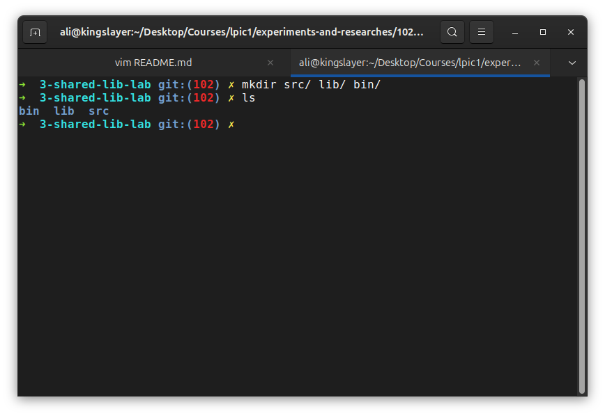
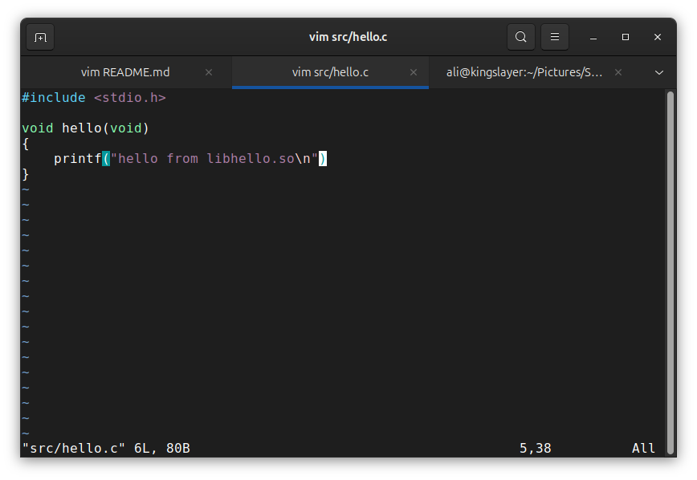
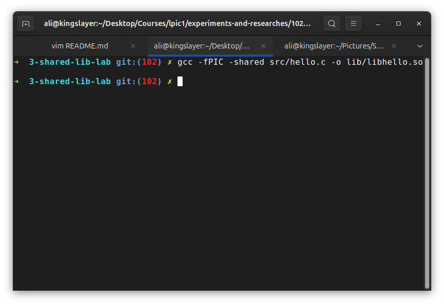
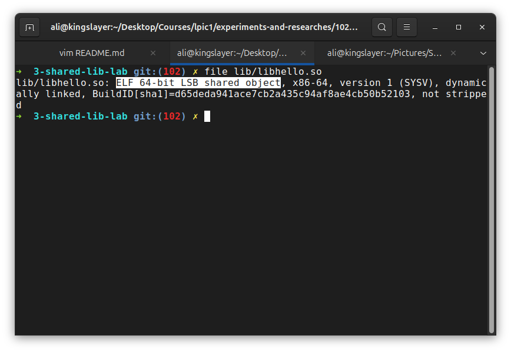
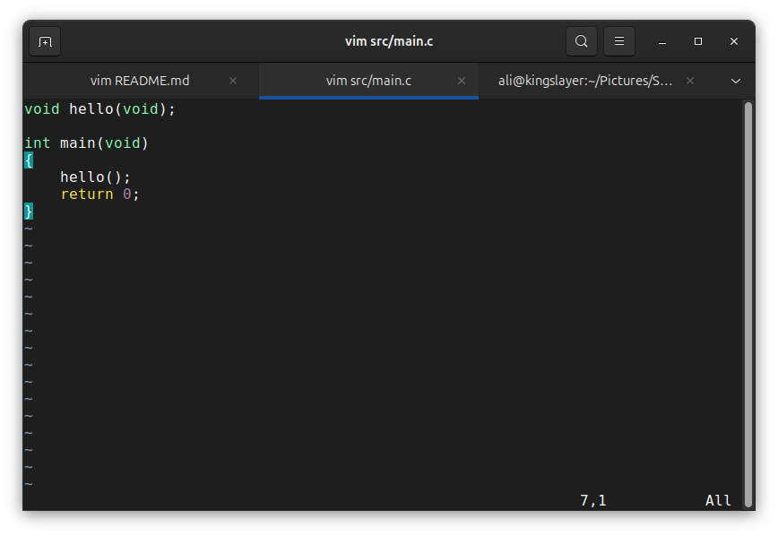
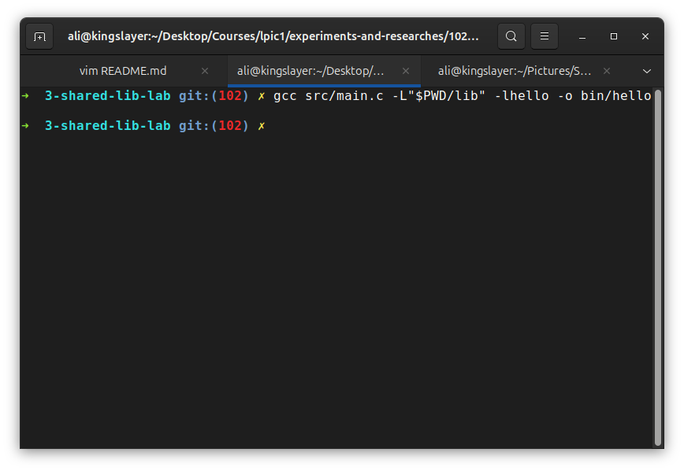
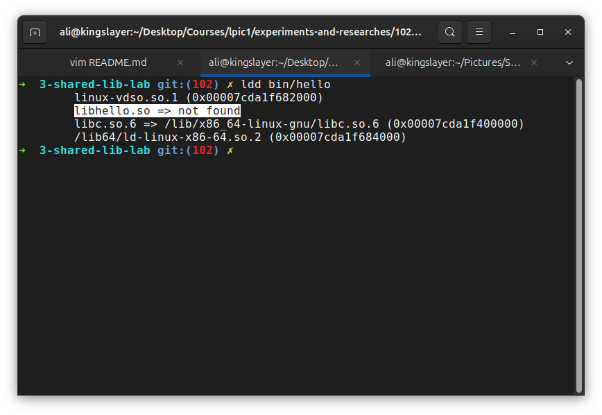
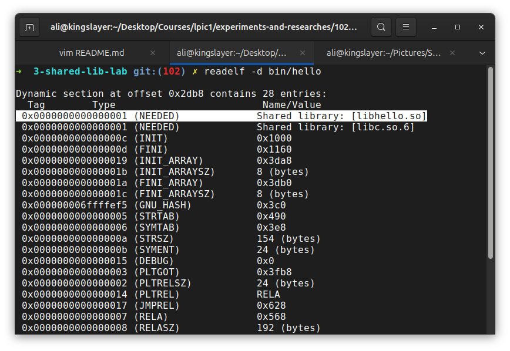
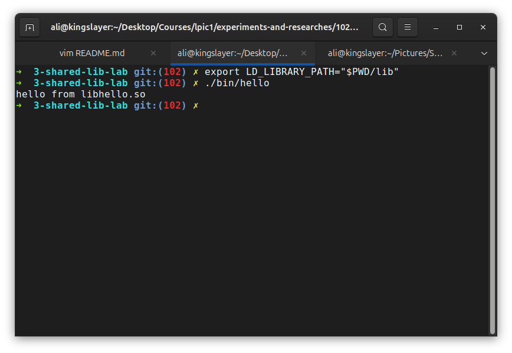
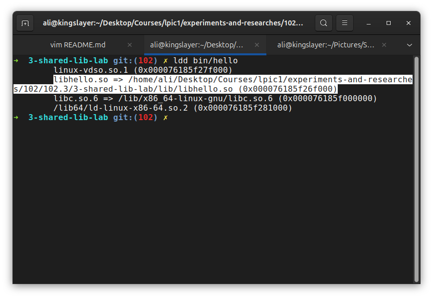

# How Linux finds a shared library

**The Goal** is to understand when an executable needs a library that isn't among system libraries, how we can create a custome space for lib and point the executable to that needed library.

## 1- Create a workspace
First we create a non-standard location to keep the library:

## 2- Create a shared library
Now we create a simple program:

And compile it as a position independent code and into a shared library format:

Now we check it:

As you can see it says that it is a "ELF shared object".

## 3- Create a program that uses it
Now that we created our shared library, we also create a program that uses that library.

## 4- Compile the program
Now we need to compile our program that uses `libhello`:

to notice somthing important is that `-L"$PWD/lib" -lhello` tells "GCC" where to find the library during compilation/linking. it doesn't necessarily tell the program where to find it later when you execute it.

## 5- Check the dependency
As you will notice, the runtime linker cannot find the library:

but the program has been succesfully compiled. if we check the ELF metadata:

you can see that the highlighted line says that the executable needs libhello to be able to get executed.

## 6- Fix runtime loader
to be able to execute the program, we need to specify where libhello is for the dynamic linker:

Now that we specified `LD_LIBRARY_PATH` and pointed it to libhello the executable got runned successfully because now the runtime know about our library:

# Conclusion
As of now we seen three separated things with an important distinction:
- 1- `gcc -L"$PWD/lib" -lhello`
- 2- Compile/Link time
- 3- Where is the library while we're building?

**VERSUS**

- 1- `LD_LIBRARY_PATH="$PWD/lib"`
- 2- Runtime loader
- 3- Where should the dynamic linker look into?
