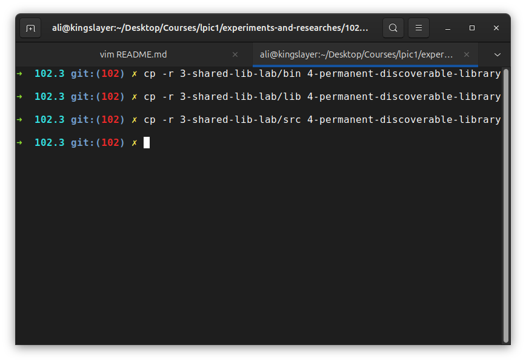
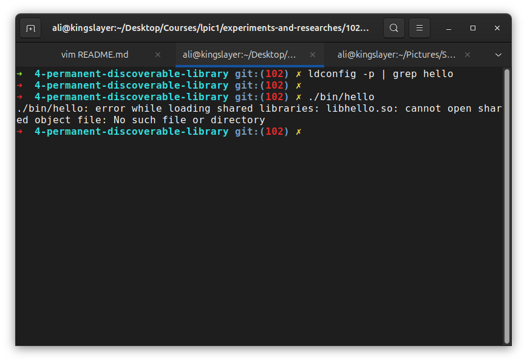
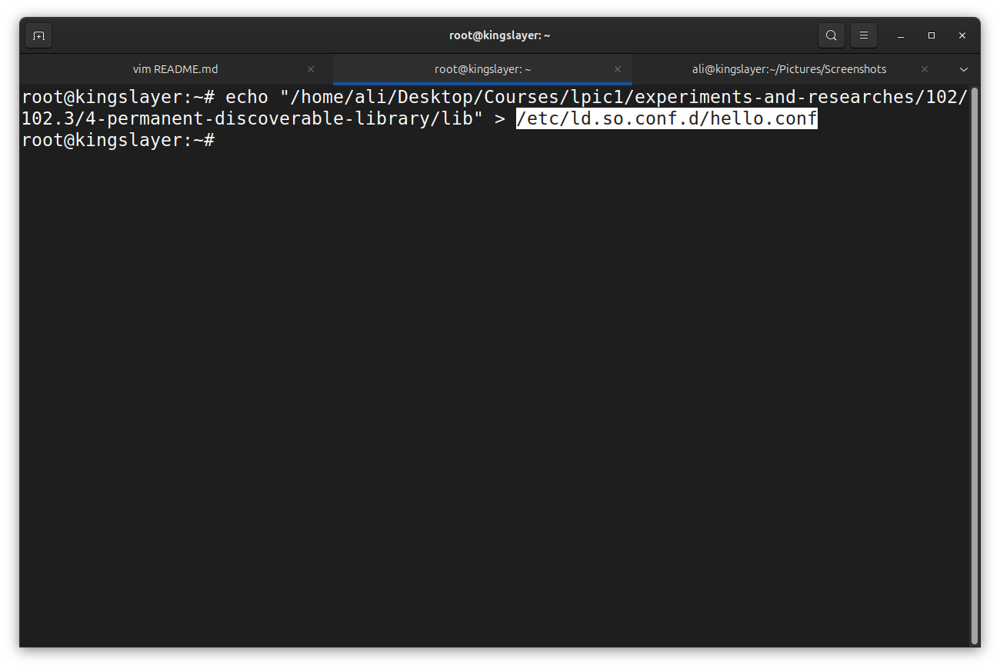
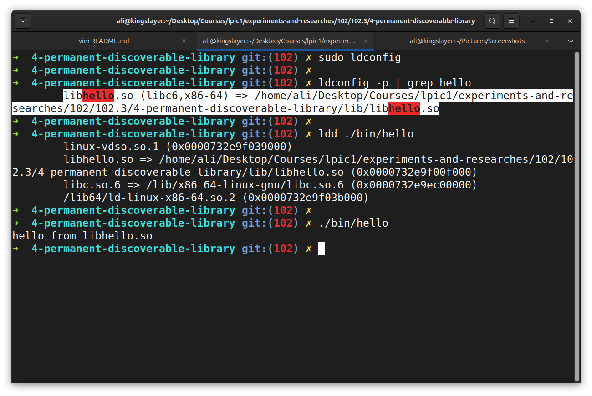
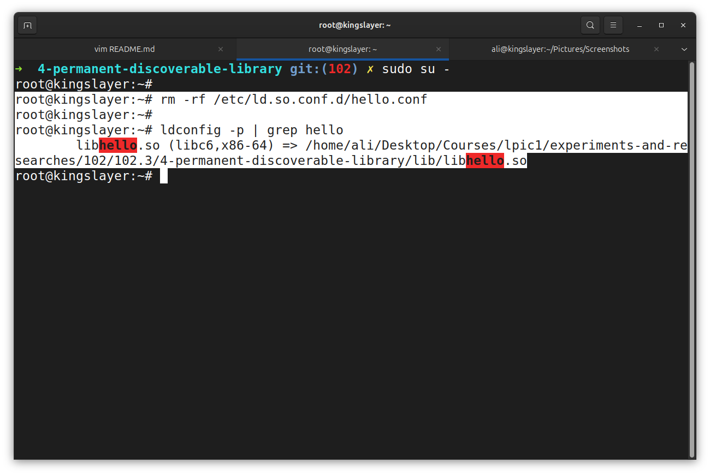
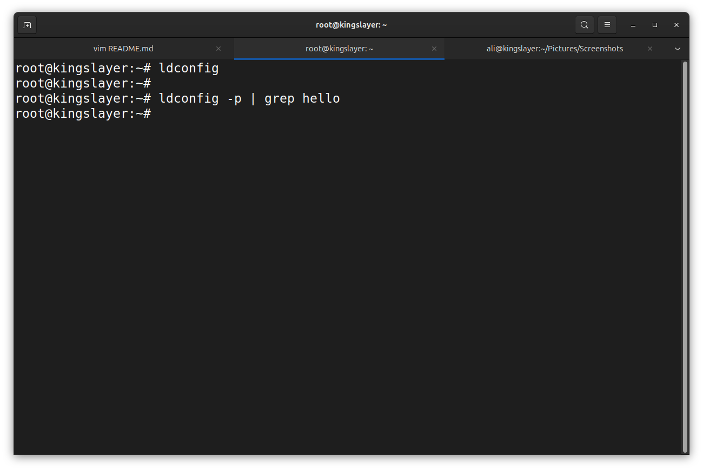

# Permanently Discoverable System-wide library
 
**The Goal** is to make a custom library, system-wide discoverable by Dynamic linker instead of relying on `LD_LIBRARY_PATH`.

### Recreate the situation
First we create the same situation as previous experimentation:

We recreated the situation by making a copy from `bin/`, `lib/`, `src/`.

### Check ldconfig for libhello

As you can see `ldconfig` returned nothing related to libhello and execution returned an error meaning that the system doesn't know about `libhello`.

### Add the library to the loader configuration
First we switch to root by `sudo su -` command and then:

### Rebuild the cache

**What did we do?**:
- 1- Run `sudo ldconfig` to rebuild cache.
- 2- Run `ldconfig -p | grep hello` to see if library is founded and placed in cache.
- 3- Run `ldd ./bin/hello` to make sure Dynamic linker founds the library.
- 4- Run the program by `./bin/hello` to be sure that executable works.

Based on the results we are now sure that the library is added system-wide and permanently.

### Break the configuration
Now intentionally remove the config file from `ld.so.conf.d/`:

Why You can see that though we deleted the configuration? because the cache still contains the old entry.

But if we rebuild the cache:

You can see the library disappeared from cache.

## Conclusion
How did we configure library location properly?
- We first put the path of library in a separate file in `ld.so.conf.d/`.
- Then we rebuild the cache by `ldconfig` command.

Why Didn't the library disappear when we deleted the configuration file from `ld.so.conf.d/`? because the cache wasn't updated by `ldconfig` so the cache still contained the library path.
