# Break and diagnose a shared library dependency

**The Goal** is to simulate a very common production problem when an application suddenly says: `libsomething.so: cannot open shared object file`.
We will use the previous experiments situation where we had `libhello.so`.

### Starting with a working application
First we create the same situation as previous experiments:

- 1- copy the directories:

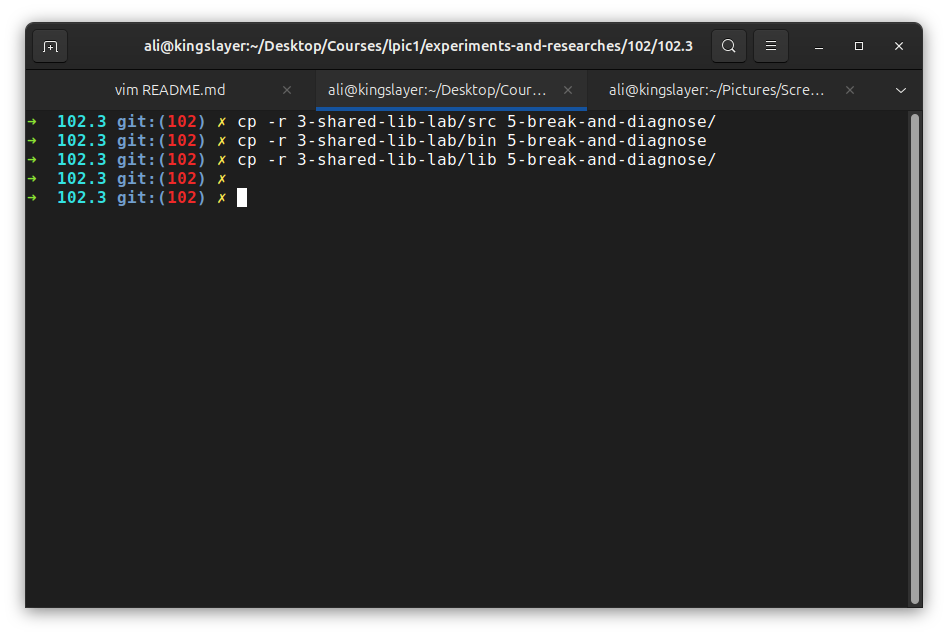

- 2- create config and rebuild the cache:

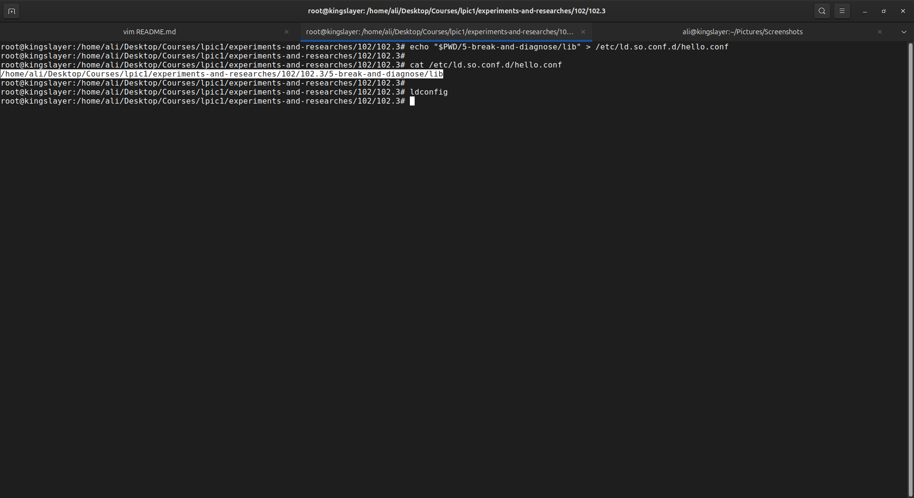

And as you can see the executable works and depends on libhello library:

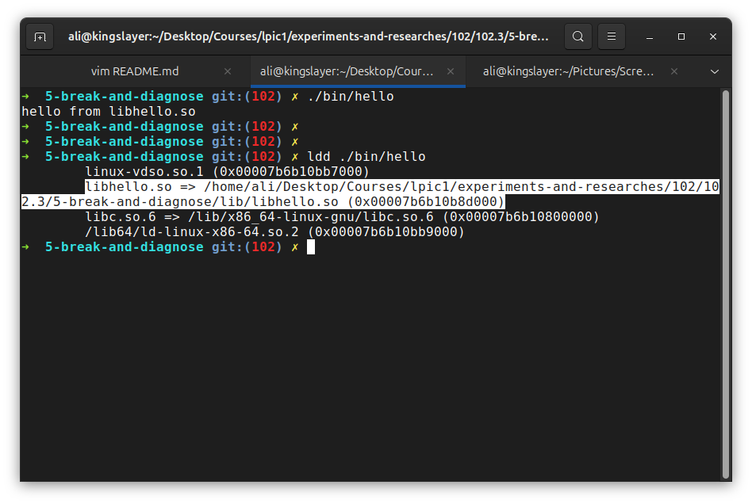

### Simulate the failure
Now we rename the library and run the executable again:

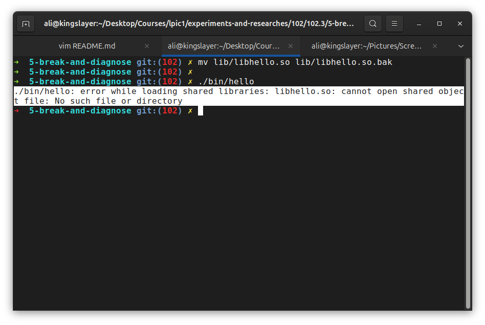

### Simulate the diagnosis
Now we check the executable with `ldd` and make sure that the executable needs the library:

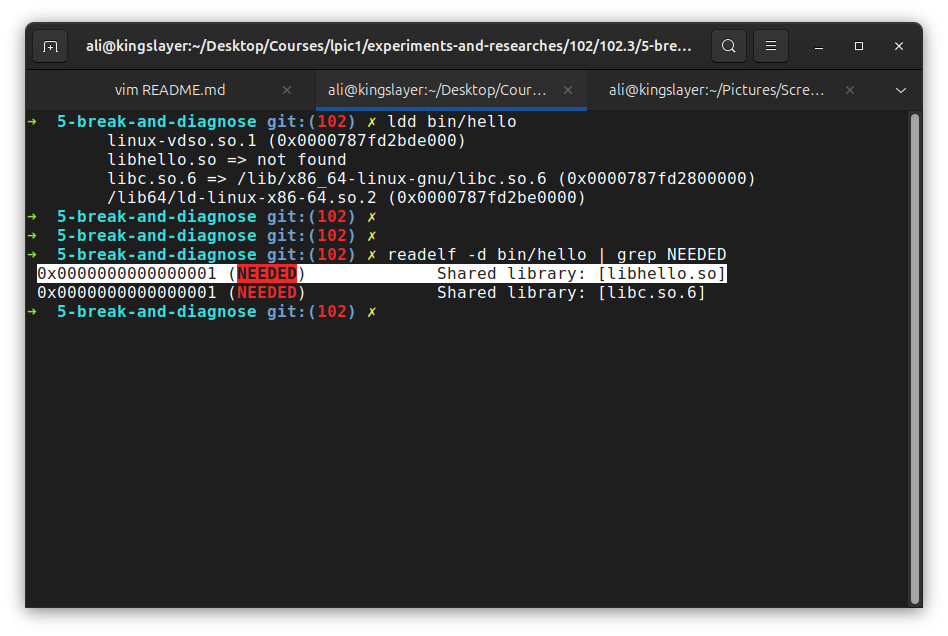

So we're sure that the executable needs libhello.so and it probably exists somewhere.

### Ask linux where it knows about library

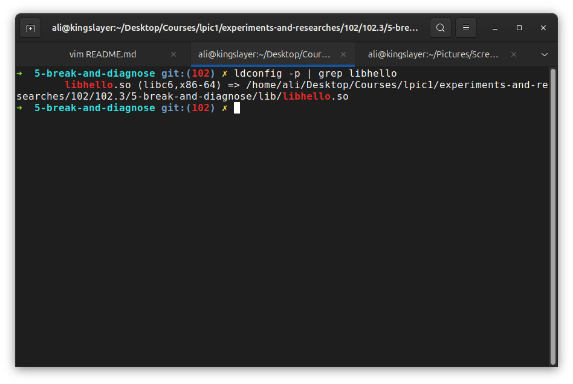

because the ld.so.cache is still untouched we may see previous location of library but the file itself doesn't exist anymore.

Now we go into the previous location and check and see the file:

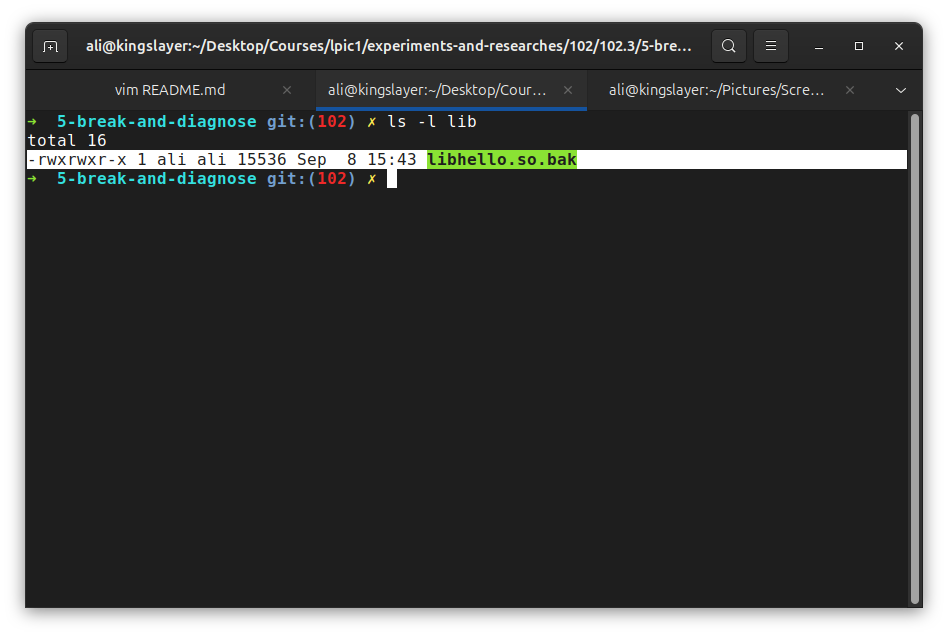

This is an interesting real world situation where the loader's cache can contain a path that is no longer valid.

Now we run `ldconfig` and rebuild the cache:

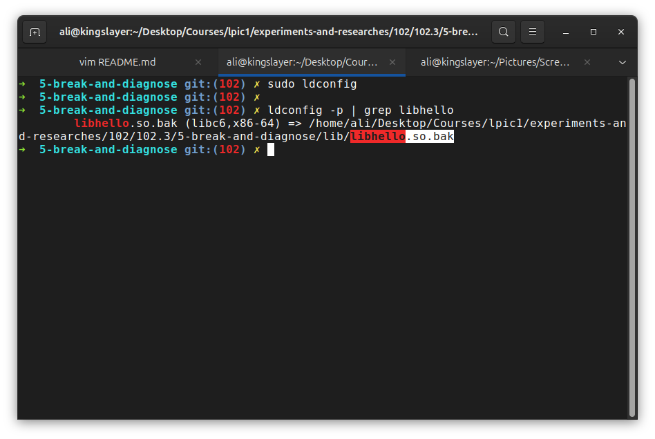

This demonstrates why `ldconfig` matters when a library is added, removed, or relocated.

### Find the library manually
Suppose we don't know where the library went, then:

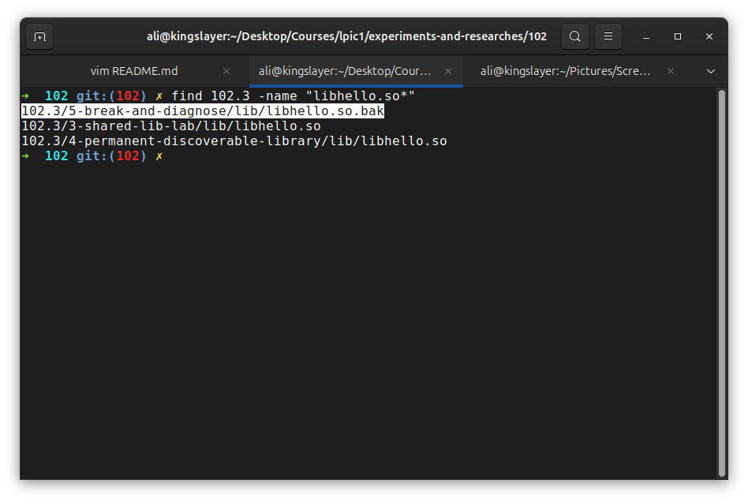

So now we know that the require library is `libhello.so` but the available one is named `libhello.so.bak`.

### Fix the executable

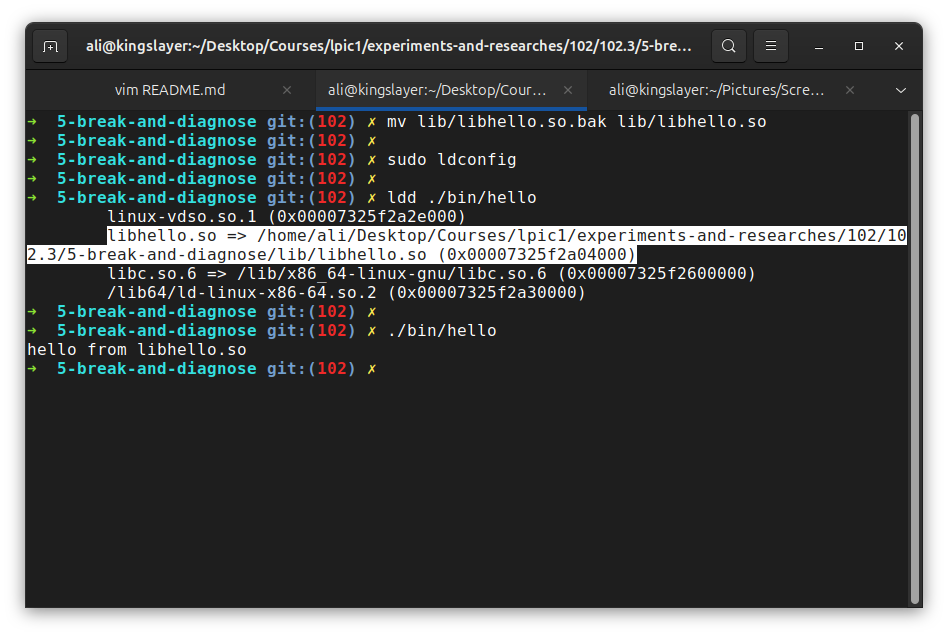

### Another interesting failure

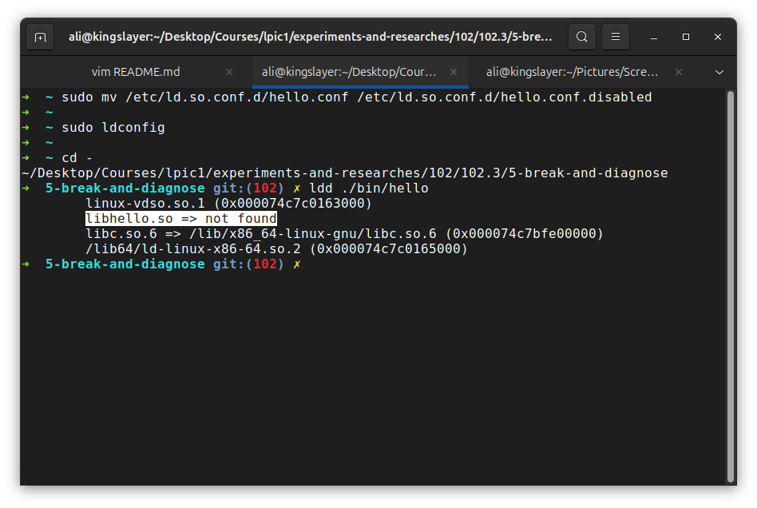

Now again the linker says the library cannot be found **BUT**:

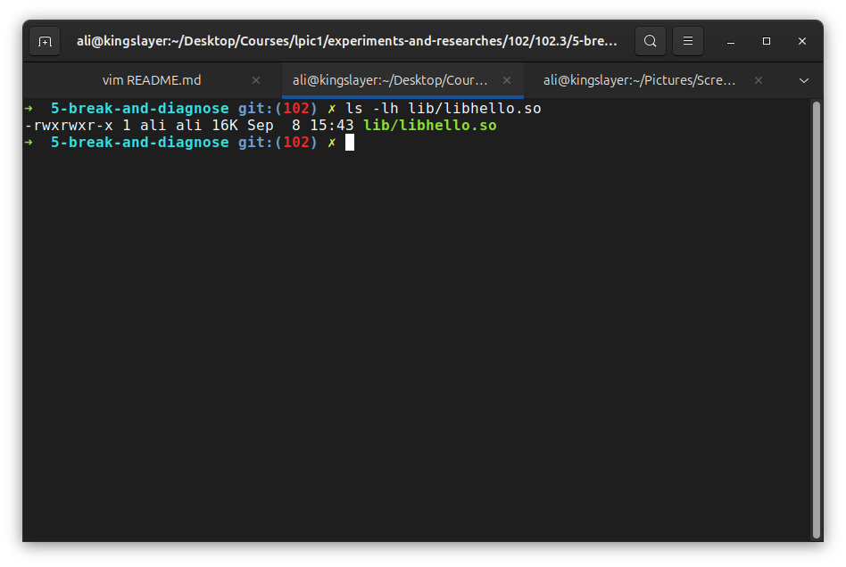

This show that the library does exist. that's a different kind of failure: 
- Library exists.
- Dynamic linker doesn't know where it is.
- So it cannot be found.
This distinction is pretty important. to know is the library having an issue or the config file?

### Restore the config

```bash
➜  ~ sudo mv /etc/ld.so.conf.d/hello.conf.disabled /etc/ld.so.conf.d/hello.conf
➜  ~ ldconfig
```

**Verify**:

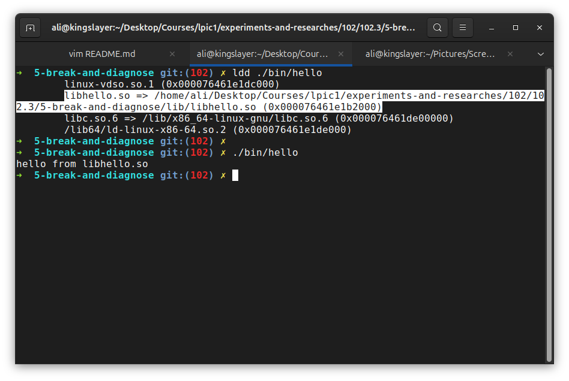

### Conclusion
When having an error saying library cannot be found it is pretty important to ask the right question:
- does the library file exist?
- or does the linker know where the library file is?

The lifecycle mental model:
- 1- C source 
- 2- shared library (.so file)
- 3- executable recording dependency
- 4- dynamic linker
- 5- library search mechanism
- 6- ld.so.cache or configuration
- 7- library loading
- 8- program runs.
