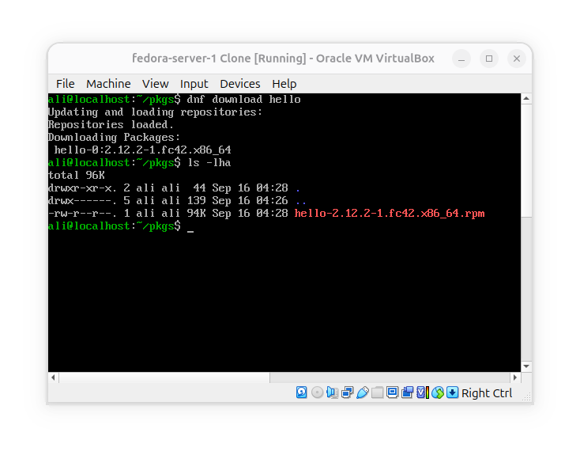
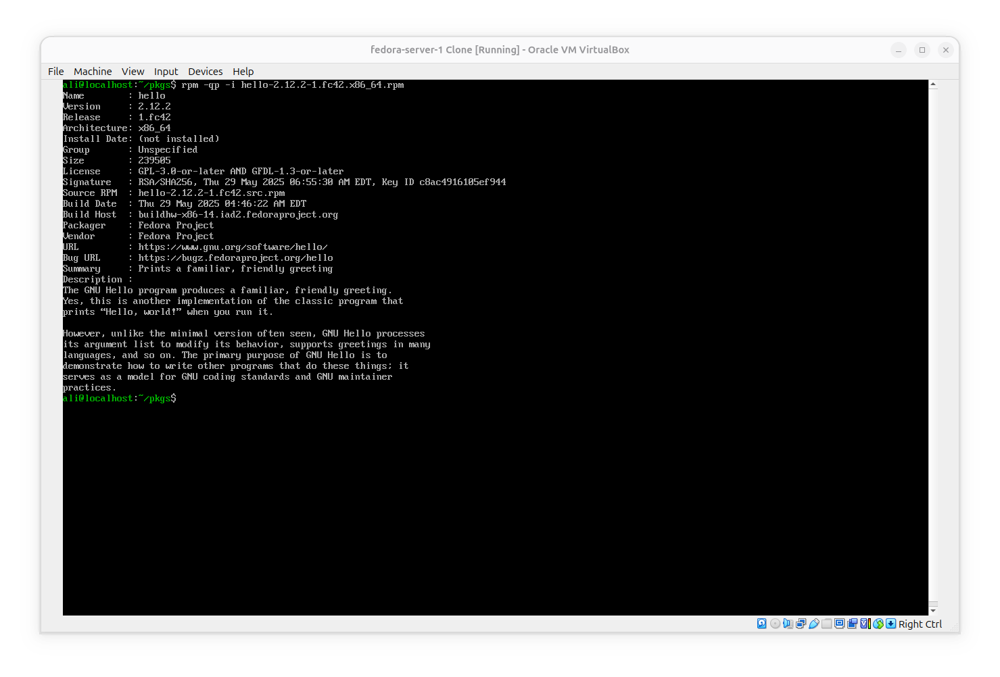
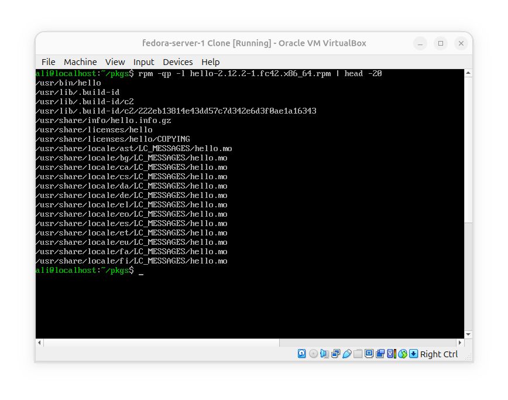
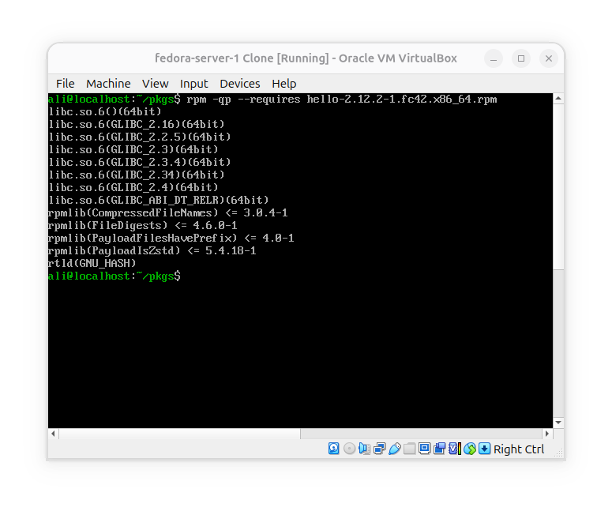
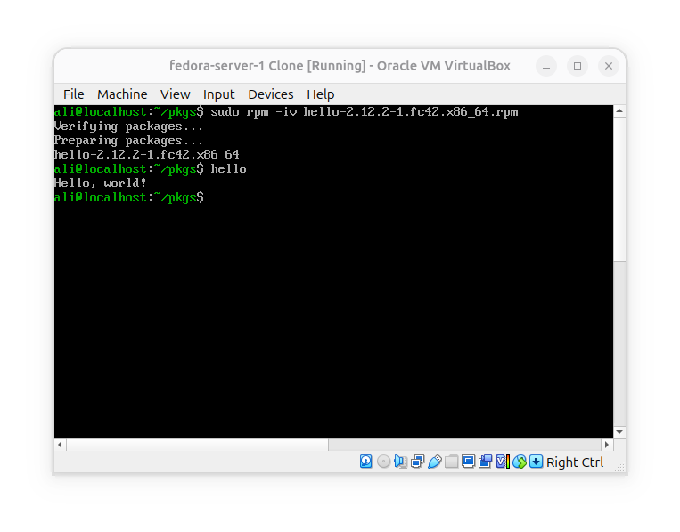
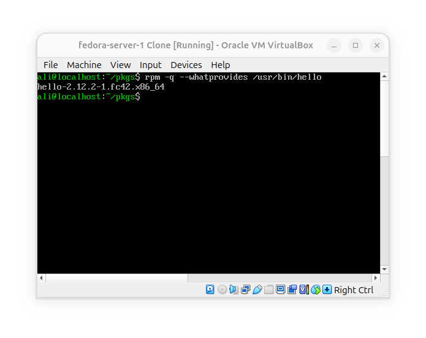

# Anatomy of an `.rpm`
**Goal**: Understand what an `.rpm` package contains and how `rpm` can inspect it without installing it.

### Download an `.rpm` without installing

### Inspect package metadata
Show info:

- `-qp`: Query(q) a package file(p).
- `-i`: Show information.
**Notice that** `-p` is important because we're querying the **RPM** file, not an installed package.

### See what files it contains:

- `l`: List files related to the package rpm file.

### See its dependencies

This answers what does this `.rpm` need in order to work correctly.

### Install the `.rpm`

- `-i`: install the package file.
- `-v`: show a more verbose result.

### Check what packages provides its files

## Conclusion

The key **Comparison** with Debian:
- `.rpm` == `.deb`: Package format.

- `dpkg-deb --info` == `rpm -qp --info`: See information.

- `dpkg-deb --contents` == `rpm -qp -l`: List package files.

- `dpkg-deb --field *.deb Depends` == `rpm -qp --requires *.rpm`: Inspect dependencies.

- `dpkg -i *.deb` == `rpm -i *.rpm`: Install package. 
