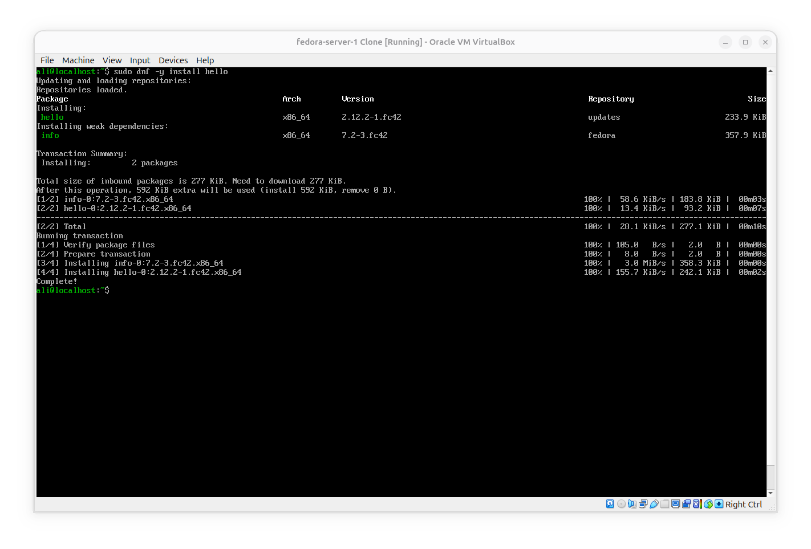
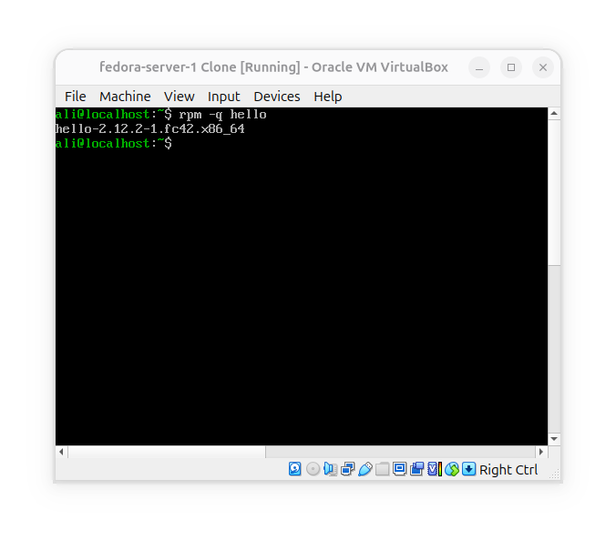
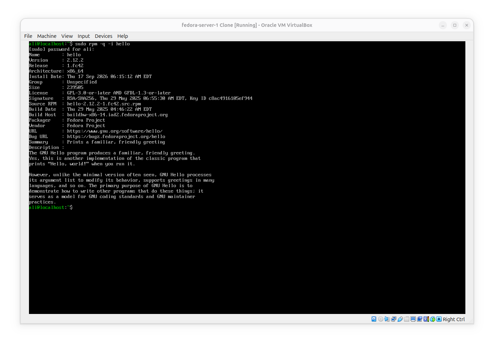
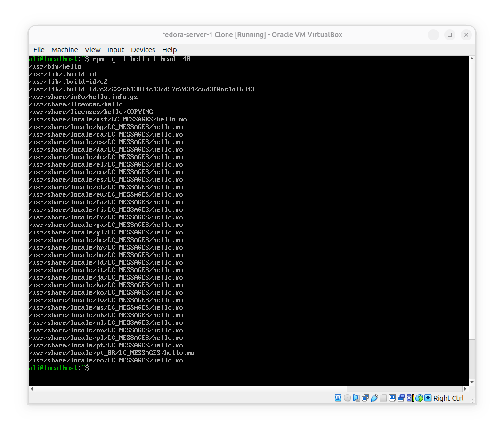
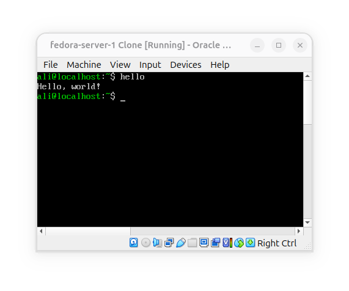
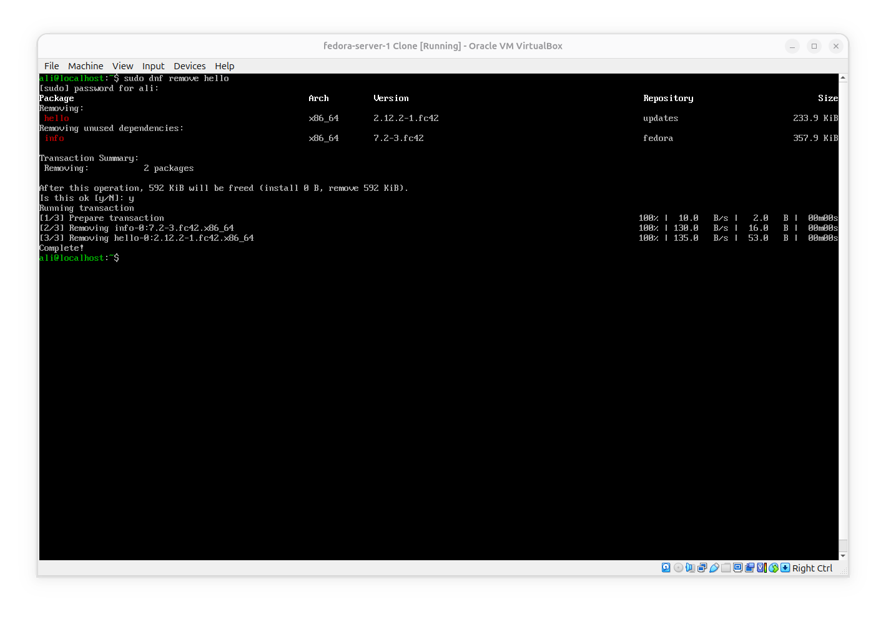
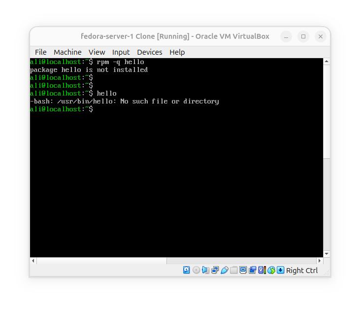

# Install, verify, remove an RPM package

**Goal**: Understand the actuall lifecycle of a package on Fedora.

### Install a package




### Verify that RPM has installed it




### Inspect its information



**What we see**:
- Version: 2.12.2
- Release: `1.fc42`
- Architecture: X_86 64bit compatible
- Installation date: Thu 17 September 6:15-AM
- Packager: Fedora-project
- Description: Produces a greeting message.


### See what file is installed



Now we can connect the package to the actuall files on filesystem.


### Complete the chain

**Run the program**:



**What happend**?:
- 1- DNF Downloaded package from repository and resolved dependencies

- 2- DNF used RPM to install the package and dependencies in correct order

- 3- RPM database now knows about it

- 4- Package owns files on system

- 5- Executable exists

- 6- You can run the program


### Remove the package



**Now verify again**:



The verfication of the package is failed because we removed it.


## Conclusion
- DNF downloaded and resolved the package's dependencies
- RPM installed the packages one by one in the correct order
- RPM package database got updated
- Installed package provided program and files
- Program got removed by DNF using RPM
- RPM database got updated after uninstallation
- Package verfication failed after removal and there is no data in RPM database

So dnf managed the operation at a higher level, and rpm maintained and queried package information and did the underlaying operations such as installation and removal of the packages one by one.

Useful commands that've been used to inspect info, verfication, installation, and removal of the package:
```bash
sudo dnf install hello
rpm -q hello
rpm -qi hello
rpm -ql hello
hello
sudo dnf remove hello
rpm -q hello
```
