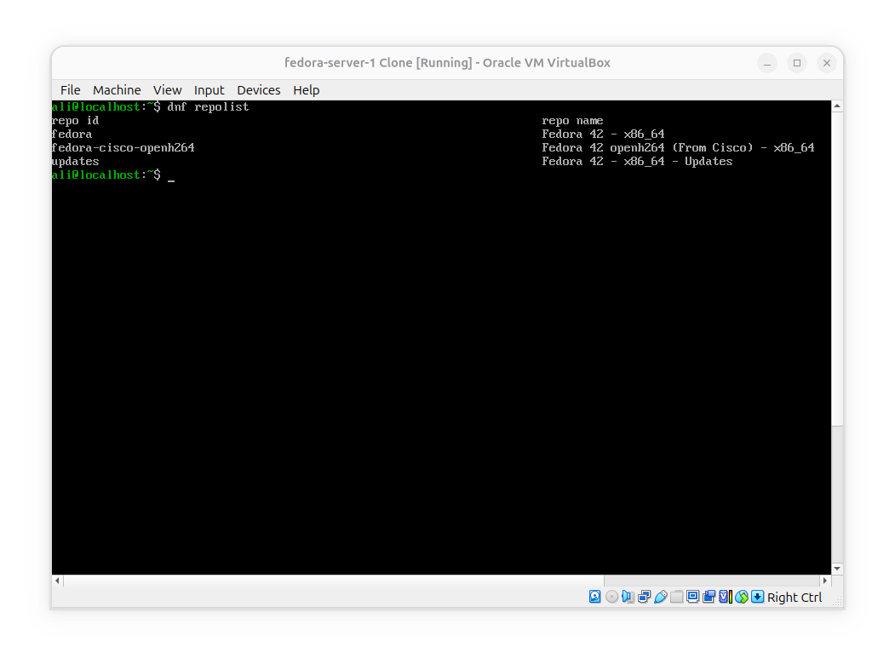
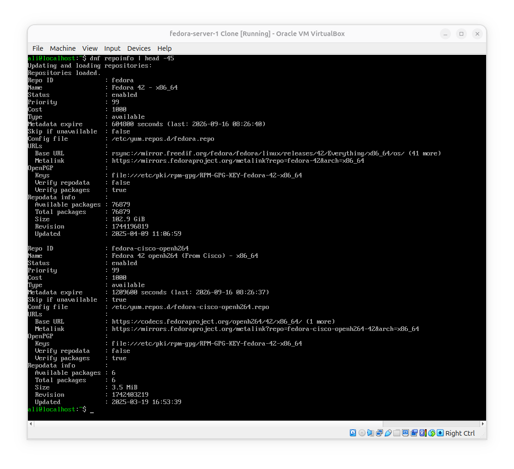
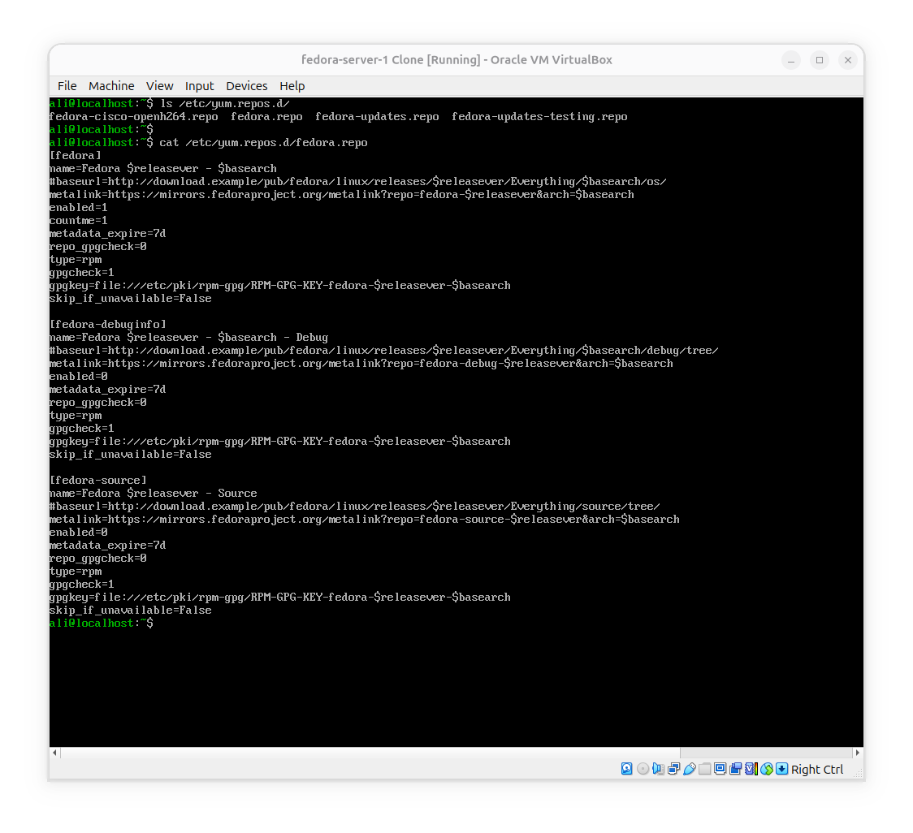
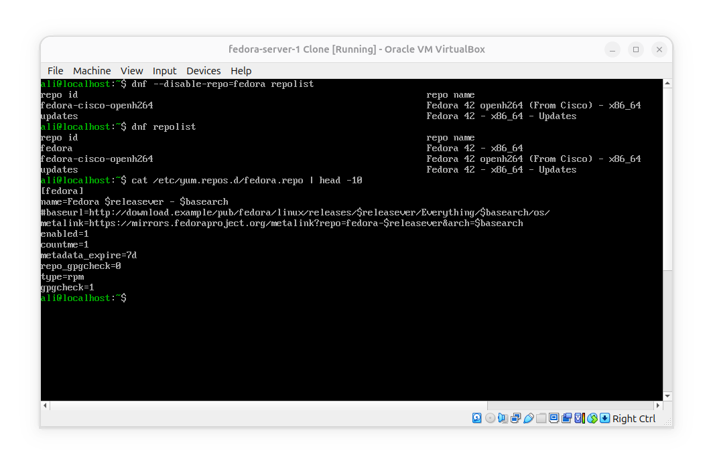
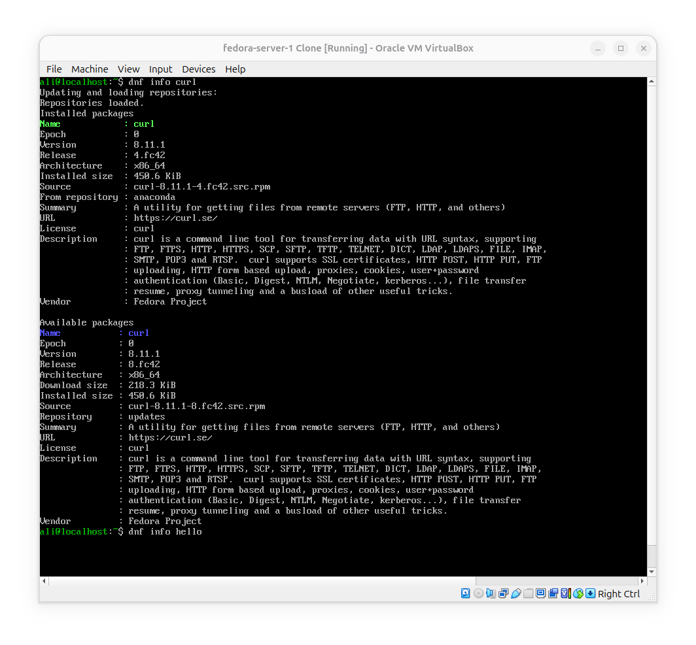

# Inspect and manage DNF repositories

**Goal**: Where DNF gets packages and how we can configure those sources.

DNF doesn't magically know where to get packages; repository configuration tells DNF where to look.

### See enabled repositories

### Get more information

This way we get considerably more information about repositories, including things such as:
- Repositody ID
- Repository Name
- Status
- Size and Number of packages
- Base Url and mirror information

### Find repository configuration file

- We saw that files are named after repository IDs.
- We have a basic picture about repo configuration.
- We know where and how DNF obtains packages.

### Disable a repo temporarily

**What happend**:
We disabled `fedora` repository for that specific command which was `repolist` on the go, and actuall settings were untouched; as you can see the next time we ran `repolist` the `fedora` repository is present in output, and also `enabled=1` in config file indicates that we are still using the repository in next operations. So `--disable-repo` is only used to disable the repository temporarily on the current command.

### See a package's repository

This command indicate's two releases of `curl`, one is already installed and if you look after `From repository` on installed package, you can see that it comes from `anaconda` repository, but if you look for `Repository` on Available packages, you can see that if we update curl we will get it from `updates` repository.

## Conclusion
Now we know:
- Where does an .rpm package come from
- How to get more information about enabled repositories.
- How to enable and disable a repository from configuration permanently and on the go when doing an operation.
- How to findout from which repository a specific package comes from.
