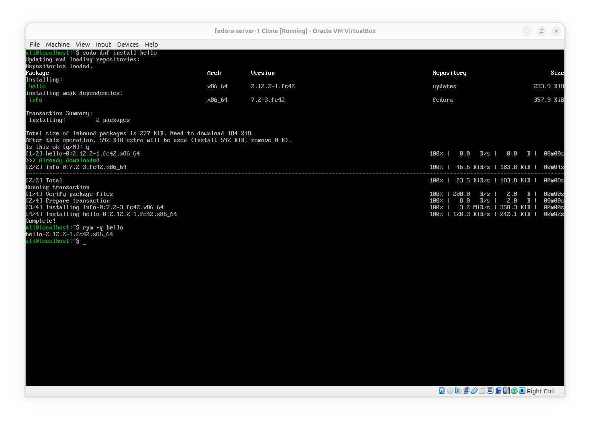
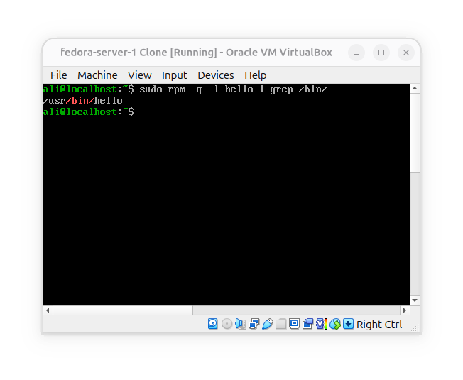
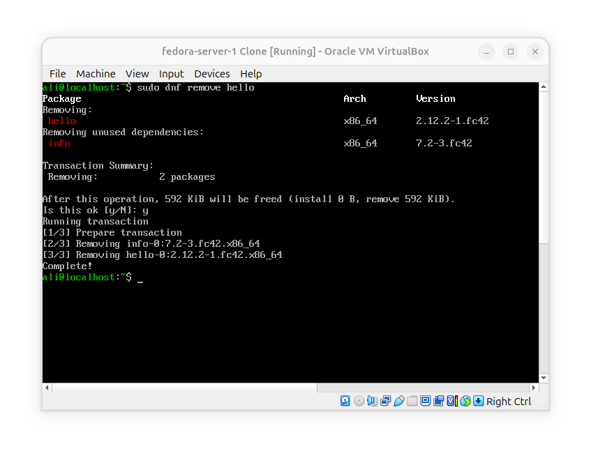
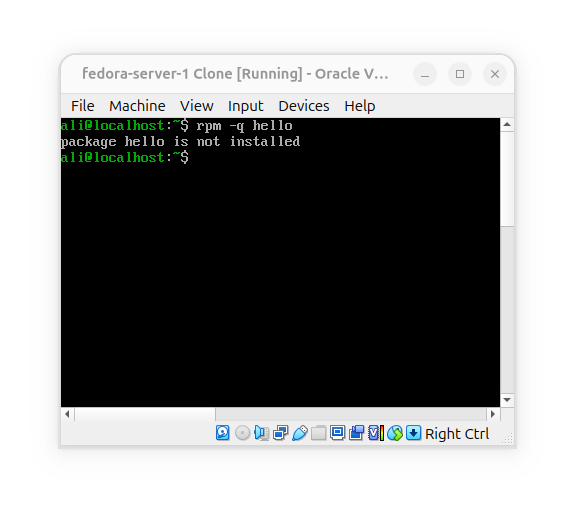
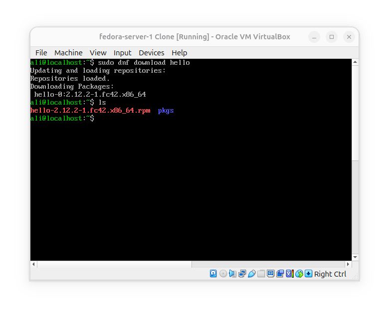
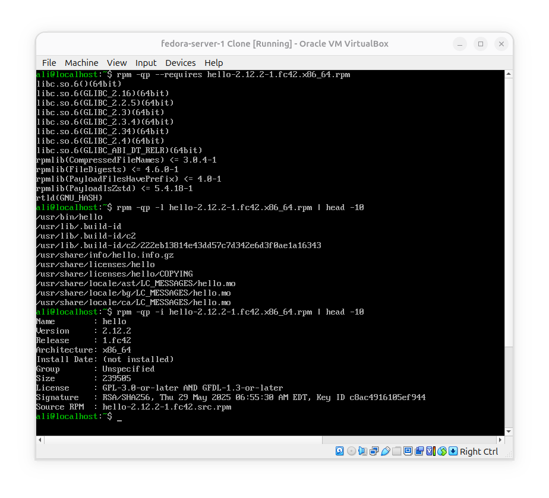
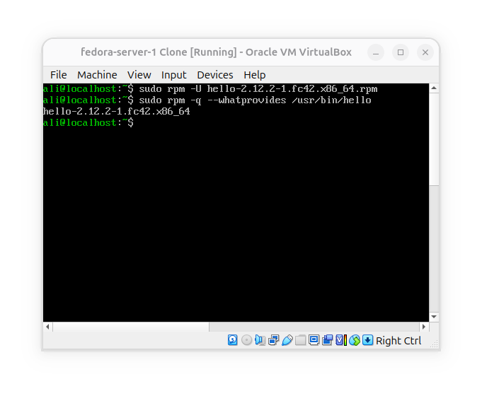
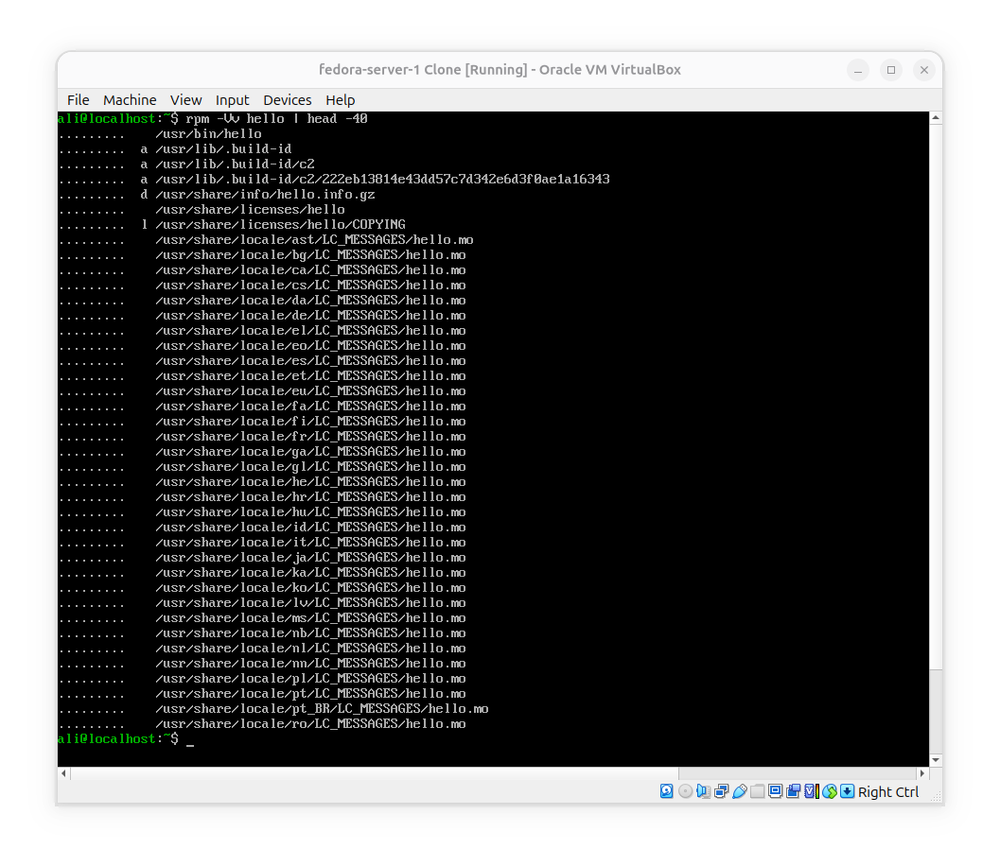
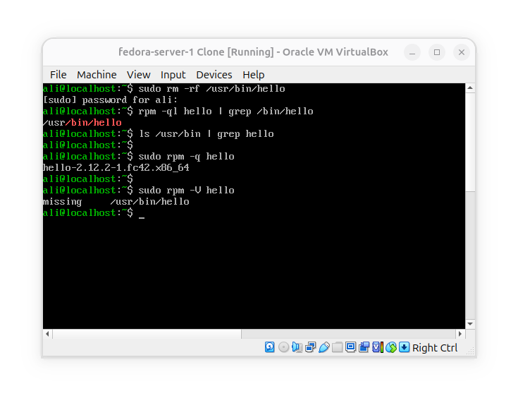

# Troubleshoot RPM/DNF package problems

**Goal**: When somthing is wrong with a package, how to determine what happend?

### Package state vs Package file

- 1- Install a package and verify:

- 2- Locate its executable:

- 3- Remove the package:

- 4- Check if still exists on RPM database:

**As you can see, after the package got deleted by dnf, it does not exists on RPM's database anymore**.

### Inspect an RPM pkg before installing

- 1- Download package without installing:

- 2 inspect the requirements and metadata:

**What have been used?**
- 1- `-q`: Query package metadata
- 2- `-p`: Query package .rpm file data
- 3- `--requires`: Query package file dependencies
- 4- `-l`: List .rpm package files
- 5- `-i`: Inspect package file metadata (info)

When Querying data about an .rpm file we use `-p`, but when querying an installed package we only use `-q` without `-p`.

### Find which package provides a file

First we installed the downloaded package, then we asked rpm to check its database and tell us which package provides `/usr/bin/hello` executable. this is specially useful when as an administor we need a file but its package is broken, so we can findout to which package it belonges so we can reinstall the package and then use the file.

### Verify an installed package
Sometimes we have a package recorded as installed in rpm database and we know which files are belong to that package, but the program still doesn't work so we need to find out if RPM's recorded information matches everything installed.
in this case:

In the above example we asked rpm do the installed files still match what this package says they should be?

### Simulate a missing executable

**What happend?**:
- 1- First we deleted hello executable: `sudo rm -rf /usr/bin/hello`.

- 2- We asked `rpm` if executable exists and rpm confirmed that it does.

- 3- We asked if `hello` package is recorded as existing in database and it again said yes.

- 4- We've checked manually if executable exists in `/bin` but didn't find the executable

- 5- Finally we asked rpm to verify the installation and it said `/usr/bin/hello` is missing.

## Conclusion
**The trouble shooting workflow is as below:**

- with `-q` we ask rpm if the package is recorded as installed?

- with `-l` we ask rpm what files belong to the package?

- with `-i` we get access to package's metadata and information

- with `-V` we ask rpm that "are installed files consistent?"

If a package is broken, rpm shows the recorded data about it saying it is not broken until we ask it to verify with `rpm -V package`.
