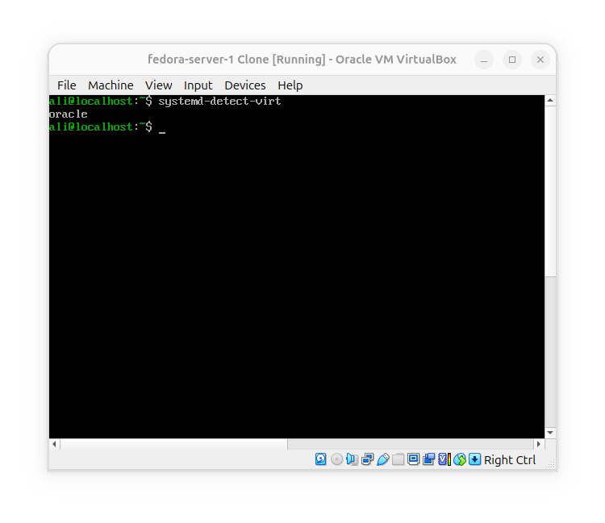
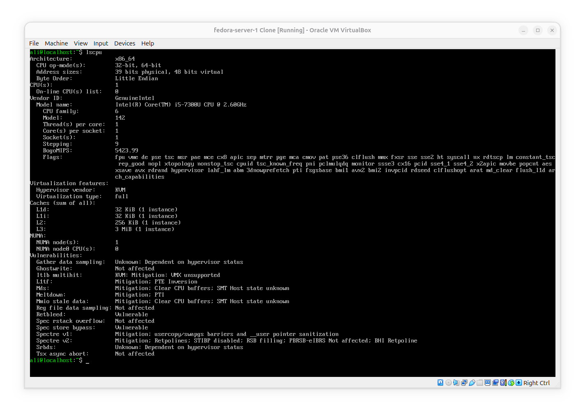
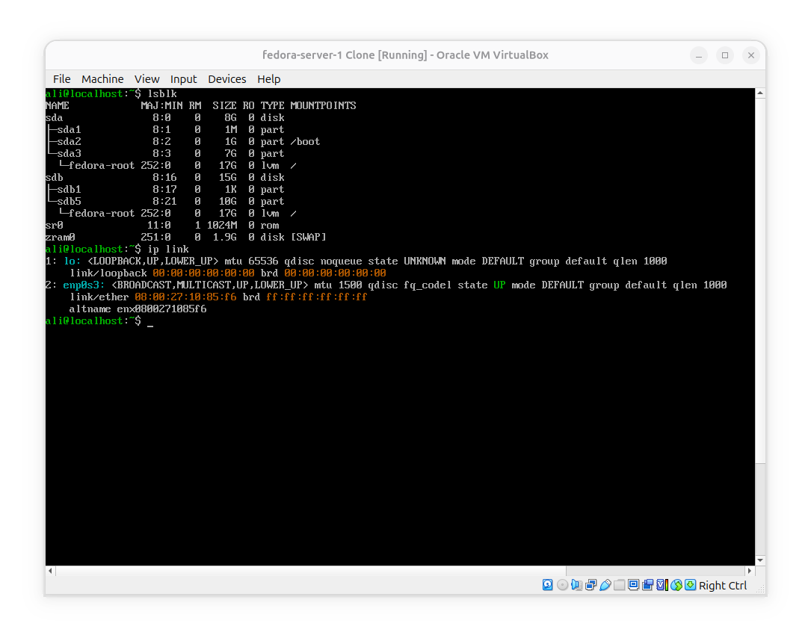

# Identify the virtualization environment from inside fedora

**Goal**: I'm inside a linux system, how can i prove what kind of environment i'm running in?

### Inside fedora, we'll investigate several layers.

We've got an indication on virtualization environment.

### Check CPU

What fedora sees as a cpu?
- CPU(s): 1
- Core(s) per socket: 1
- Thread(s) per core: 1

This tells us what CPU topology the VM has been presented.

### Other hardware

As you see fedora doesn't show the host's hardware specs, but only shows us virtual hardware that hypervisor has created for it.

## Conclusion
- We simply don't see Host's hardware when running a VM because the guest is not directly operating the physical hardware. The Virtualization layer sits between physical hardware and Virtual hardware.

- Virtualization has two important properties: 1- Isolation: the guest doesn't freely control the host's hardware. 2- Abstraction: the same fedora can run on a different physical machines because it sees a standardized virtual hardware environment created by the hypervisor.
