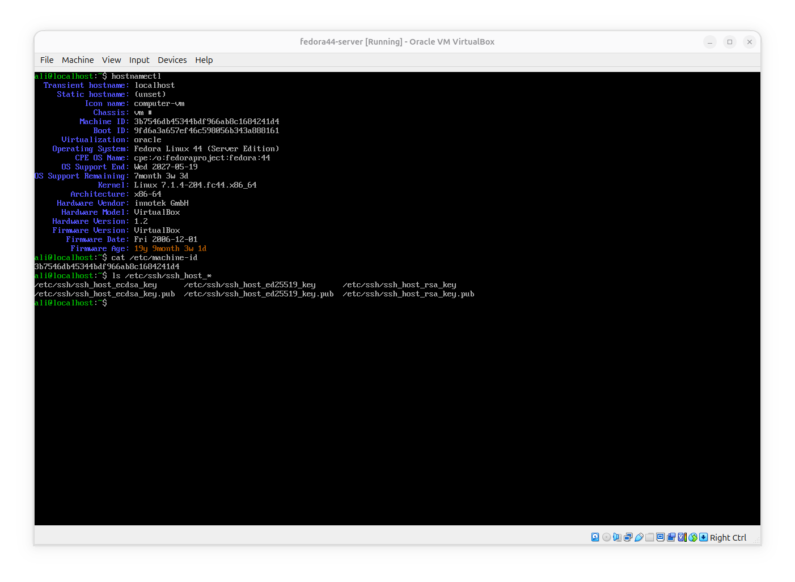
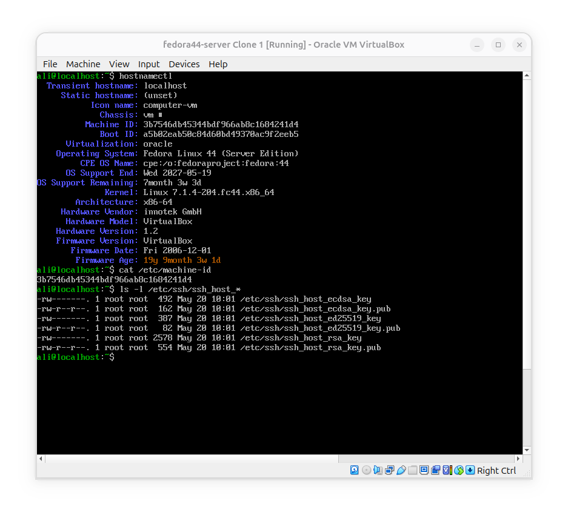
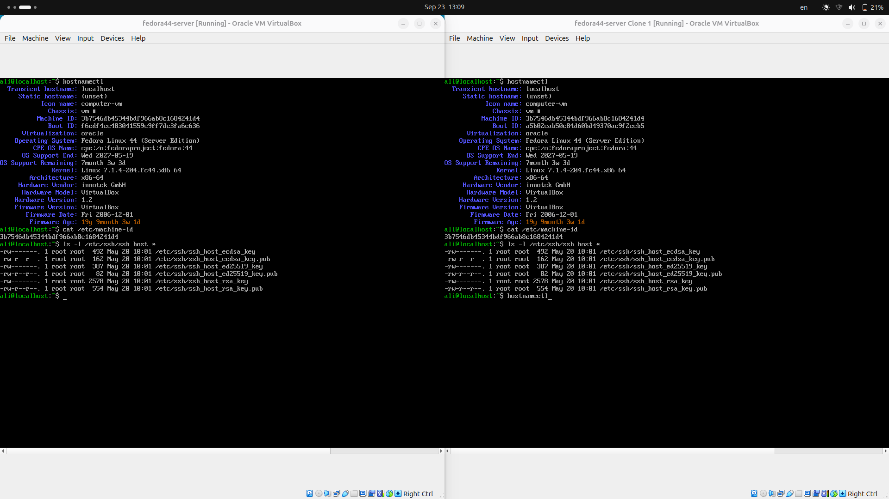
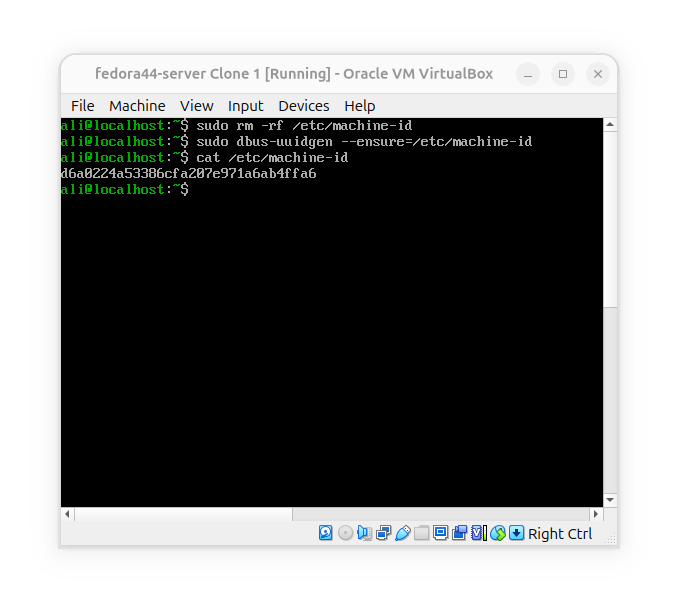
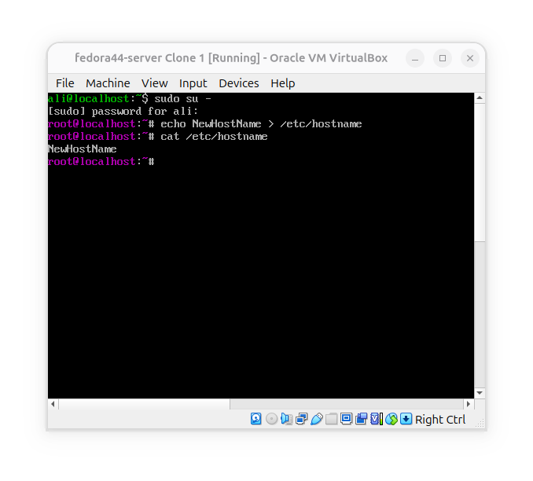
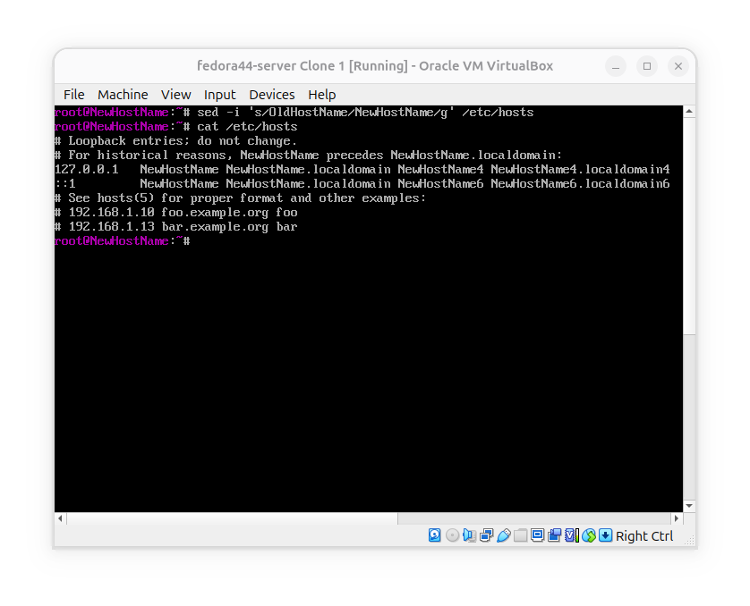
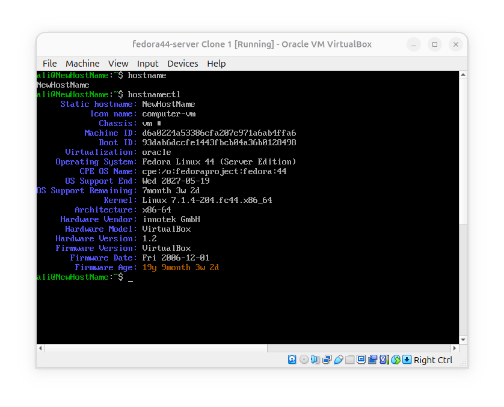
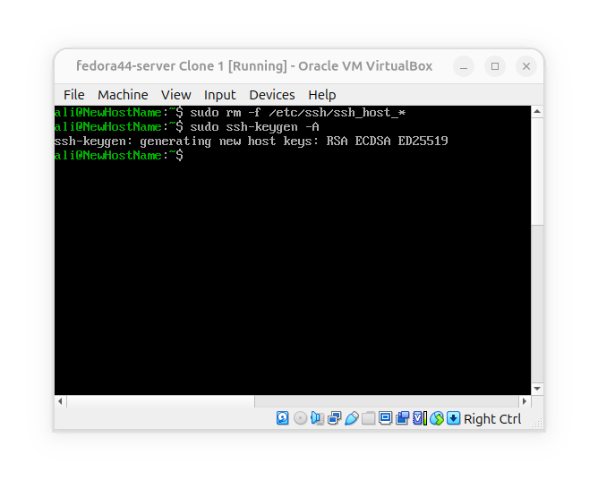

# What happens when you clone a Linux VM

**Goal**: if we create a VM by cloning another one, should both machines have  exactly the same identity?

### Check VM properties

1- start with machine A:




2- do the same with machine B:




**As you can see, there is no difference between machine A and Cloned machine B. all properties except BootID are the same.**


### Start them together



All identity properties are the same on deployed machines, which can cause problems.


### Change the machine-id



What happened: first deleted the old machine id with `sudo rm -rf /etc/machine-id` and then created a new one with `dbus-uuidgen`.


### Change the Host name



- switch to root user by: `sudo su -`
- replace the old hostname with the new hostname: `echo NewHostName > /etc/hostname`

And if your system works with `/etc/hosts`:



- Now it's time to reboot the system:
```bash
$ reboot
```

- Verify:




### Replace SSH keys



- 1- delete the old ssh keys.
- 2- execute `ssh-keygen -A` to create new ssh keys.


## Conclusion
- After cloning a virtualized linux, some duplicate values should change so the two won't have conflict with eachother.

- linux system's host name can change by replacing it on `/etc/hostname` but some systems may use `/etc/hosts` to determine hostname.
