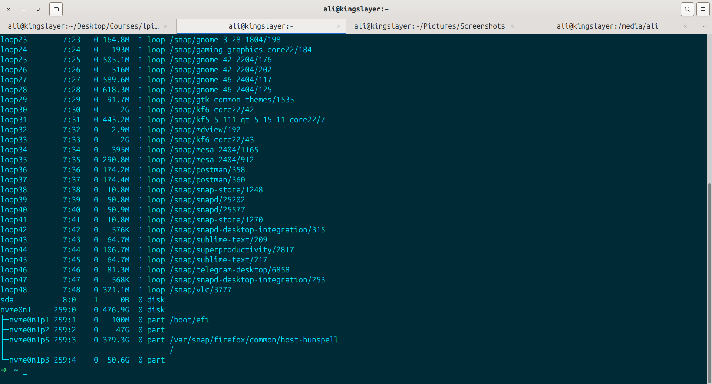
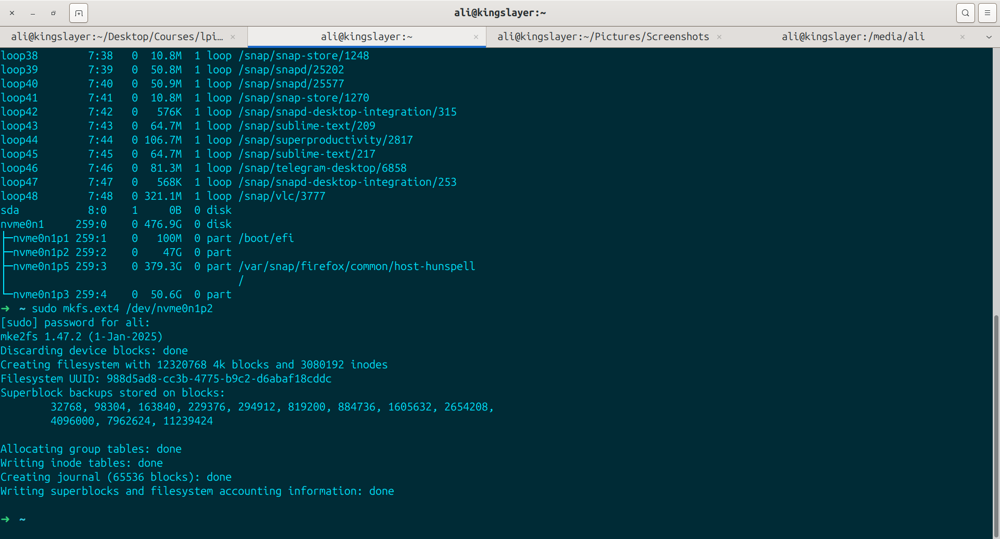
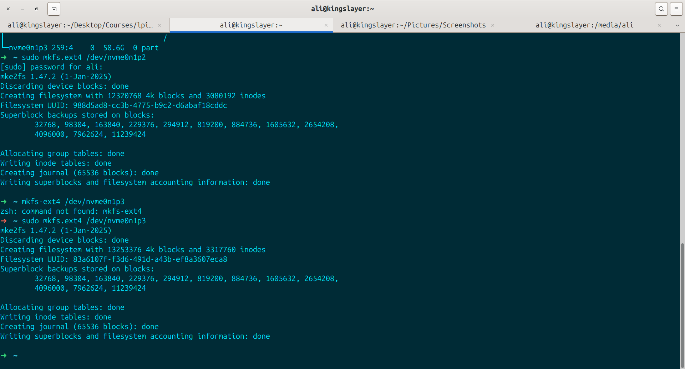

# Creating File System on Unoccupied Software Partition

- I have slplited my partition into two half in previous section. Now i want to create filesystems in them and turn them into Ext4 format. so what i have now is:

- the first partition got its filesystem:

- and finally the last one:

