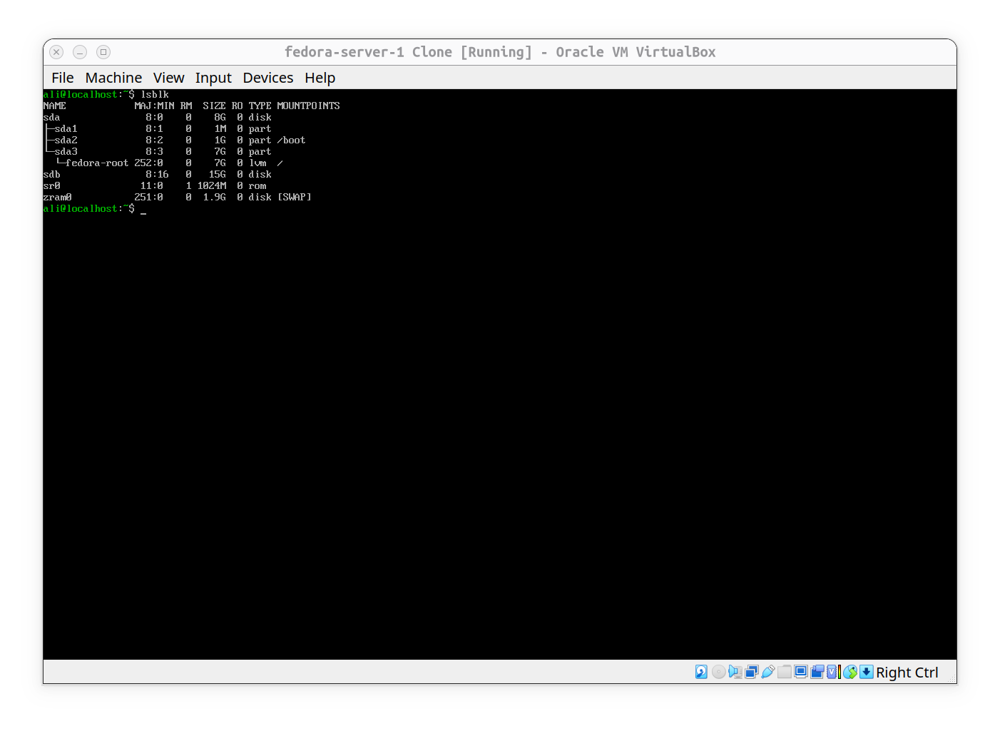
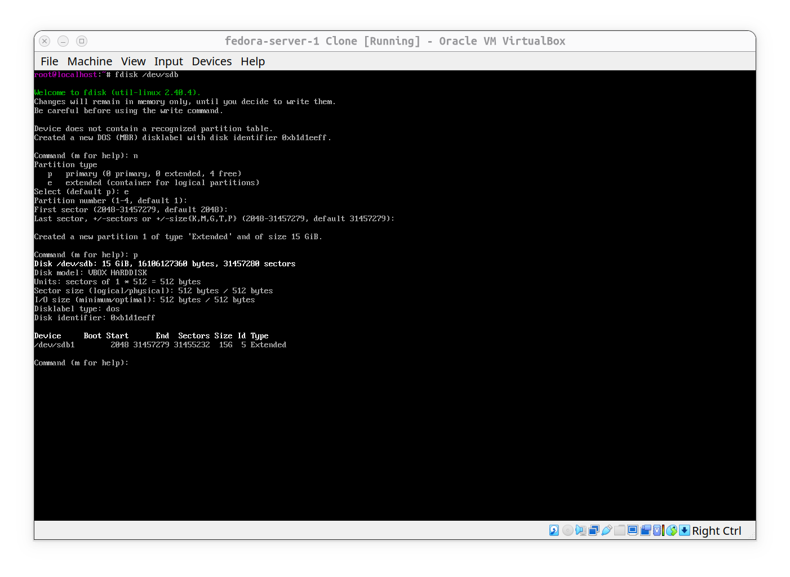
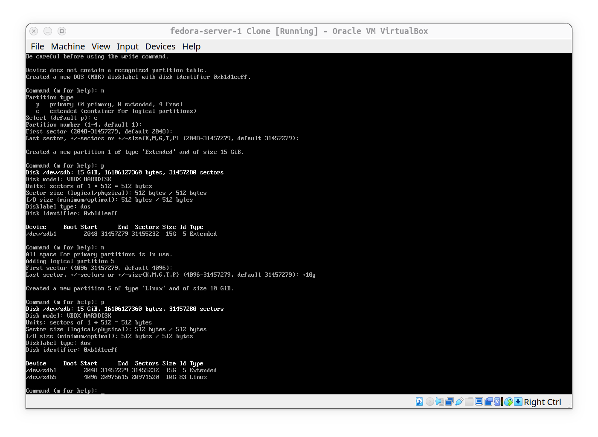
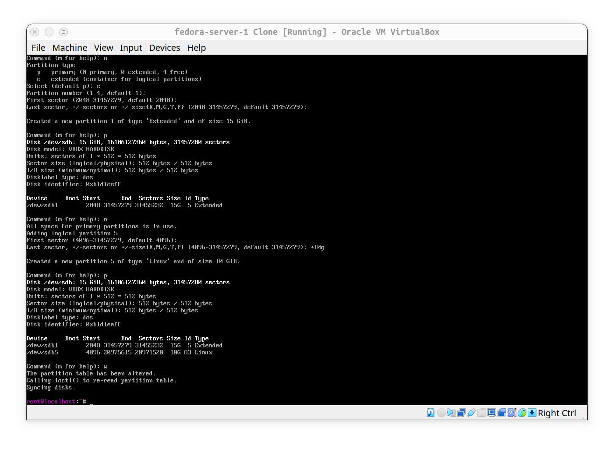
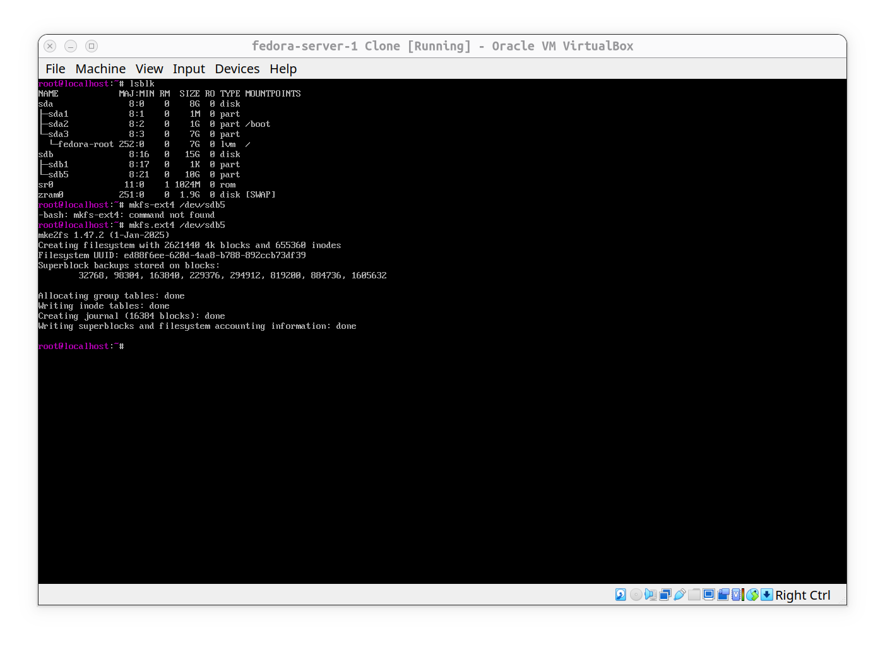

# Create logical volumes on disk

- 1- first seeing what we got; as you can see i have a 15gb disk:

- 2- now i have formated 15gb disk into extended partition so be able to create logical ones:

- 3- created a logical or (lv) partition with size 10gb in my 15gb extended partition:

- 4- after creating the partitions its time to make changes permanent and applied:

- 5- and the last job to do would be checking disks with `lsblk` and verify it exists, and then create file systen for new logical volume or (lv):

