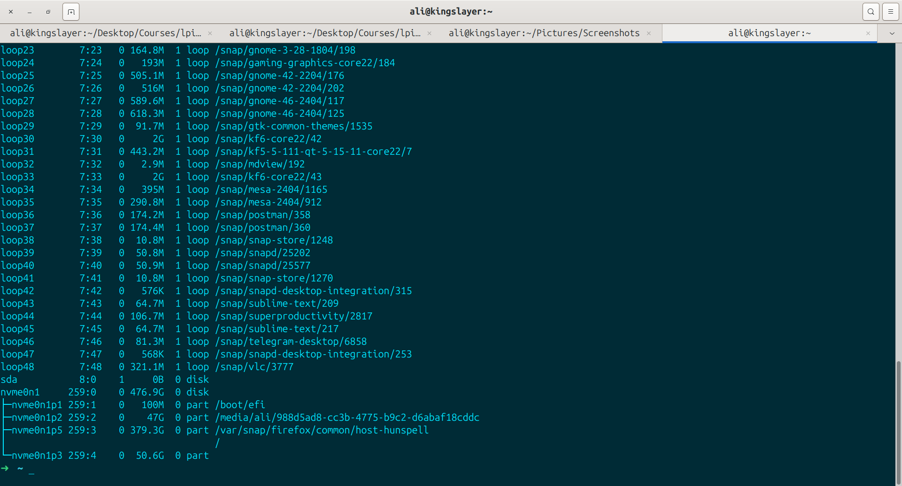
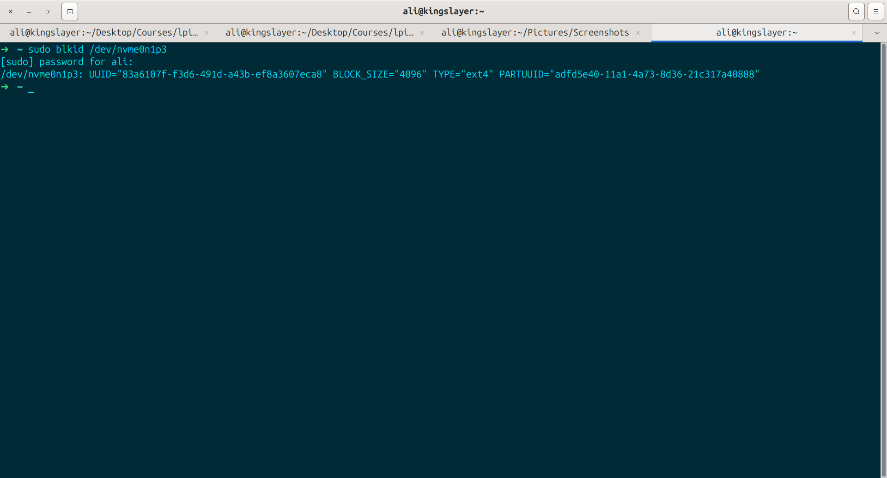
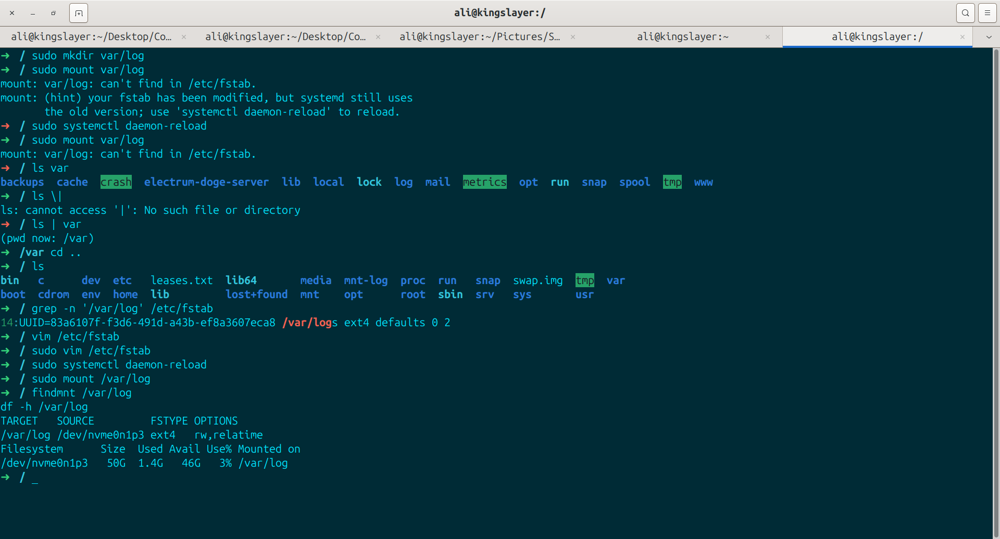

# Change the logs path into another partition

1- first we inspect what we have in out partitions

 

2- then i inspect and pick up my partition's uuid:

3- i have moved var logs by rsync command into new mount point of it. i did a daemon reload and then mounted /var/log to part 3 of my disk and from now on logs will be saved in that particullar partition:

