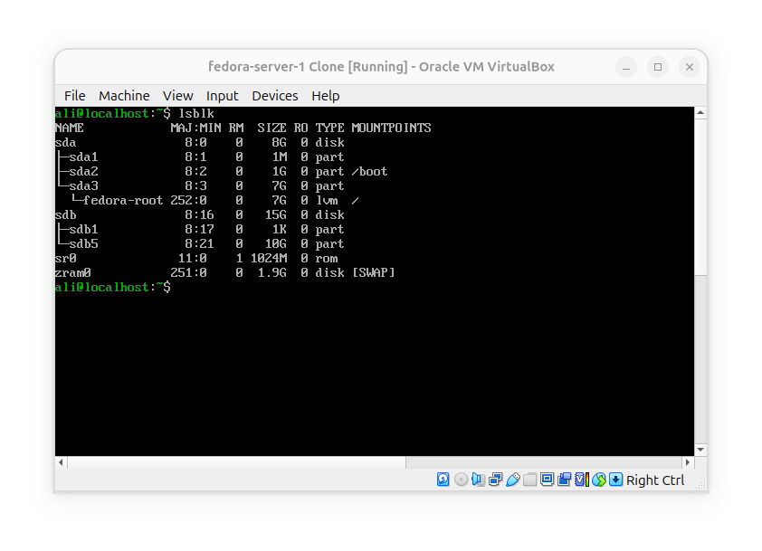
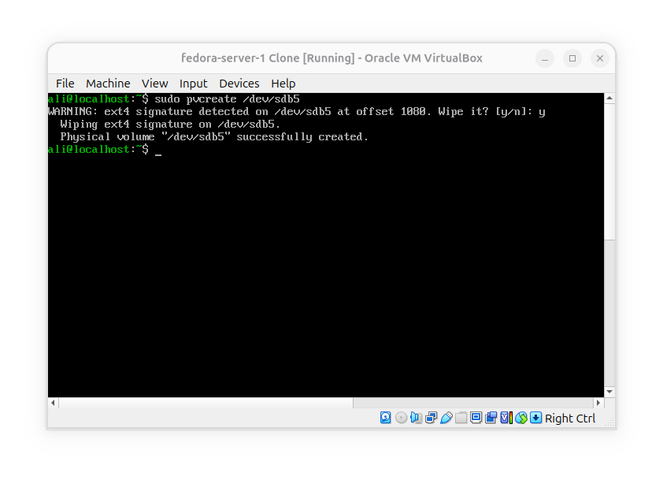
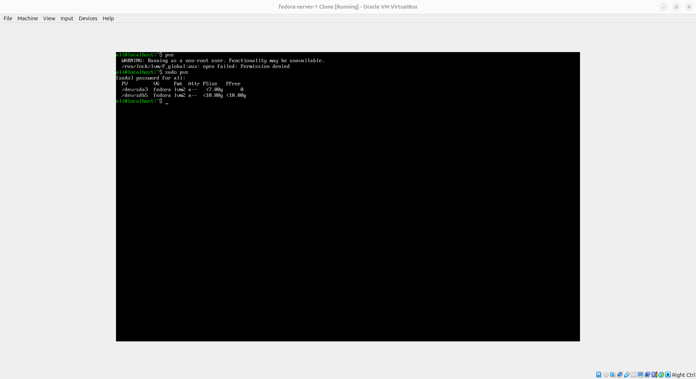
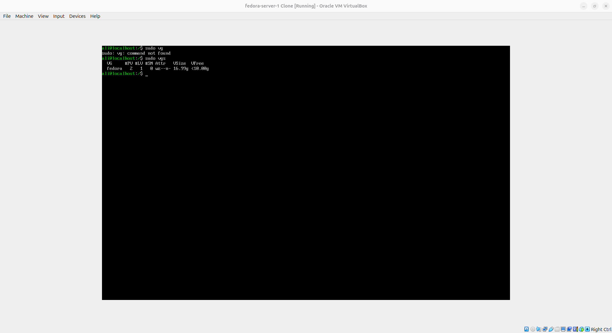
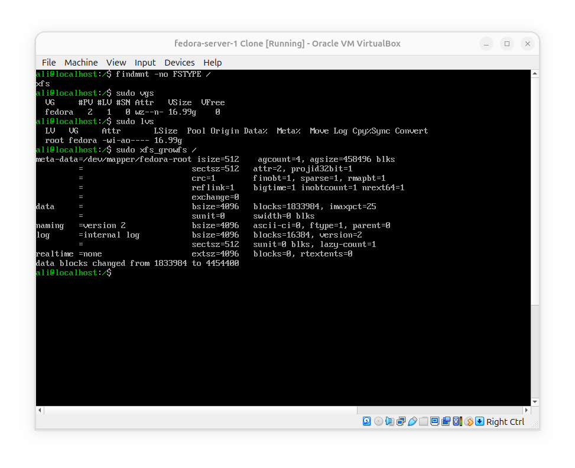
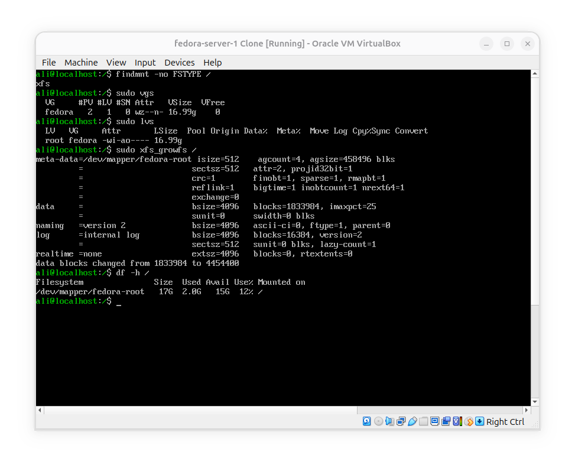

**Used commands and utilities**:
- `lsblk`: to observe current state of disk
- `pvcreate`: to create a physical volume from a logical volume to extend the lvm root partition.
- `vgextend`: to create a lvm using a phisycal volume and root lvm.
- `pvs`: to observe physical volumes
- `vgs`: to observe volume groupes made before.
- `xfs_growfs`: to extend the xfs filesystem capacity by created volume group. 

# GOAL: Extend root lvm with by another pv

- 1- fist took a look on my disks and saw fedora is already an lvm



- 2- then i tried to create a volume group with sda3 and sdb5 and unify them but i cought errors because sda3 already had fedora root lvm inside it. so i decided to extend it instead of creating a volume group. and i turned sdb5 into Phisycal volume



- 3- then i used this command to extend fedora by 10gbs which belonged to sdb5:
```bash
sudo vgextend fedora /dev/sdb5
```

- 4- at the end the results wasn't clear by `lsblk` that if i have done it or not, so i used `sudo pvs` to see my volums and finally both partitions was associated with **fedora**.




- 5- and as you can see the size of fedora root been increased by 10gbs when we execute `sudo vgs`:


 

- 6 but the thing is when i checked the size of root by `df -h /` it was still the old size which was 7gbs. for this situation, the root lvm was extended but its file system needed to be grown as it has more potential for capacity:
```bash
xfs_growfs /
```


- 7- finally the root file system :`/` has grown into 16gbs:



### Note
fedora and RHEL uses XFS file system format and debian uses ext4

### What i have learned
Extending the size of a file system and partition using Phisycal volums and LVM
