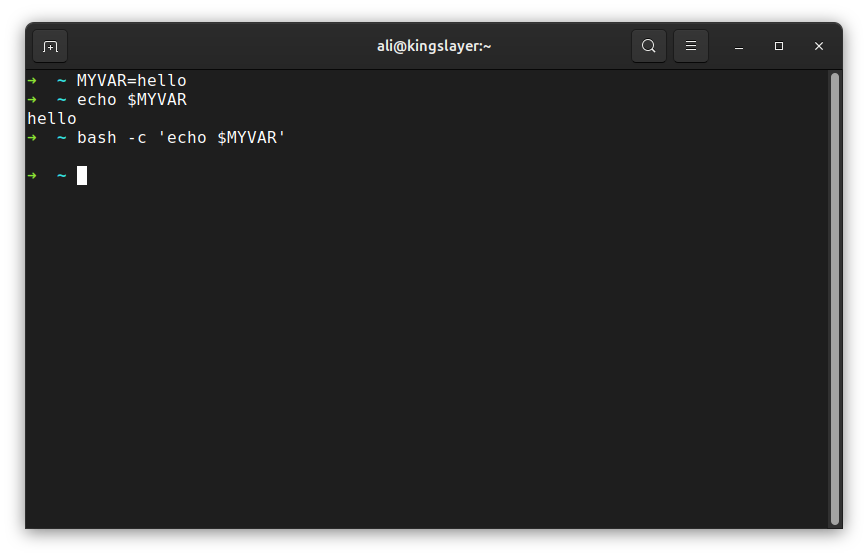
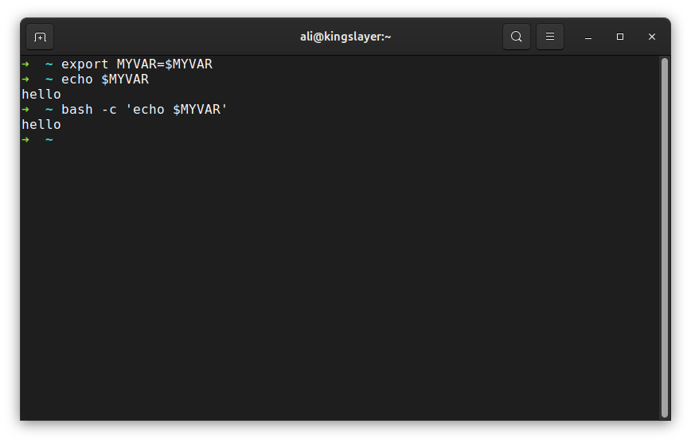
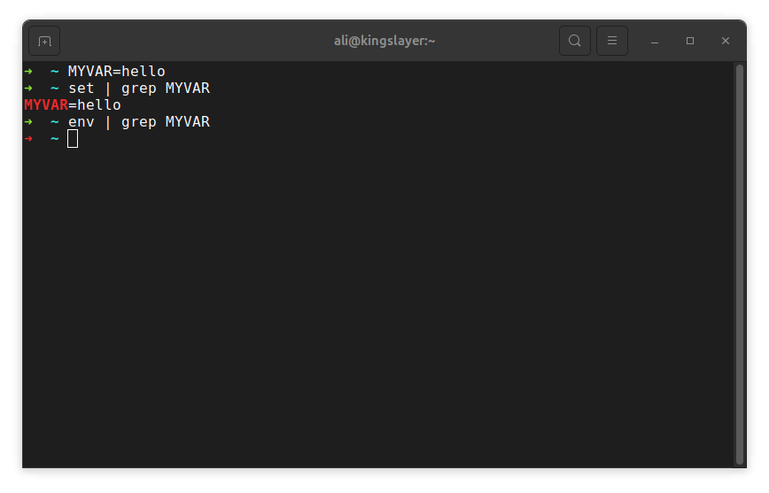
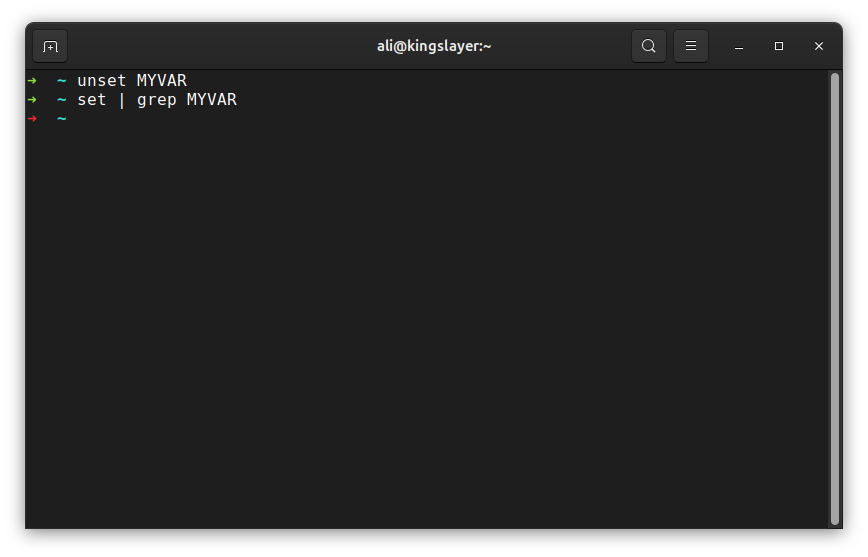
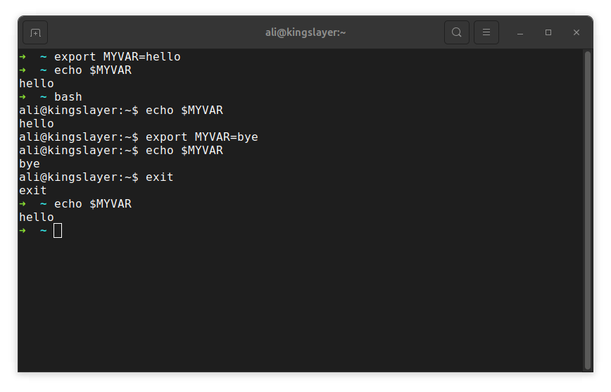
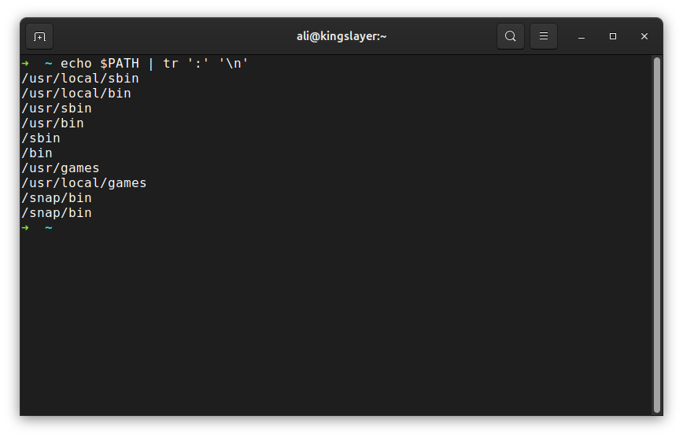
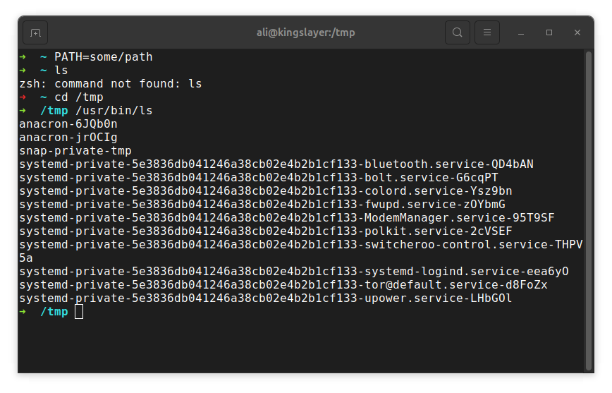
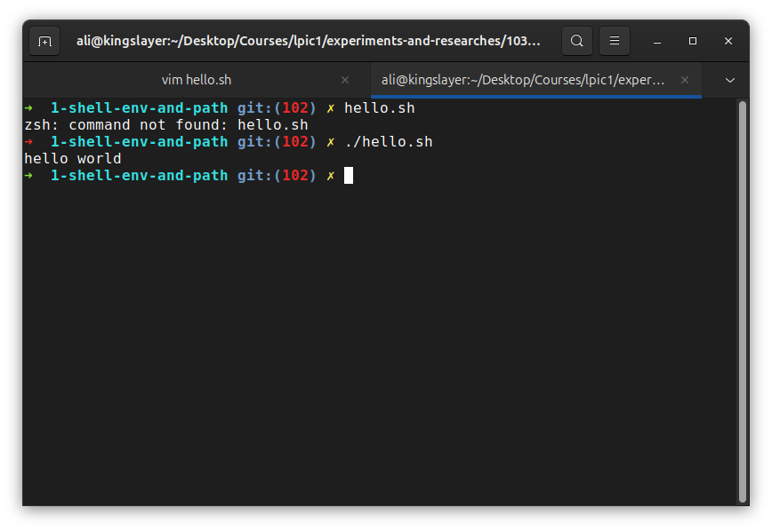
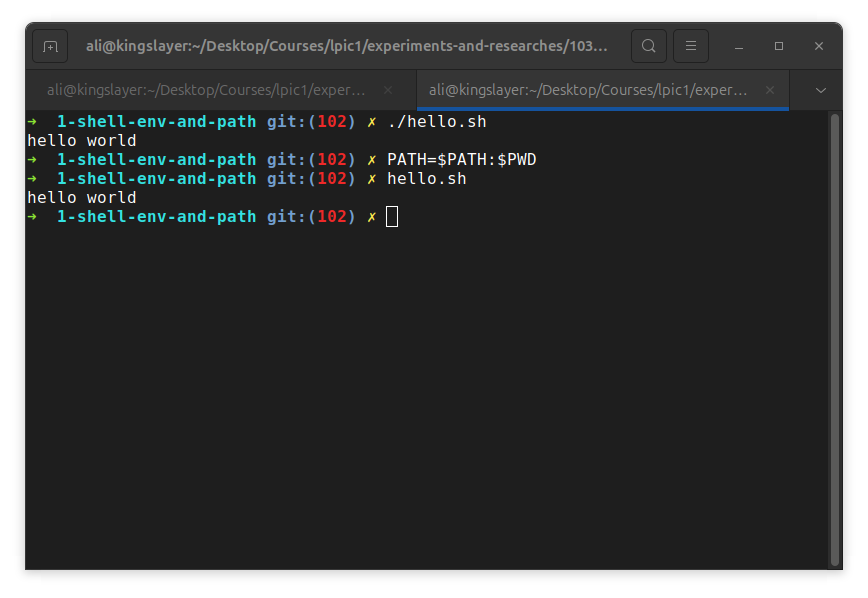

# Shell environment and path

**Goal:** Understand difference between shell variables and environmental variables and how the shell finds command through `PATH`.

### Part A
- 1- Create a Variable and see if a child bash would recognize it: if we create a variable not using `export` command, the variable will be accessible only on current bash session:

- 2- Make `MYVAR` available in the environment: if we use `export` command when creating a variable, it will be exported to the environment and is available to other shell sessions:

- 3- Find two ways to list variables, one that shows only environment variables, and one that also shows shell-only variables: `env` only shows environmental variables but `set` shows shell variables too:

- 4- Remove the variable. How do you prove it's gone? by checking `set` output which shows shell and environment variables.

- 5- Inside a child shell, change the value of the exported MYVAR and exit. What does the parent shell show now? it still shows `hello`, the changes didn't propagate back up to the parrent.

### Part B
- 1- Print PATH with one directory per line. Which directory is searched first, and why might the order matter? The Order of searching directories is left to right; order matters for example when you want to override a system's command.

- 2- In a subshell (so your real terminal stays intact), set PATH to a directory that doesn't exist. Predict, then run: ls, cd /tmp, and /usr/bin/ls. Explain each result: after doing it commands like ls won't work because they are not a shell built-in command and need $PATH variable to find where the command's binary is:

As you can see, ls was not built in so shell didn't find it, but `cd` was built-in, and `ls` only worked because we knew the exact path to the executable and we executed and it worked.

- 3- Create an executable hello.sh in your current directory that prints a message. Run it by name, then run it with ./. Why do the results differ? When run by name, it will fail because the location of executable isn't on PATH, but when run by `./`, it will run with no problem because the location to get executed is explicitely been declared.

- 4- Make hello.sh runnable by name only, without ./, for this terminal session. Then open a new terminal and try again. What do you observe, and why? When opening a new terminal we're not gonna have the changed variables in the previous shell, so because of PATH, on a new shell we again cannot run the executable by its name.

