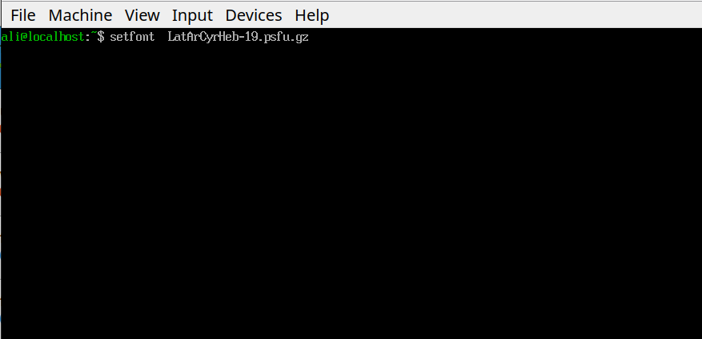
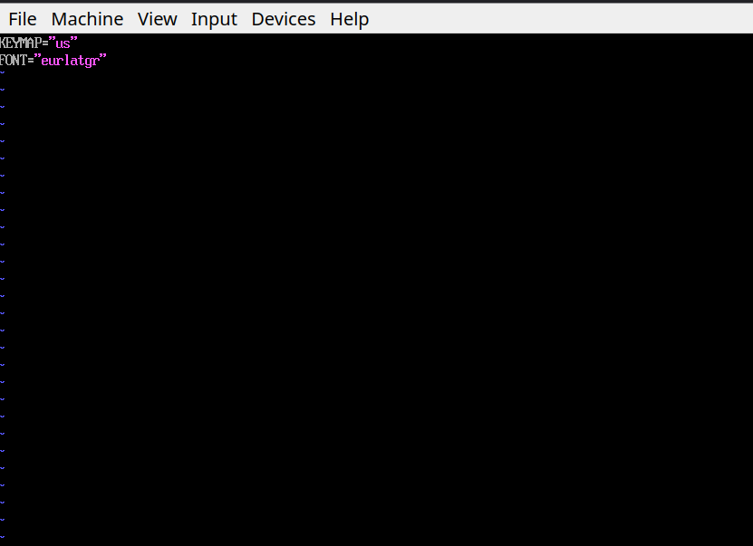
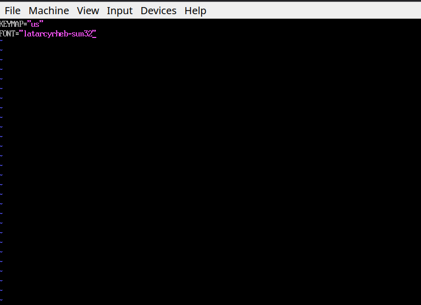
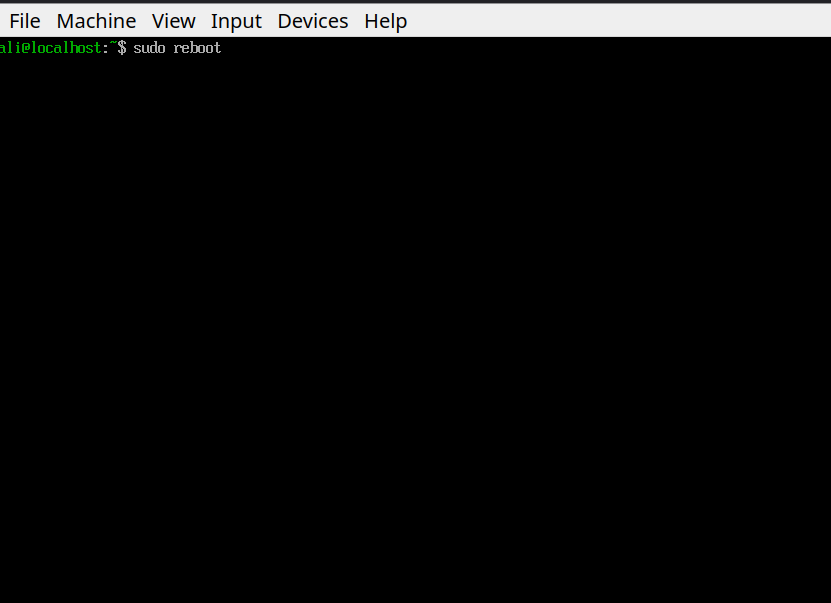
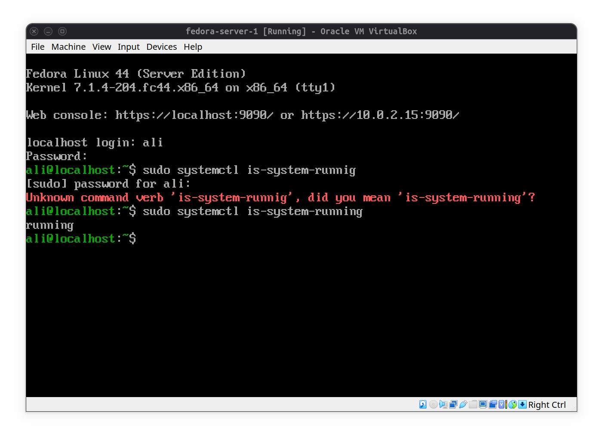

# Change Fedora Server Font Size

The text size on fedora vm terminal was botheringly small so I decided to increase it by changing the font.
- 1- You can achieve it by listing the fonts in `/usr/lib/kbd/consolefonts` and choosing one.
- 2- temporarly you can change the font by using command `sudo setfont <fontname>` but it will be reset after a reboot.

- 3- a permanent way to achieve this is to change the configuration file `/etc/vconsole.conf`:

- 4- **!Note** that in configuration file we don't need to set .psfu.gz suffix

- 5- after you've changed the font in configuration file it is time to reboot.

- 6- and result will be like this:

