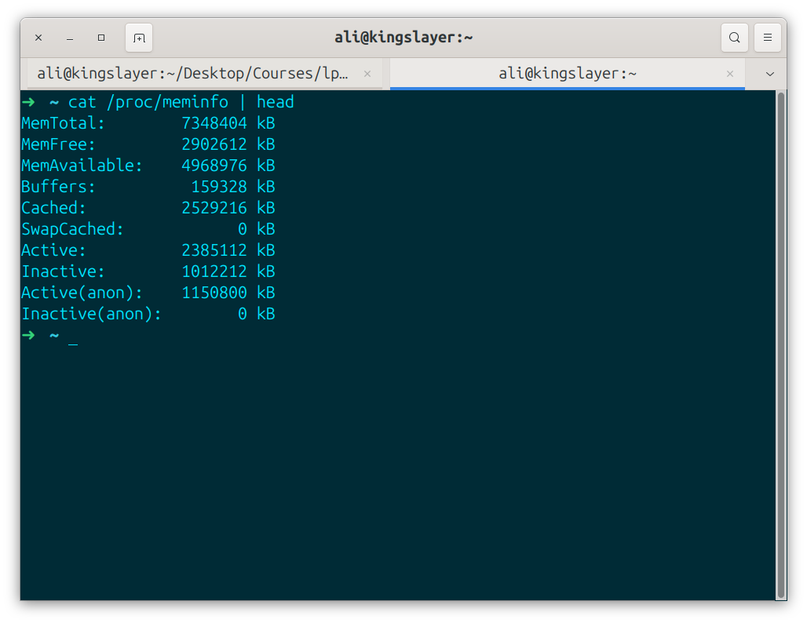
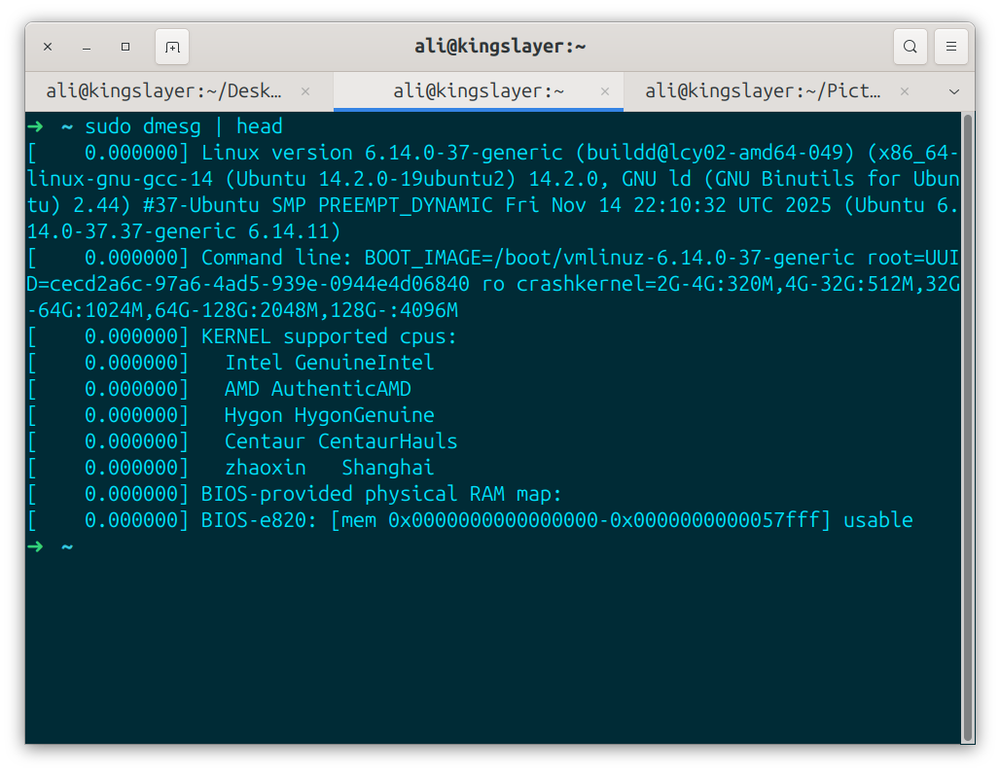
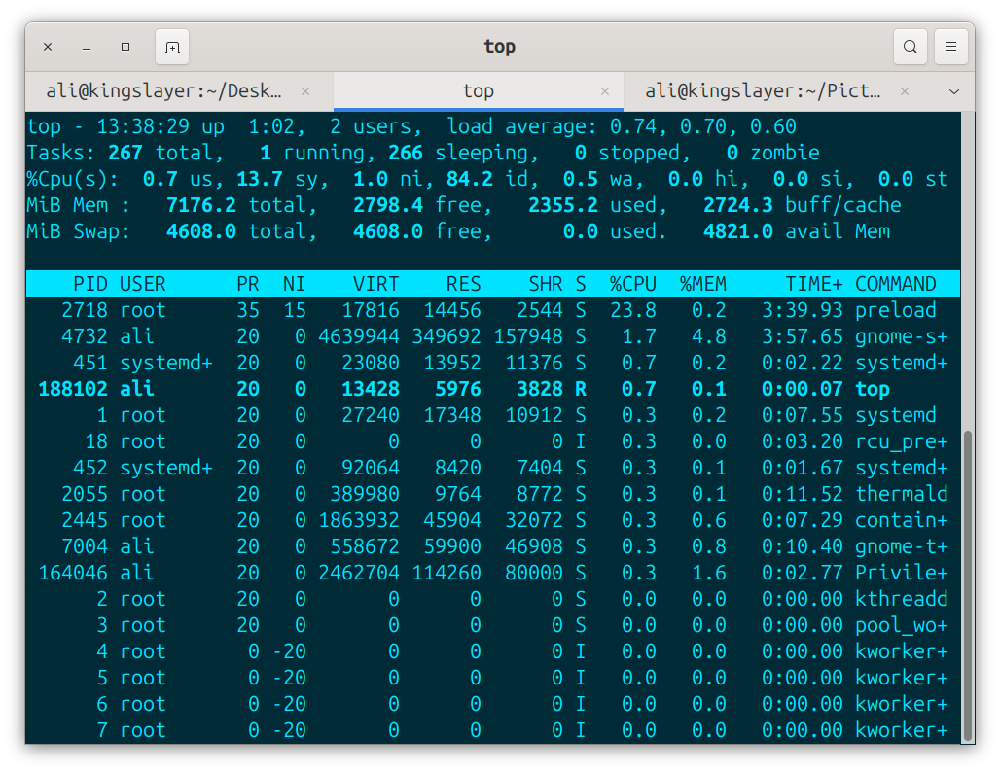
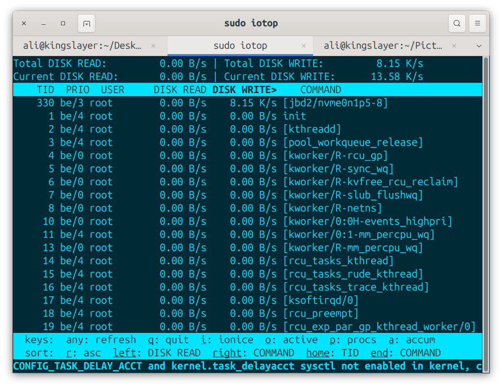
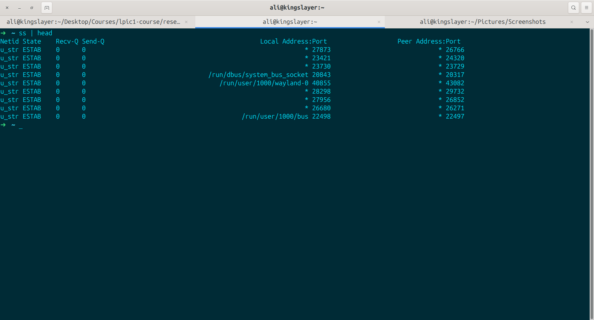
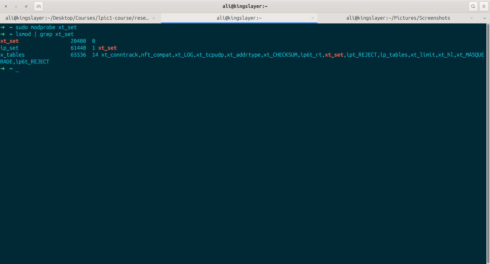
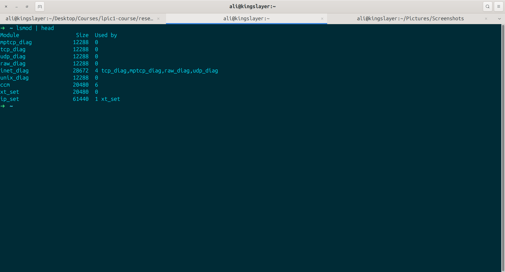

# Kernel Subsystems

**The** Linux kernel is the core of the operating system; it manages hardware and resources and provides services to user-space applications. the Kernel is modular and organized into several inter connected *Subsystems* that work together to ensure stability, performence and security.

**!Note** each topic has a section "in other words" for a simple and comprehensive explaination of each subsystem.

## Core Subsystems

- 1-Process Management & scheduling:
**Handles** process and thread creation, execution & termination. it uses Completely Fair Scheduler (CFS) by default for fair cpu allocation. it also supports real-time Scheduling. **Key Structure** is "task_struct". **in other words:** it controls running programs (processes). decides which program gets CPU time & when.

- 2-Memory Management:
**Manages** physical & virtual memory with paging, swapping and allocators (buddy for pages, Slab/SLUB for objects). Implements demand paging, copy-on-write & works with MMU for address translation. **in other words:** manages computer's RAM. it gives memory to programs & reclaims it when it is not needed. it can also use a space in SSD or HDD called Swap for more memory.

- 3-Virtual File System (VFS):
**Provides** a unified interface for all file systems such as (ext4, XFS, Btrfs & etc). it uses *inodes*, dentries & page cach for efficient file operations. **in other words:** allows kernel to read & write file on different storage types.

- 4-Device Drivers & Block I/O: Controls Hardware devices (character, block, Network). Includes the block layer with request queues and multi-queue (block-mq) support for storage devices. **in other words:** it is a software that lets kernel talk to hardware such as keyboard, mice, graphic, storage devs and ....

- 5-Networking (net): Implements the full TCP/IP stack, routing, firewall(netfilter), and advanced features like namespaces & XDP for high performence networking. **in other words:** Handles network connections, sending & recieving data over Internet or Local network.

- 6-Security: Uses Linux Security Module (LSM) such as SELinux & AppArmor. Manages permissions, capabilities, name spaces & seccomp. **in other words:** Controls who can access files & resources. Manages user permissions & and basic protection.

## Additional Key Subsystems:
- power management: CPU frequency scaling & suspend/resume.
- timers & time: High resolution timers & tickless operation.
- trace / debbuging: ftrace, pref, kprobes.
- kernel modules: dynamic loading of drivers & features.

## Other Important parts:
+ modules: small pieces of code that can be added or removed the system is running (drivers for new hardware).
+ power management: helps save battery by controlling cpu speed & sleep states.

## How they work together:
**Subsystems** communicate via well defined APIs. for example reading a file involves **VFS** -> page cache -> block layer -> device driver. namespace & cgroups enable Container Isolation.

## LPIC1 Relevence: 
**Understanding** these help with performence tuning, troubleshooting, & using `/proc` & `/sys`, module management (lsmod, modprobe) and system configuration.

## Quick Commands
- `cat /proc/meminfo`: information about memory

- `dmesg`: view Kernel messages.

- `top`: realtime monitor showing cpu & ram usage by processes.

- `iotop`: realtime showing disk read/write by processes.

- `ss`: shows network connections & listing ports (replacement of netstat).

- `modprobe`: load modules.

- `lsmod`: list modules.

